## ISS-00 — Requisitos previos

#### Verificación:

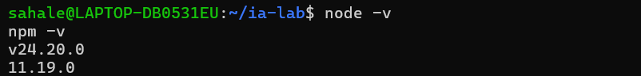

## ISS-01 — Esqueleto del proyecto

#### 2.1 Inicializar npm y scripts

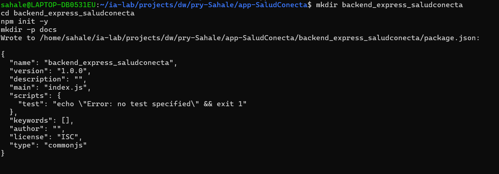

**PARCHE** — `package.json` (ya existe, lo creó `npm init -y`). Edita manualmente para que las claves `"scripts"` y `"type"` queden así:

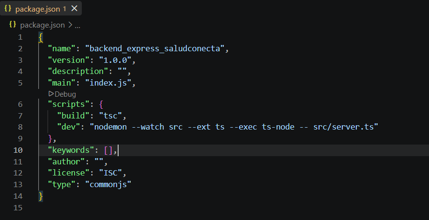

#### 2.2 Estructura de carpetas (features)

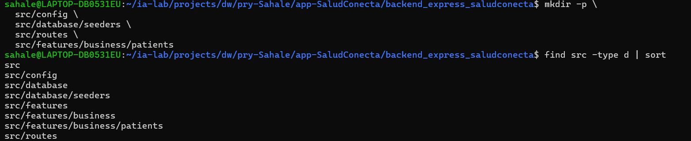

#### 2.3 Dependencias base (Express + TypeScript)

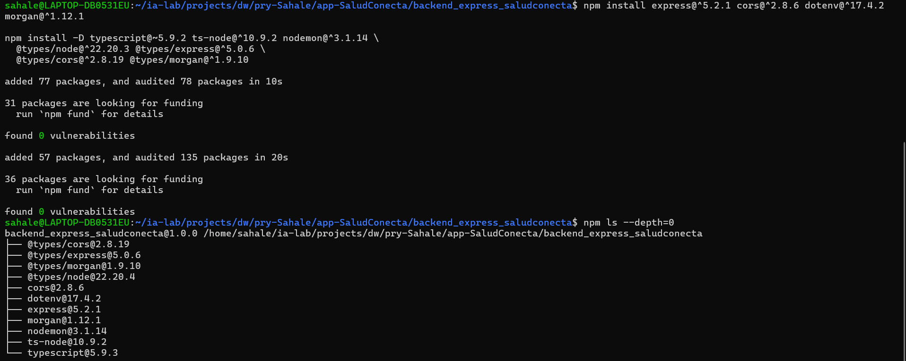

#### 2.4 TypeScript (`tsconfig.json`)

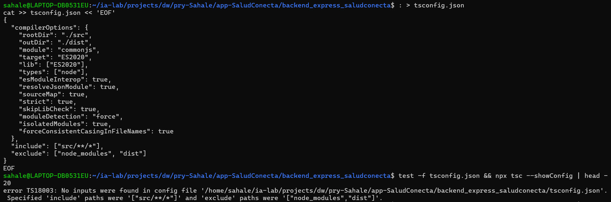

#### 2.5.1 `src/server.ts`

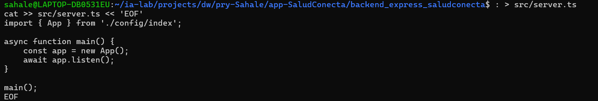

#### 2.5.2 `src/config/index.ts` (esqueleto)

Esqueleto. Los imports de modelos, associations, Routes y Swagger llegan por PARCHE en ISS-02...08.

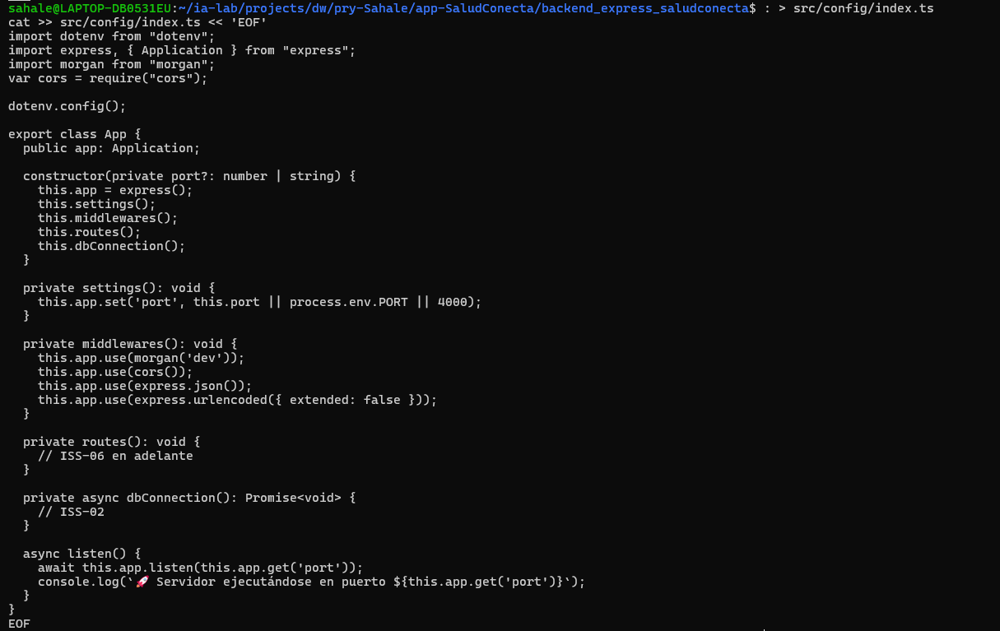

#### Verificación del ISS-01

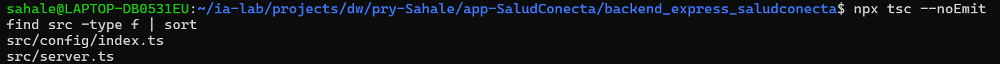

#### Cierre del ISS

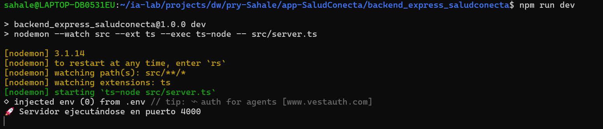

## ISS-02 — Infraestructura de base de datos

##### **Bloqueado por:** ISS-01.

#### 3.1 Drivers Sequelize y `.env`

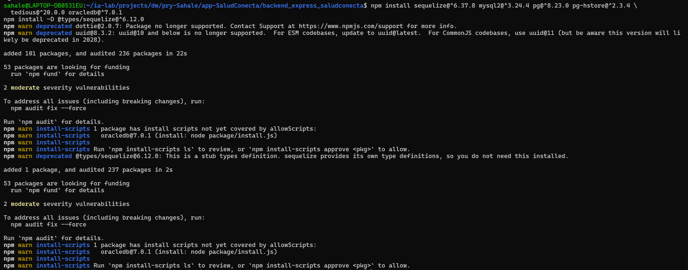

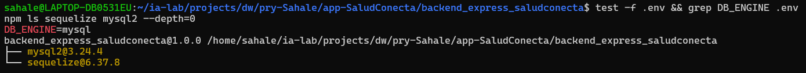](images/clipboard-171196581.png)

#### 3.2 Configuración Sequelize (`src/database/db.ts`)

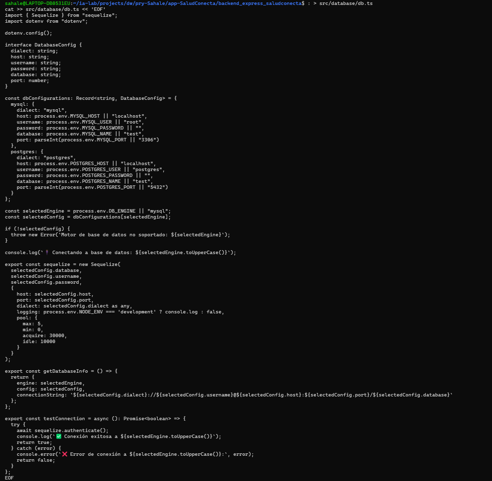

``` bash
test -f src/database/db.ts && npx tsc --noEmit
```

#### 3.3 Carpeta seeders (reservada)

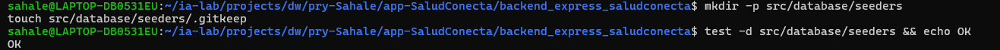

#### Verificación del ISS-02

``` bash
npx tsc --noEmit
test -f src/database/db.ts && test -f .env && test -d src/database/seeders
```

#### Cierre del ISS

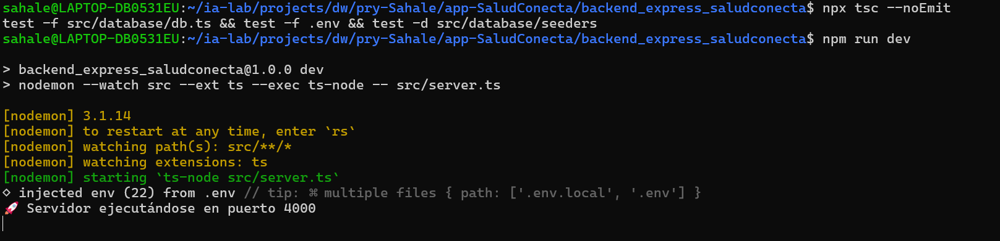

## 4. ISS-03-A — Feature Patient: fundación (modelo, esqueleto, HTTP, cableado)

**Objetivo:** dejar el feature Patient listo para CRUD. Incluye el modelo, el esqueleto de controller y routes, la carpeta `http/`, el agregador de rutas y el sync.\

**Bloqueado por:** ISS-02.\

**Patrón del manual:** Client (§4.1–4.3).

### 4.1 Modelo Patient

**Archivo:** `src/features/business/patient/patient.model.ts`

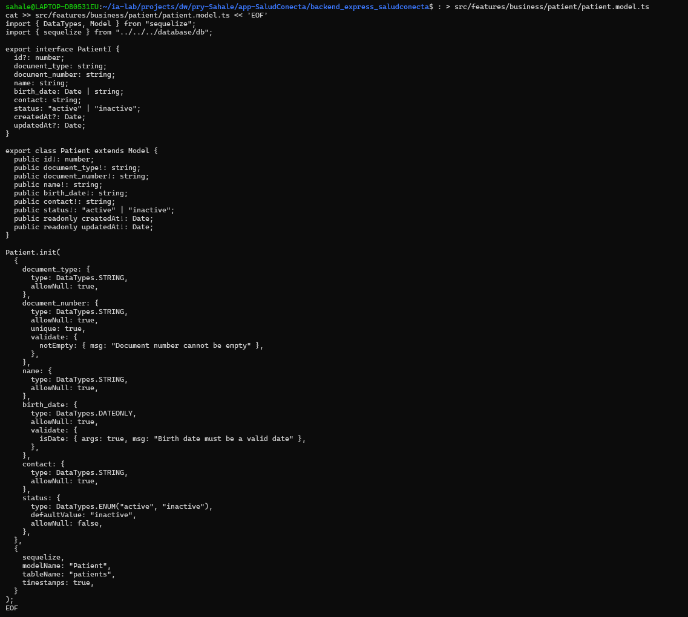

### 4.2 Esqueleto controller / routes + carpeta HTTP

#### 4.2.a Carpeta `http/`

``` bash
mkdir -p src/features/business/patient/http
```

#### 4.2.b `patient.controller.ts` (esqueleto)

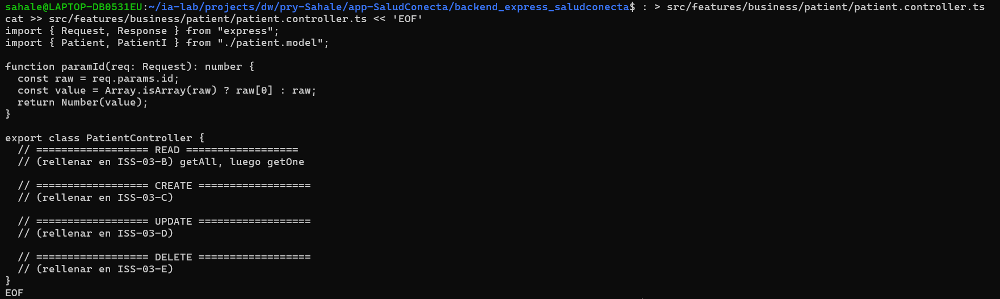

#### 4.2.c `patient.routes.ts` (esqueleto)

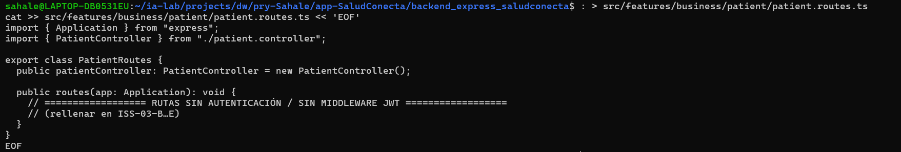

### 4.3 Agregador Routes + cableado en Config

#### 4.3.a `src/routes/index.ts` (archivo nuevo)

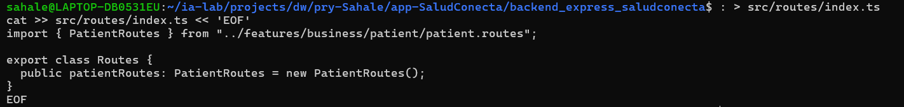

#### 4.3.b PARCHE — `src/config/index.ts` (ya existe desde ISS-01)

#### 1. Debajo de `var cors = require("cors");`, añadir:

``` typescript
import { sequelize, getDatabaseInfo, testConnection } from "../database/db";
import "../features/business/patient/patient.model";
import { Routes } from "../routes/index";
```

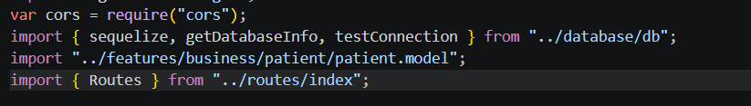

**2. Dentro de** `export class App`, **debajo de** `public app: Application;`, **añadir:**

``` typescript
  public routePrv: Routes = new Routes();
```

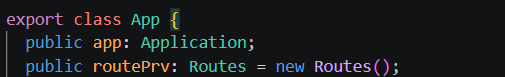

**3. Dentro de** `routes()`, **reemplazar** la línea `// ISS-03 §4.3` por:

``` typescript
  this.routePrv.patientRoutes.routes(this.app);
```

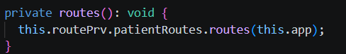

**4. Dentro de** `dbConnection()`, **reemplazar** la línea `// ISS-02 / ISS-03` por:

``` typescript
    try {
      // Mostrar información de la base de datos seleccionada
      const dbInfo = getDatabaseInfo();
      console.log(`🔗 Intentando conectar a: ${dbInfo.engine.toUpperCase()}`);

      // Probar la conexión
      const isConnected = await testConnection();

      if (!isConnected) {
        throw new Error(`No se pudo conectar a la base de datos ${dbInfo.engine.toUpperCase()}`);
      }

      // alter: true actualiza columnas faltantes (ej. createdAt/updatedAt tras timestamps: true).
      // force: false no recrea tablas; no borra datos. En producción preferir migraciones.
      await sequelize.sync({ force: false, alter: true });
      console.log(`📦 Base de datos sincronizada exitosamente`);
    } catch (error) {
      console.error("❌ Error al conectar con la base de datos:", error);
      process.exit(1); // Terminar la aplicación si no se puede conectar
    }
```

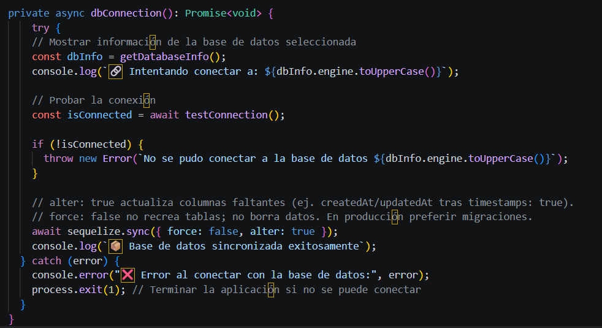

#### Estado esperado del archivo tras el PARCHE, para comparar:

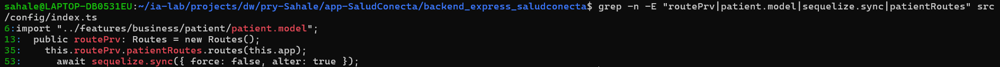

#### Verificación ISS-03-A

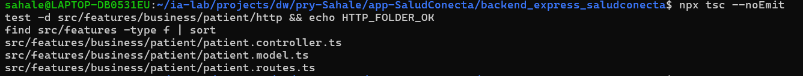

#### Cierre del ISS

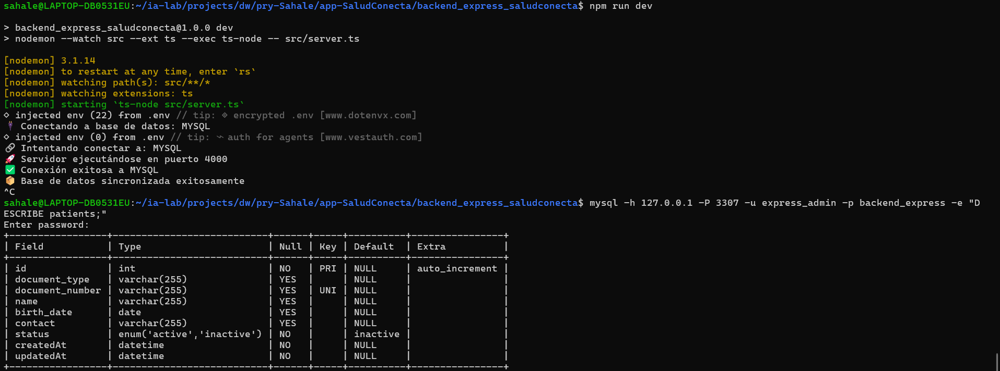

## 5. ISS-03-B — Feature Patient: GetAll y GetOne

**Objetivo:** listar los pacientes activos y obtener uno por id.\
**Bloqueado por:** ISS-03-A.\
**Patrón del manual:** §5 (Client getAll / getOne).

#### Criterios de aceptación (ISS-03-B)

- Controller: `getAll` (solo `status: 'active'`) y, debajo, `getOne`

- Rutas `GET /api/patients` y `GET /api/patients/:id`, **sin auth**

- `http/patients.get.http` con la leyenda **SIN AUTH**

### 5.1 PARCHE — `patient.controller.ts` (ya existe)

**Reemplazar** la línea:

``` typescript
  // (rellenar en ISS-03-B) getAll, luego getOne
```

que está **debajo de** `// ================== READ ==================` y **encima de** `// ================== CREATE ==================`, por:

``` typescript
  public async getAll(req: Request, res: Response) {
    try {
      const patients = await Patient.findAll({
        where: { status: "active" },
      });
      res.status(200).json({ patients });
    } catch (error) {
      res.status(500).json({ error: "Error fetching patients", detail: String(error) });
    }
  }

  public async getOne(req: Request, res: Response) {
    try {
      const id = paramId(req);
      const patient = await Patient.findByPk(id);
      if (!patient) {
        res.status(404).json({ error: "Patient not found" });
        return;
      }
      res.status(200).json({ patient });
    } catch (error) {
      res.status(500).json({ error: "Error fetching patient", detail: String(error) });
    }
  }
```

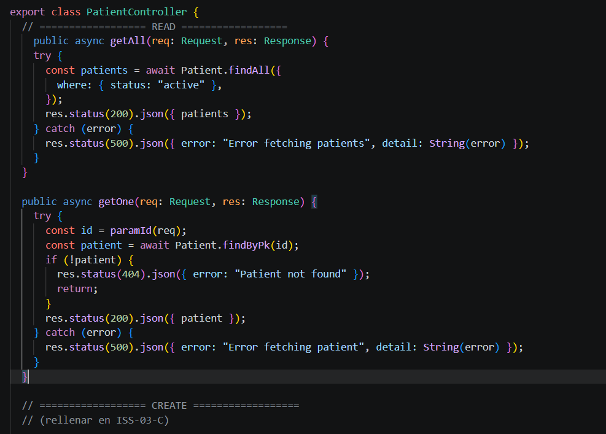

### 5.2 PARCHE — `patient.routes.ts` (ya existe)

**Reemplazar** la línea:

``` typescript
    // (rellenar en ISS-03-B…E)
```

que está **debajo de** `// ================== RUTAS SIN AUTENTICACIÓN / SIN MIDDLEWARE JWT ==================`, por:

``` typescript

    // getAll
    app
      .route("/api/patients")
      .get(this.patientController.getAll.bind(this.patientController));

    // getOne
    app
      .route("/api/patients/:id")
      .get(this.patientController.getOne.bind(this.patientController));
```

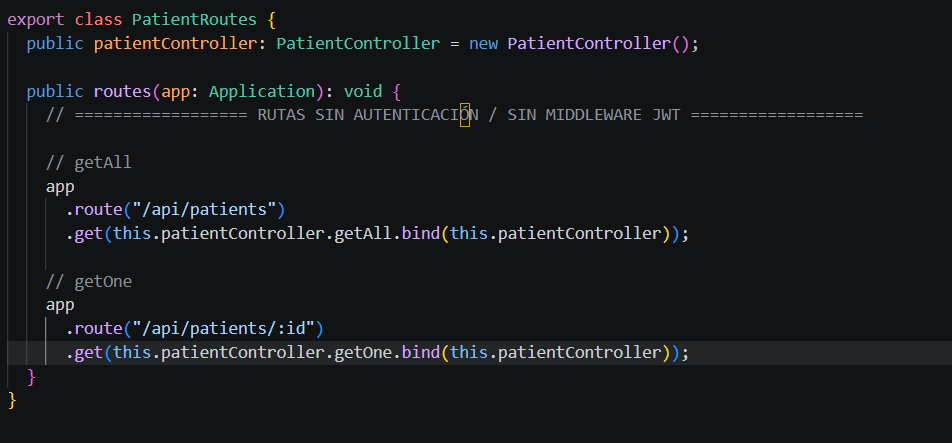

### 5.3 HTTP — `patients.get.http` (archivo nuevo)

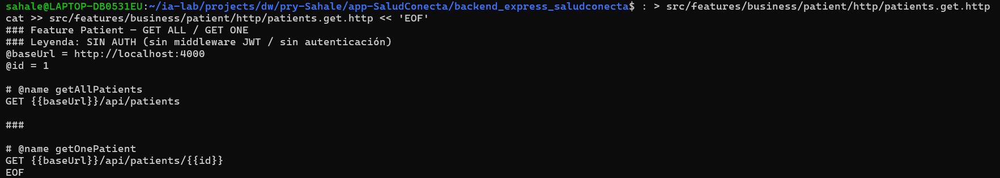

#### Verificación ISS-03-B

``` bash
npx tsc --noEmit
```

#### Cierre del ISS

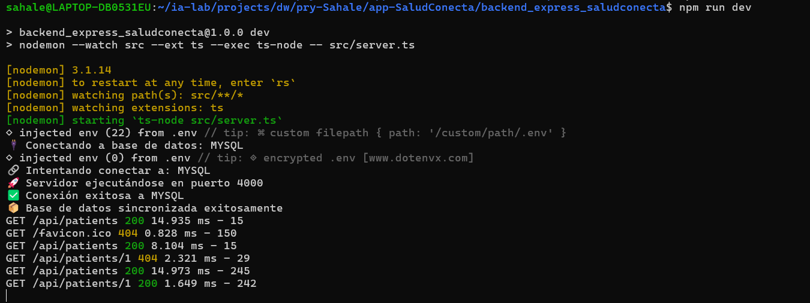

## 6. ISS-03-C — Feature Patient: Crear paciente

**Objetivo:** dar de alta pacientes vía API, después de getAll y getOne.\
**Bloqueado por:** ISS-03-B.

### 6.1 PARCHE — `patient.controller.ts`

**Reemplazar** la línea:

``` typescript
  // (rellenar en ISS-03-C)
```

que está **debajo de** `// ================== CREATE ==================` y **encima de** `// ================== UPDATE ==================`, por:

``` typescript
  public async create(req: Request, res: Response) {
    try {
      const body = req.body as PatientI;
      const patient = await Patient.create({
        document_type: body.document_type,
        document_number: body.document_number,
        name: body.name,
        birth_date: body.birth_date,
        contact: body.contact,
        status: body.status ?? "active",
      });
      res.status(201).json({ patient });
    } catch (error) {
      res.status(500).json({ error: "Error creating patient", detail: String(error) });
    }
  }
```

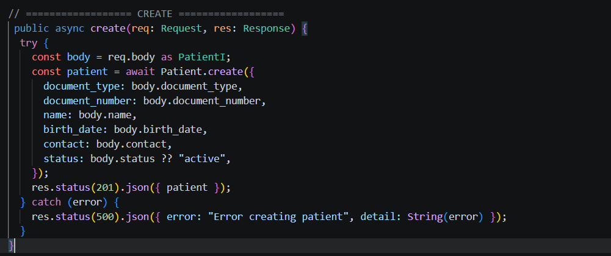

### 6.2 PARCHE — `patient.routes.ts`

**Debajo de** el bloque `// getOne` (después de su `.get(...getOne...)`), **añadir:**

``` typescript

    // create
    app
      .route("/api/patients")
      .post(this.patientController.create.bind(this.patientController));
```

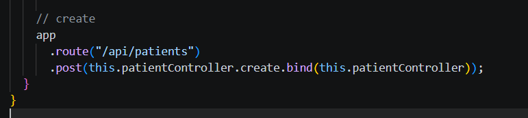

### 6.3 HTTP — `patients.create.http` (archivo nuevo)

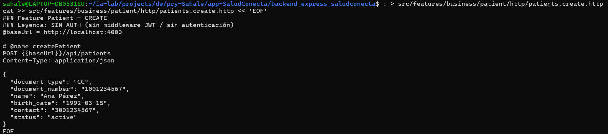

#### Verificación ISS-03-C

``` bash
npx tsc --noEmit
```

Con `npm run dev` corriendo, en la segunda terminal:

``` bash
curl -s -X POST http://localhost:4000/api/patients \
  -H 'Content-Type: application/json' \
  -d '{"document_type":"CC","document_number":"1009999999","name":"Ana","birth_date":"1992-03-15","contact":"3001","status":"active"}'
```

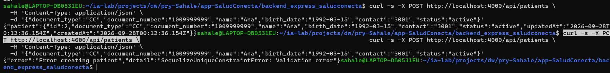

Debe responder `201` con `{"patient":{...}}`. Si repites el mismo `document_number`, responde `500` con `SequelizeUniqueConstraintError` en `detail`. Eso confirma que el `UNIQUE` funciona (el manual no hace un manejo especial de ese error).

#### Cierre del ISS

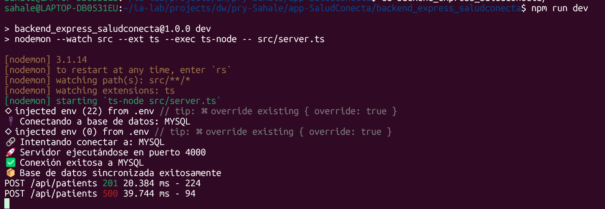

## 7. ISS-03-D — Feature Patient: Update (PUT) y Update (PATCH)

**Objetivo:** actualización completa y parcial.\
**Bloqueado por:** ISS-03-C.

### 7.1 PARCHE — `patient.controller.ts`

**Reemplazar** la línea:

``` typescript
  // (rellenar en ISS-03-D)
```

que está **debajo de** `// ================== UPDATE ==================` y **encima de** `// ================== DELETE ==================`, por:

``` typescript
  public async updatePut(req: Request, res: Response) {
    try {
      const id = paramId(req);
      const body = req.body as PatientI;
      const patient = await Patient.findByPk(id);
      if (!patient) {
        res.status(404).json({ error: "Patient not found" });
        return;
      }

      await patient.update({
        document_type: body.document_type,
        document_number: body.document_number,
        name: body.name,
        birth_date: body.birth_date,
        contact: body.contact,
        status: body.status ?? patient.status,
      });

      res.status(200).json({ patient });
    } catch (error) {
      res.status(500).json({ error: "Error updating patient (PUT)", detail: String(error) });
    }
  }

  public async updatePatch(req: Request, res: Response) {
    try {
      const id = paramId(req);
      const body = req.body as Partial<PatientI>;
      const patient = await Patient.findByPk(id);
      if (!patient) {
        res.status(404).json({ error: "Patient not found" });
        return;
      }

      await patient.update(body);
      res.status(200).json({ patient });
    } catch (error) {
      res.status(500).json({ error: "Error updating patient (PATCH)", detail: String(error) });
    }
  }
```

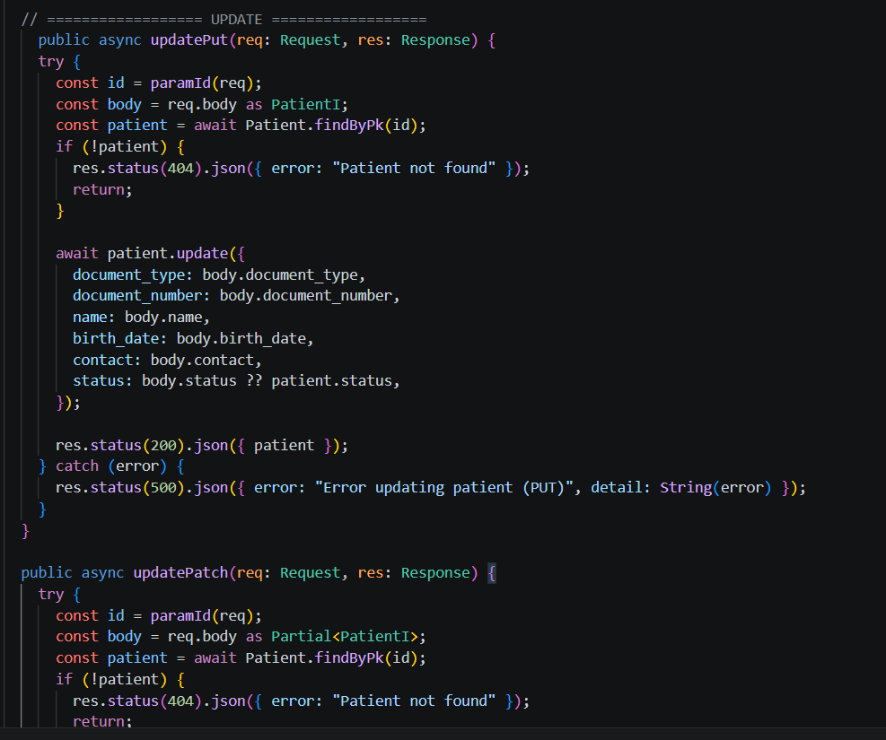

### 7.2 PARCHE — `patient.routes.ts`

**Debajo de** el bloque `// create`, **añadir:**

``` typescript

    // update (PUT / PATCH)
    app
      .route("/api/patients/:id")
      .put(this.patientController.updatePut.bind(this.patientController))
      .patch(this.patientController.updatePatch.bind(this.patientController));
```

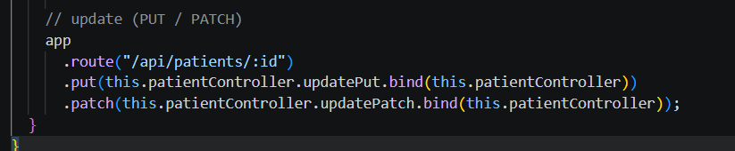

### 7.3 HTTP — `patients.update.http` (archivo nuevo)

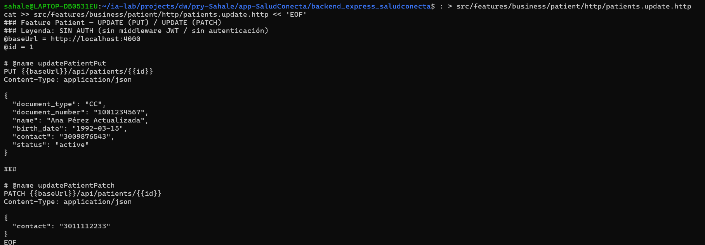

#### Verificación ISS-03-D

``` bash
npx tsc --noEmit
```

Con el servidor corriendo:

``` bash
curl -s -X PUT http://localhost:4000/api/patients/1 -H 'Content-Type: application/json' \
  -d '{"document_type":"CC","document_number":"1000000001","name":"Paciente Editado","birth_date":"1990-05-10","contact":"300","status":"active"}'
curl -s -X PATCH http://localhost:4000/api/patients/1 -H 'Content-Type: application/json' \
  -d '{"contact":"301"}'
```

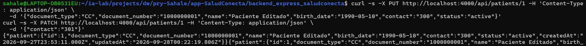

#### Cierre del ISS

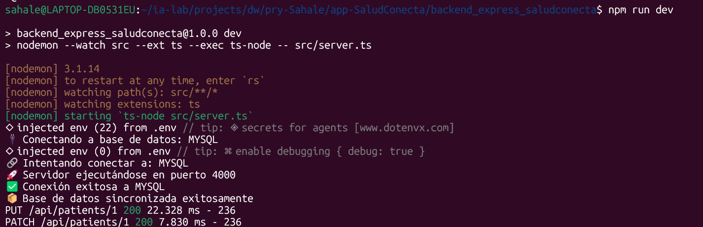

## 8. ISS-03-E — Feature Patient: Eliminar (físico y lógico)

**Objetivo:** borrado físico (`DELETE`) y lógico (`status = 'inactive'`).\
**Bloqueado por:** ISS-03-D.

### 8.1 PARCHE — `patient.controller.ts`

**Reemplazar** la línea:

``` typescript
  // (rellenar en ISS-03-E)
```

que está **debajo de** `// ================== DELETE ==================`, por:

``` typescript
  /** Eliminación física */
  public async deletePhysical(req: Request, res: Response) {
    try {
      const id = paramId(req);
      const patient = await Patient.findByPk(id);
      if (!patient) {
        res.status(404).json({ error: "Patient not found" });
        return;
      }
      await patient.destroy();
      res.status(200).json({ message: "Patient permanently deleted", id });
    } catch (error) {
      res.status(500).json({ error: "Error deleting patient", detail: String(error) });
    }
  }

  /** Eliminación lógica → status = inactive */
  public async deleteLogical(req: Request, res: Response) {
    try {
      const id = paramId(req);
      const patient = await Patient.findByPk(id);
      if (!patient) {
        res.status(404).json({ error: "Patient not found" });
        return;
      }
      await patient.update({ status: "inactive" });
      res.status(200).json({ message: "Patient deactivated (logical delete)", patient });
    } catch (error) {
      res.status(500).json({ error: "Error deactivating patient", detail: String(error) });
    }
  }
```

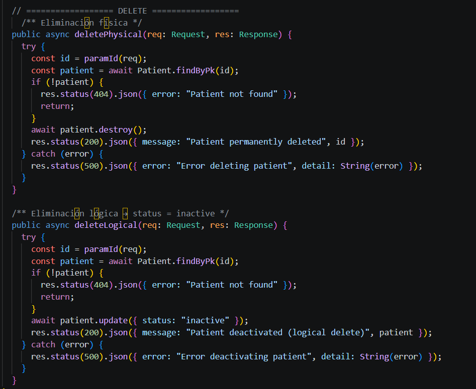

### 8.2 PARCHE — `patient.routes.ts`

**Debajo de** el bloque `// update (PUT / PATCH)`, **añadir:**

``` typescript

    // delete físico
    app
      .route("/api/patients/:id")
      .delete(this.patientController.deletePhysical.bind(this.patientController));

    // delete lógico
    app
      .route("/api/patients/:id/deactivate")
      .patch(this.patientController.deleteLogical.bind(this.patientController));
```

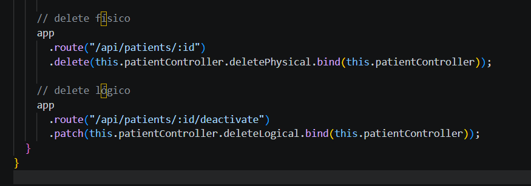

### 8.3 HTTP — `patients.delete.http` (archivo nuevo)

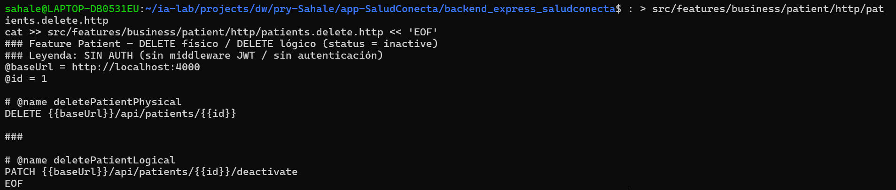

#### 8.4 Estado final consolidado — `patient.controller.ts`

``` bash
: > src/features/business/patient/patient.controller.ts
cat >> src/features/business/patient/patient.controller.ts << 'EOF'
import { Request, Response } from "express";
import { Patient, PatientI } from "./patient.model";

function paramId(req: Request): number {
  const raw = req.params.id;
  const value = Array.isArray(raw) ? raw[0] : raw;
  return Number(value);
}

export class PatientController {
  // ================== READ ==================
  public async getAll(req: Request, res: Response) {
    try {
      const patients = await Patient.findAll({
        where: { status: "active" },
      });
      res.status(200).json({ patients });
    } catch (error) {
      res.status(500).json({ error: "Error fetching patients", detail: String(error) });
    }
  }

  public async getOne(req: Request, res: Response) {
    try {
      const id = paramId(req);
      const patient = await Patient.findByPk(id);
      if (!patient) {
        res.status(404).json({ error: "Patient not found" });
        return;
      }
      res.status(200).json({ patient });
    } catch (error) {
      res.status(500).json({ error: "Error fetching patient", detail: String(error) });
    }
  }

  // ================== CREATE ==================
  public async create(req: Request, res: Response) {
    try {
      const body = req.body as PatientI;
      const patient = await Patient.create({
        document_type: body.document_type,
        document_number: body.document_number,
        name: body.name,
        birth_date: body.birth_date,
        contact: body.contact,
        status: body.status ?? "active",
      });
      res.status(201).json({ patient });
    } catch (error) {
      res.status(500).json({ error: "Error creating patient", detail: String(error) });
    }
  }

  // ================== UPDATE ==================
  public async updatePut(req: Request, res: Response) {
    try {
      const id = paramId(req);
      const body = req.body as PatientI;
      const patient = await Patient.findByPk(id);
      if (!patient) {
        res.status(404).json({ error: "Patient not found" });
        return;
      }

      await patient.update({
        document_type: body.document_type,
        document_number: body.document_number,
        name: body.name,
        birth_date: body.birth_date,
        contact: body.contact,
        status: body.status ?? patient.status,
      });

      res.status(200).json({ patient });
    } catch (error) {
      res.status(500).json({ error: "Error updating patient (PUT)", detail: String(error) });
    }
  }

  public async updatePatch(req: Request, res: Response) {
    try {
      const id = paramId(req);
      const body = req.body as Partial<PatientI>;
      const patient = await Patient.findByPk(id);
      if (!patient) {
        res.status(404).json({ error: "Patient not found" });
        return;
      }

      await patient.update(body);
      res.status(200).json({ patient });
    } catch (error) {
      res.status(500).json({ error: "Error updating patient (PATCH)", detail: String(error) });
    }
  }

  // ================== DELETE ==================
  /** Eliminación física */
  public async deletePhysical(req: Request, res: Response) {
    try {
      const id = paramId(req);
      const patient = await Patient.findByPk(id);
      if (!patient) {
        res.status(404).json({ error: "Patient not found" });
        return;
      }
      await patient.destroy();
      res.status(200).json({ message: "Patient permanently deleted", id });
    } catch (error) {
      res.status(500).json({ error: "Error deleting patient", detail: String(error) });
    }
  }

  /** Eliminación lógica → status = inactive */
  public async deleteLogical(req: Request, res: Response) {
    try {
      const id = paramId(req);
      const patient = await Patient.findByPk(id);
      if (!patient) {
        res.status(404).json({ error: "Patient not found" });
        return;
      }
      await patient.update({ status: "inactive" });
      res.status(200).json({ message: "Patient deactivated (logical delete)", patient });
    } catch (error) {
      res.status(500).json({ error: "Error deactivating patient", detail: String(error) });
    }
  }
}
EOF
```

#### 8.5 Estado final consolidado — `patient.routes.ts`

``` bash
: > src/features/business/patient/patient.routes.ts
cat >> src/features/business/patient/patient.routes.ts << 'EOF'
import { Application } from "express";
import { PatientController } from "./patient.controller";

export class PatientRoutes {
  public patientController: PatientController = new PatientController();

  public routes(app: Application): void {
    // ================== RUTAS SIN AUTENTICACIÓN / SIN MIDDLEWARE JWT ==================

    // getAll
    app
      .route("/api/patients")
      .get(this.patientController.getAll.bind(this.patientController));

    // getOne
    app
      .route("/api/patients/:id")
      .get(this.patientController.getOne.bind(this.patientController));

    // create
    app
      .route("/api/patients")
      .post(this.patientController.create.bind(this.patientController));

    // update (PUT / PATCH)
    app
      .route("/api/patients/:id")
      .put(this.patientController.updatePut.bind(this.patientController))
      .patch(this.patientController.updatePatch.bind(this.patientController));

    // delete físico
    app
      .route("/api/patients/:id")
      .delete(this.patientController.deletePhysical.bind(this.patientController));

    // delete lógico
    app
      .route("/api/patients/:id/deactivate")
      .patch(this.patientController.deleteLogical.bind(this.patientController));
  }
}
EOF
```

#### Verificación ISS-03-E

``` bash
npx tsc --noEmit
```

Con el servidor corriendo, en este orden (primero la baja lógica, luego la física, como en el manual):

``` bash
curl -s -X PATCH http://localhost:4000/api/patients/1/deactivate
curl -s http://localhost:4000/api/patients
curl -s -X DELETE http://localhost:4000/api/patients/1
curl -s http://localhost:4000/api/patients/1
```

> Después de la baja lógica, `GET /api/patients` ya no lista el id 1 porque solo muestra `active`. Después del DELETE, `GET /api/patients/1` responde 404.

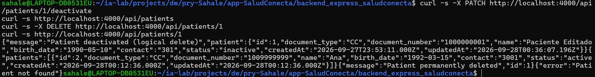

#### Cierre del ISS

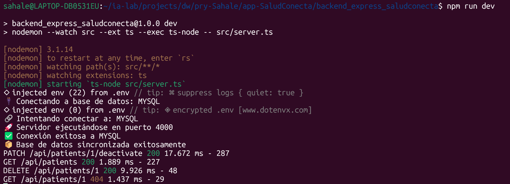

## 9. ISS-04 — Seeders con Faker (feature + runner externo)

**Objetivo:** generar datos falsos de Patient con Faker, más un orquestador externo que ejecuta todos los seeders con una cantidad configurable por entidad.\
**Bloqueado por:** ISS-03-A (modelo). Se recomienda hacerlo después de ISS-03-E.

### 9.1 Seeder dentro del feature Patient

#### 9.1.a Dependencia

Es infraestructura genérica, así que va igual que en el manual:

``` bash
npm install -D @faker-js/faker@^10.6.0
```

#### 9.1.b `patient.seeder.ts` (archivo nuevo)

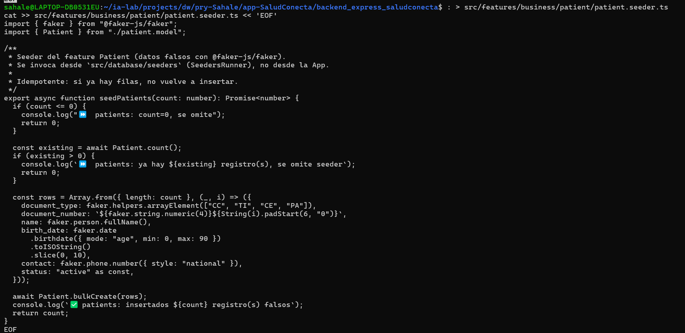

### 9.2 SeedersRunner + conteos por entidad (`database/seeders`)

#### 9.2.1 `counts.ts` (archivo nuevo)

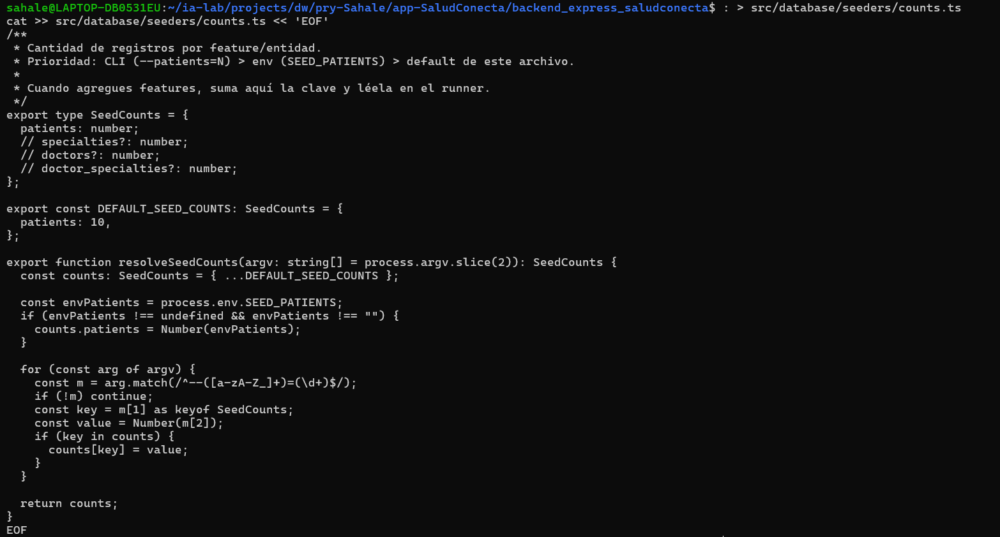

#### 9.2.2 `index.ts`, el runner (archivo nuevo)

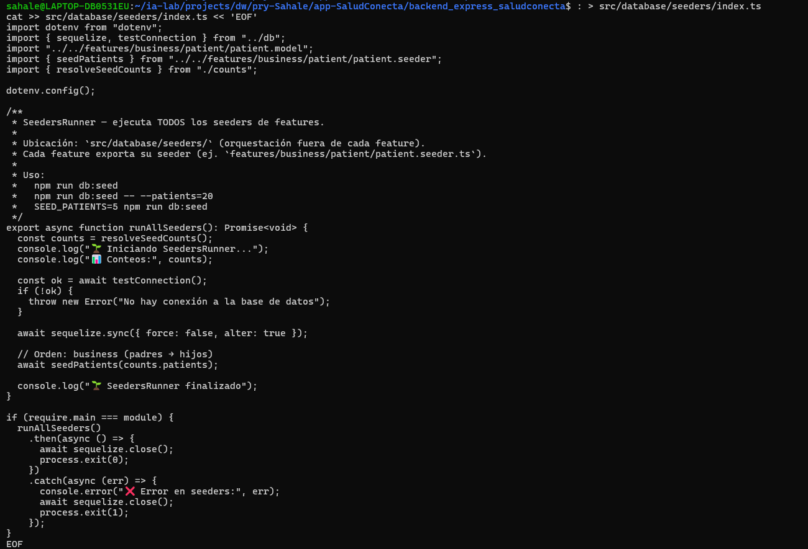

#### 9.2.3 PARCHE — `package.json` (script `db:seed`)

Dentro de `"scripts"`, debajo de `"dev"`, se agrega la clave `db:seed`:

``` bash
npm pkg set "scripts.db:seed=ts-node -- src/database/seeders/index.ts"
```

Estado esperado:

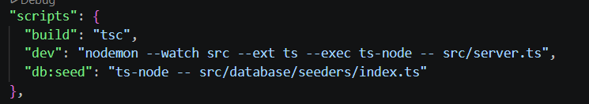

#### Verificación ISS-04

``` bash
npx tsc --noEmit
```

``` bash
npm run db:seed
npm run db:seed -- --patients=20
SEED_PATIENTS=5 npm run db:seed
```

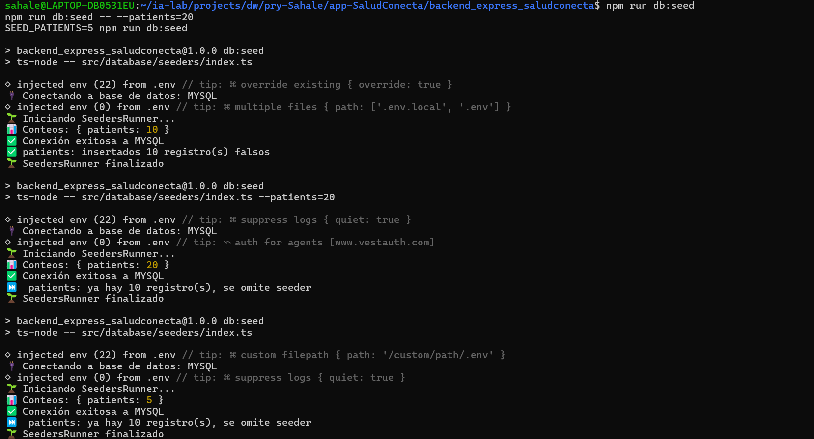

La primera inserta 10, porque es el default. La segunda y la tercera muestran `📊 Conteos: { patients: 20 }` y `{ patients: 5 }`, lo que confirma que el CLI y el env se leen bien. Pero omiten la inserción, porque ya hay filas. Ese es exactamente el comportamiento del manual. Para ver insertar 20 o 5, vacía la tabla antes de cada una.

``` bash
curl -s -w "\n%{http_code}\n" http://localhost:4000/api/patients
```


#### Cierre del ISS


## 10. ISS-05 — Swagger / OpenAPI (feature + registry externo)

**Objetivo:** documentar el API de Patient en OpenAPI 3 y montar Swagger UI desde un registry externo, con el mismo patrón que los seeders.\
**Bloqueado por:** ISS-03-E (rutas CRUD definidas).

### 10.1 OpenAPI dentro del feature Patient

#### 10.1.a Dependencias

``` bash
npm install swagger-ui-express@^5.0.1
npm install -D @types/swagger-ui-express@^4.1.8
```

#### 10.1.b `patient.swagger.ts` (archivo nuevo)


### 10.2 Registry externo + montaje en Config

#### 10.2.a Carpeta `src/swagger/`

``` bash
mkdir -p src/swagger
```

#### 10.2.b `src/swagger/index.ts` (archivo nuevo)


#### 10.2.c PARCHE — `src/config/index.ts`

**1. Debajo de** `import { Routes } from "../routes/index";`, **añadir:**

``` typescript
import { setupSwagger } from "../swagger/index";
```


**2. Dentro del** `constructor`, **debajo de** `this.routes();` y **encima de** `this.dbConnection();`, **añadir:**

``` typescript
    this.docs();
```


**3. Dentro de** la clase `App`, **debajo de** el método `routes()` completo (después de su llave de cierre `}`) y **encima de** `private async dbConnection()`, **añadir:**

``` typescript
  
  private docs(): void {
    setupSwagger(this.app);
  }
```


**Comprobación rápida:**

``` bash
grep -n -E "setupSwagger|this.docs|private docs" src/config/index.ts
```


#### Verificación ISS-05

``` bash
npx tsc --noEmit

curl -s http://localhost:4000/api/docs.json | head -c 400; echo
```


#### Cierre del ISS


## 11. ISS-06 — Feature Specialty (especialidades)

**Objetivo:** CRUD + seeder + swagger de Specialty, un catálogo simple sin FK.\
**Bloqueado por:** ISS-05.\
**API:** `/api/specialties`, **SIN AUTH**.\
**Patrón del manual:** ProductType (§11.1–11.6).

La carpeta de la entidad es nueva. Un solo `mkdir -p` crea la base y `http/`, como en el manual (§11):

``` bash
mkdir -p src/features/business/specialty/http
```

#### 11.1 Modelo Specialty


### 11.2 Controller + routes (CRUD completo)

#### 11.2.a `specialty.controller.ts`


#### 11.2.b `specialty.routes.ts`


### 11.3 HTTP (REST Client)

#### 11.3.a `specialties.get.http`


#### 11.3.b `specialties.create.http`


#### 11.3.c `specialties.update.http`


#### 11.3.d `specialties.delete.http`


### 11.4 Cableado Routes + Config

#### 11.4.a PARCHE — `src/routes/index.ts`

**1. Debajo de** `import { PatientRoutes } from "../features/business/patient/patient.routes";`, **añadir:**

``` typescript
import { SpecialtyRoutes } from "../features/business/specialty/specialty.routes";
```


**2. Dentro de** `export class Routes`, **debajo de** `public patientRoutes: PatientRoutes = new PatientRoutes();`, **añadir:**

``` typescript
  public specialtyRoutes: SpecialtyRoutes = new SpecialtyRoutes();
```


#### 11.4.b PARCHE — `src/config/index.ts`

**1. Debajo de** `import "../features/business/patient/patient.model";`, **añadir:**

``` typescript
import "../features/business/specialty/specialty.model";
```


**2. Dentro de** `routes()`, **debajo de** `this.routePrv.patientRoutes.routes(this.app);`, **añadir:**

``` typescript
    this.routePrv.specialtyRoutes.routes(this.app);
```


``` bash
npx tsc --noEmit
```

#### Verificación intermedia (API)

``` bash
curl -s -w "\n%{http_code}\n" -X POST http://localhost:4000/api/specialties \
  -H 'Content-Type: application/json' \
  -d '{"name":"Pediatría","description":"Atención de niños y adolescentes","status":"active"}'
curl -s -w "\n%{http_code}\n" http://localhost:4000/api/specialties
```


### 11.5 Seeder Specialty

#### 11.5.a `specialty.seeder.ts` (archivo nuevo)


#### 11.5.b PARCHE — `src/database/seeders/counts.ts`

**1. Dentro de** `export type SeedCounts`, **reemplazar** la línea:

``` typescript
  // specialties?: number;
```

**por:**

``` typescript
  specialties: number;
```


**2. Dentro de** `DEFAULT_SEED_COUNTS`, **debajo de** `patients: 10,`, **añadir:**

``` typescript
  specialties: 10,
```


**3. Dentro de** `resolveSeedCounts`, **debajo de** el bloque `if (envPatients ...) { ... }` (su llave de cierre) y **encima de** `for (const arg of argv) {`, **añadir:**

``` typescript

  const envSpecialties = process.env.SEED_SPECIALTIES;
  if (envSpecialties !== undefined && envSpecialties !== "") {
    counts.specialties = Number(envSpecialties);
  }
```


#### 11.5.c PARCHE — `src/database/seeders/index.ts` (runner)

**1. Debajo de** `import "../../features/business/patient/patient.model";`, **añadir:**

``` typescript
import "../../features/business/specialty/specialty.model";
```


**2. Debajo de** `import { seedPatients } from "../../features/business/patient/patient.seeder";`, **añadir:**

``` typescript
import { seedSpecialties } from "../../features/business/specialty/specialty.seeder";
```


**3. Debajo de** `await seedPatients(counts.patients);`, **añadir:**

``` typescript
  await seedSpecialties(counts.specialties);
```


``` bash
npx tsc --noEmit
```

> `specialties` ya tiene la fila que creaste en la verificación intermedia, así que el seeder la omitirá. Si quieres verlo insertar, vacía primero: `mysql -h 127.0.0.1 -P 3307 -u express_admin -p backend_express -e "DELETE FROM specialties;"`

``` bash
npm run db:seed
```


### 11.6 Swagger Specialty

#### 11.6.a `specialty.swagger.ts` (archivo nuevo)


](images/clipboard-1446177125.png)


#### 11.6.b PARCHE — `src/swagger/index.ts` (registry)

**1. Debajo de** `import { patientSwagger } from "../features/business/patient/patient.swagger";`, **añadir:**

``` typescript
import { specialtySwagger } from "../features/business/specialty/specialty.swagger";
```


**2. Dentro de** `featureSwaggerModules`, **reemplazar** la línea:

``` typescript
  // specialtySwagger,
```

**por:**

``` typescript
  specialtySwagger,
```


#### Verificación ISS-06

``` bash
npx tsc --noEmit
```

**Con el servidor corriendo:**

```         
curl -s -w "\n%{http_code}\n" http://localhost:4000/api/specialties
curl -s http://localhost:4000/api/docs.json | grep -o '"name":"Specialties"'
```


#### Cierre del ISS

``` bash
npm run dev
```


## 12. ISS-07 — Feature Doctor (médicos)

**Objetivo:** CRUD + seeder + swagger de Doctor.\
**Bloqueado por:** ISS-06.\
**API:** `/api/doctors`, **SIN AUTH**.\
**Patrón del manual:** Product (§12.1–12.6), adaptado.

``` bash
mkdir -p src/features/business/doctor/http
```

#### 12.1 Modelo Doctor


### 12.2 Controller + routes

#### 12.2.a `doctor.controller.ts`


#### 12.2.b `doctor.routes.ts`


### 12.3 HTTP

#### 12.3.a `doctors.get.http`


#### 12.3.b `doctors.create.http`


#### 12.3.c `doctors.update.http`


#### 12.3.d `doctors.delete.http`


### 12.4 Cableado

#### 12.4.a PARCHE — `src/routes/index.ts`

**1. Debajo de** `import { SpecialtyRoutes } from "../features/business/specialty/specialty.routes";`, **añadir:**

``` typescript
import { DoctorRoutes } from "../features/business/doctor/doctor.routes";
```


**2. Dentro de** `Routes`, **debajo de** `public specialtyRoutes: SpecialtyRoutes = new SpecialtyRoutes();`, **añadir:**

``` typescript
public doctorRoutes: DoctorRoutes = new DoctorRoutes();
```


#### 12.4.b PARCHE — `src/config/index.ts` (modelo + ruta)

**1. Debajo de** `import "../features/business/specialty/specialty.model";`, **añadir:**

``` typescript
import "../features/business/doctor/doctor.model";
```


**2. Dentro de** `routes()`, **debajo de** `this.routePrv.specialtyRoutes.routes(this.app);`, **añadir:**

``` typescript
this.routePrv.doctorRoutes.routes(this.app);
```


``` bash
npx tsc --noEmit
```

### 12.5 Sync seguro para FKs (hueco del manual) — PARCHE `src/config/index.ts`

**Por qué ahora:** en ISS-08 aparecen las primeras FKs (`doctor_specialties → doctors / specialties`). Con MySQL, `sync({ alter: true })` puede fallar al alterar tablas que ya tienen restricciones FK. El manual lo resuelve en §13.7 desactivando `FOREIGN_KEY_CHECKS` solo durante el sync, y añade la opción `DB_SYNC_FORCE`. Lo dejo instalado desde ya.

**Dentro de** `dbConnection()`, **reemplazar** estas 4 líneas:

```         
      // alter: true actualiza columnas faltantes (ej. createdAt/updatedAt tras timestamps: true).
      // force: false no recrea tablas; no borra datos. En producción preferir migraciones.
      await sequelize.sync({ force: false, alter: true });
      console.log(`📦 Base de datos sincronizada exitosamente`);
```

**por:**

``` typescript
      // Lab: sync crea/altera tablas desde los modelos (BD limpia → snake_case desde cero).
      const force = process.env.DB_SYNC_FORCE === "true";
      const isMysql =
        sequelize.getDialect() === "mysql" || sequelize.getDialect() === "mariadb";

      if (isMysql) {
        await sequelize.query("SET FOREIGN_KEY_CHECKS = 0");
      }
      try {
        await sequelize.sync({ force, alter: !force });
      } finally {
        if (isMysql) {
          await sequelize.query("SET FOREIGN_KEY_CHECKS = 1");
        }
      }

      console.log(
        force
          ? "📦 Base de datos recreada (DB_SYNC_FORCE=true)"
          : "📦 Base de datos sincronizada exitosamente"
      );
```


- `DB_SYNC_FORCE` **no** se agrega al `.env`. Por defecto no existe, así que el comportamiento es `alter: true`, igual que antes.

- ⚠️ Si algún día corres `DB_SYNC_FORCE=true npm run dev`, se **borran y recrean todas las tablas con sus datos**. Úsalo solo cuando quieras empezar la BD desde cero.

```         
npx tsc --noEmit
```

### 12.6 Seeder + Swagger Doctor

#### 12.6.a `doctor.seeder.ts` (archivo nuevo)


#### 12.6.b PARCHE — `src/database/seeders/counts.ts`

**1. Dentro de** `SeedCounts`, **reemplazar** la línea:

``` typescript
  // doctors?: number;
```

**por:**

``` typescript
  doctors: number;
```


**2. Dentro de** `DEFAULT_SEED_COUNTS`, **debajo de** `specialties: 10,`, **añadir:**

``` typescript
  doctors: 15,
```


**3. Dentro de** `resolveSeedCounts`, **debajo de** el bloque `if (envSpecialties ...) { ... }` y **encima de** `for (const arg of argv) {`, **añadir:**

``` typescript

  const envDoctors = process.env.SEED_DOCTORS;
  if (envDoctors !== undefined && envDoctors !== "") {
    counts.doctors = Number(envDoctors);
  }
```


#### 12.6.c PARCHE — `src/database/seeders/index.ts` (runner)

**1. Debajo de** `import "../../features/business/specialty/specialty.model";`, **añadir:**

``` typescript
import "../../features/business/doctor/doctor.model";
```


**2. Debajo de** `import { seedSpecialties } from "../../features/business/specialty/specialty.seeder";`, **añadir:**

``` typescript
import { seedDoctors } from "../../features/business/doctor/doctor.seeder";
```


**3. Debajo de** `await seedSpecialties(counts.specialties);`, **añadir:**

``` typescript
  await seedDoctors(counts.doctors);
```


#### 12.6.d `doctor.swagger.ts` (archivo nuevo)

](images/clipboard-4098916138.png)

#### 12.6.e PARCHE — `src/swagger/index.ts` (registry)

**1. Debajo de** `import { specialtySwagger } from "../features/business/specialty/specialty.swagger";`, **añadir:**

``` typescript
import { doctorSwagger } from "../features/business/doctor/doctor.swagger";
```


**2. Dentro de** `featureSwaggerModules`, **reemplazar** la línea:

``` typescript
  // doctorSwagger,
```

**por:**

``` typescript
  doctorSwagger,
```


#### Verificación ISS-07

``` bash
npx tsc --noEmit 
npm run db:seed
```

> Esperado: `📊 Conteos: { patients: 10, specialties: 10, doctors: 15 }`, luego `⏭️` para patients y specialties (ya tienen filas) y `✅ doctors: insertados 15`.


**Con `npm run dev` corriendo:**

``` bash
curl -s -w "\n%{http_code}\n" http://localhost:4000/api/doctors
curl -s -w "\n%{http_code}\n" -X POST http://localhost:4000/api/doctors \
  -H 'Content-Type: application/json' \
  -d '{"name":"Dra. Laura Ríos","description":"Pediatra","status":"active"}'
```

> En [**http://localhost:4000/api/docs**](http://localhost:4000/api/docs) deben aparecer tres grupos: Patients, Specialties y Doctors.


#### Cierre del ISS

](images/clipboard-2643533845.png)

## 13. ISS-08 — Feature DoctorSpecialty (pivote N:M médico ↔ especialidad)

**Objetivo:** implementar la relación N:M Doctor ↔ Specialty con un feature propio `doctor-specialty/` (tabla `doctor_specialties`), con CRUD, asociaciones, seeder y swagger.\
**Bloqueado por:** ISS-07 (Doctor) y ISS-06 (Specialty).\
**API:** `/api/doctor-specialties`, **SIN AUTH**.\
**Patrón del manual:** el feature `product-sale/` de ISS-08 (§13.1, 13.1b, 13.2b, 13.3b, 13.4b, 13.6b). La parte de Sale del manual corresponde a Cita (ISS-11), no a este ISS.

### 13.1 Modelo y asociaciones

#### 13.1.a `doctor-specialty.model.ts`


#### 13.1.b `doctor-specialty.associations.ts`


#### 13.2 Controller DoctorSpecialty

](images/clipboard-620016912.png)


### 13.3 Routes + HTTP

#### 13.3.a `doctor-specialty.routes.ts`


#### 13.3.b `doctor-specialties.get.http`


#### 13.3.c `doctor-specialties.create.http`


#### 13.3.d `doctor-specialties.update.http`


#### 13.3.e `doctor-specialties.delete.http`


### 13.4 Cableado + relaciones

#### 13.4.a PARCHE — `src/routes/index.ts`

**1. Debajo de** `import { DoctorRoutes } from "../features/business/doctor/doctor.routes";`, **añadir:**

``` typescript
import { DoctorSpecialtyRoutes } from "../features/business/doctor-specialty/doctor-specialty.routes";
```


**2. Dentro de** `Routes`, **debajo de** `public doctorRoutes: DoctorRoutes = new DoctorRoutes();`, **añadir:**

``` typescript
  public doctorSpecialtyRoutes: DoctorSpecialtyRoutes = new DoctorSpecialtyRoutes();
```


#### 13.4.b PARCHE — `src/config/index.ts`

**1. Debajo de** `import "../features/business/doctor/doctor.model";`, **añadir** el modelo y, justo debajo, sus asociaciones. Van encima de `import { Routes }`, como indica el manual en §12.5 y §13.5:

``` typescript
import "../features/business/doctor-specialty/doctor-specialty.model";
import "../features/business/doctor-specialty/doctor-specialty.associations";
```


**2. Dentro de** `routes()`, **debajo de** `this.routePrv.doctorRoutes.routes(this.app);`, **añadir:**

``` typescript
    this.routePrv.doctorSpecialtyRoutes.routes(this.app);
```


**Comprobación de que las asociaciones quedaron después de los tres modelos que usan:**

``` bash
grep -n "features/business" src/config/index.ts
```

> Orden esperado: patient.model → specialty.model → doctor.model → doctor-specialty.model → doctor-specialty.associations.


### 13.5 Seeder + counts + runner

#### 13.5.a `doctor-specialty.seeder.ts`


#### 13.5.b PARCHE — `src/database/seeders/counts.ts`

**1. Dentro de** `SeedCounts`, **reemplazar** la línea:

``` typescript
  // doctor_specialties?: number;
```

**por:**

``` typescript
  doctor_specialties: number;
```


**2. Dentro de** `DEFAULT_SEED_COUNTS`, **debajo de** `doctors: 15,`, **añadir:**

``` typescript
  doctor_specialties: 12,
```


**3. Dentro de** `resolveSeedCounts`, **debajo de** el bloque `if (envDoctors ...) { ... }` y **encima de** `for (const arg of argv) {`, **añadir:**

``` typescript

  const envDoctorSpecialties = process.env.SEED_DOCTOR_SPECIALTIES;
  if (envDoctorSpecialties !== undefined && envDoctorSpecialties !== "") {
    counts.doctor_specialties = Number(envDoctorSpecialties);
  }
```


#### 13.5.c PARCHE — `src/database/seeders/index.ts` (runner)

**1. Debajo de** `import "../../features/business/doctor/doctor.model";`, **añadir:**

``` typescript
import "../../features/business/doctor-specialty/doctor-specialty.model"; 
import "../../features/business/doctor-specialty/doctor-specialty.associations";
```


**2. Debajo de** `import { seedDoctors } from "../../features/business/doctor/doctor.seeder";`, **añadir:**

``` typescript
import { seedDoctorSpecialties } from "../../features/business/doctor-specialty/doctor-specialty.seeder";
```


**3. Dentro de** `runAllSeeders()`, **reemplazar** la línea:

``` typescript
  await sequelize.sync({ force: false, alter: true });
```

**por el bloque del manual (§13.7), porque ya hay FKs:**

``` typescript
  const isMysql =
    sequelize.getDialect() === "mysql" || sequelize.getDialect() === "mariadb";
  if (isMysql) {
    await sequelize.query("SET FOREIGN_KEY_CHECKS = 0");
  }
  try {
    await sequelize.sync({ force: false, alter: true });
  } finally {
    if (isMysql) {
      await sequelize.query("SET FOREIGN_KEY_CHECKS = 1");
    }
  }
```


**4. Debajo de** `await seedDoctors(counts.doctors);`, **añadir:**

``` typescript
  await seedDoctorSpecialties(counts.doctor_specialties);
```


```         
npx tsc --noEmit
```

### 13.6 Swagger DoctorSpecialty

#### 13.6.a `doctor-specialty.swagger.ts`


#### 13.6.b PARCHE — `src/swagger/index.ts` (registry)

**1. Debajo de** `import { doctorSwagger } from "../features/business/doctor/doctor.swagger";`, **añadir:**

``` typescript
import { doctorSpecialtySwagger } from "../features/business/doctor-specialty/doctor-specialty.swagger";
```


**2. Dentro de** `featureSwaggerModules`, **debajo de** `doctorSwagger,`, **añadir:**

``` typescript
  doctorSpecialtySwagger,
```


#### Verificación ISS-08

``` bash
npx tsc --noEmit npm run db:seed
```

> Esperado: `📊 Conteos: { patients: 10, specialties: 10, doctors: 15, doctor_specialties: 12 }` y `✅ doctor_specialties: insertados 12`.


**Revisa en la BD las FKs y el índice único con nombre:**

``` bash
mysql -h 127.0.0.1 -P 3307 -u express_admin -p backend_express -e "SHOW CREATE TABLE doctor_specialties\G"
```

> Deben aparecer `FOREIGN KEY (doctor_id) REFERENCES doctors (id)`, `FOREIGN KEY (specialty_id) REFERENCES specialties (id)` y `UNIQUE KEY doctor_specialties_doctor_id_specialty_id_unique (doctor_id, specialty_id)`.


**Con `npm run dev` corriendo:**

``` bash
curl -s -w "\n%{http_code}\n" http://localhost:4000/api/doctor-specialties
```


**Prueba del par repetido. Toma un `doctor_id` / `specialty_id` que ya salgan en el GET anterior:**

``` bash
curl -s -w "\n%{http_code}\n" -X POST http://localhost:4000/api/doctor-specialties \
  -H 'Content-Type: application/json' \
  -d '{"doctor_id":1,"specialty_id":1,"relation_data":"Prueba"}'
```

> Si el par ya existe, la respuesta es `400` con `"Doctor already has this specialty"`. Si no existe, es `201`. Repite el mismo comando para ver el `400`.
>
> 
>
> En **/api/docs** aparece el grupo **DoctorSpecialties**, y ya son 4 grupos en total.

**Nota sobre el borrado físico de padres.** Ahora que existen FKs, un `DELETE /api/doctors/:id` o `/api/specialties/:id` de un registro que tenga relaciones en `doctor_specialties` queda sujeto a la regla ON DELETE que Sequelize puso en la FK (puedes verla en el `SHOW CREATE TABLE` de arriba). Según esa regla, se borran las relaciones en cascada o MySQL rechaza el borrado (500). En ambos casos, para médicos o especialidades con relaciones, lo indicado es la **baja lógica** (`/deactivate`).

#### Cierre del ISS

``` bash
npm run dev
```


## 14. ISS-09 — Feature Service (servicios)

**Objetivo:** CRUD + seeder + swagger de Service, un catálogo simple sin FK.\
**Bloqueado por:** ISS-08.\
**API:** `/api/services`, **SIN AUTH**.\
**Patrón del manual:** ProductType (§11.1–11.6), igual que Specialty en ISS-06.

#### 14.1 Modelo Service


### 14.2 Controller + routes

#### 14.2.a `service.controller.ts`


#### 14.2.b `service.routes.ts`


### 14.3 HTTP

#### 14.3.a `services.get.http`


#### 14.3.b `services.create.http`


#### 14.3.c `services.update.http`


#### 14.3.d `services.delete.http`


### 14.4 Cableado Routes + Config

#### 14.4.a PARCHE — `src/routes/index.ts`

**1. Debajo de** `import { DoctorSpecialtyRoutes } from "../features/business/doctor-specialty/doctor-specialty.routes";`, **añadir:**

``` typescript
import { ServiceRoutes } from "../features/business/service/service.routes";
```


**2. Dentro de** `Routes`, **debajo de** `public doctorSpecialtyRoutes: DoctorSpecialtyRoutes = new DoctorSpecialtyRoutes();`, **añadir:**

``` typescript
  public serviceRoutes: ServiceRoutes = new ServiceRoutes();
```


#### 14.4.b PARCHE — `src/config/index.ts`

**1. Debajo de** `import "../features/business/doctor-specialty/doctor-specialty.model";` (y **encima de** `import "../features/business/doctor-specialty/doctor-specialty.associations";`), **añadir:**

``` typescript
import "../features/business/service/service.model";
```

> 

**2. Dentro de** `routes()`, **debajo de** `this.routePrv.doctorSpecialtyRoutes.routes(this.app);`, **añadir:**

```         
    this.routePrv.serviceRoutes.routes(this.app);
```


### 14.5 Seeder Service

#### 14.5.a `service.seeder.ts`


#### 14.5.b PARCHE — `src/database/seeders/counts.ts`

**1. Dentro de** `SeedCounts`, **debajo de** `doctor_specialties: number;`, **añadir:**

``` typescript
  services: number;
```


**2. Dentro de** `DEFAULT_SEED_COUNTS`, **debajo de** `doctor_specialties: 12,`, **añadir:**

``` typescript
  services: 10,
```


**3. Dentro de** `resolveSeedCounts`, **debajo de** el bloque `if (envDoctorSpecialties ...) { ... }` y **encima de** `for (const arg of argv) {`, **añadir:**

``` typescript

  const envServices = process.env.SEED_SERVICES;
  if (envServices !== undefined && envServices !== "") {
    counts.services = Number(envServices);
  }
```


#### 14.5.c PARCHE — `src/database/seeders/index.ts` (runner)

**1. Debajo de** `import "../../features/business/doctor-specialty/doctor-specialty.model";` (y **encima de** su import de `.associations`), **añadir:**

``` typescript
import "../../features/business/service/service.model";
```


**2. Debajo de** `import { seedDoctorSpecialties } from "../../features/business/doctor-specialty/doctor-specialty.seeder";`, **añadir:**

``` typescript
import { seedServices } from "../../features/business/service/service.seeder";
```


**3. Debajo de** `await seedDoctorSpecialties(counts.doctor_specialties);`, **añadir:**

``` typescript
  await seedServices(counts.services);
```

### 

### 14.6 Swagger Service

#### 14.6.a `service.swagger.ts`


#### 14.6.b PARCHE — `src/swagger/index.ts` (registry)

**1. Debajo de** `import { doctorSpecialtySwagger } from "../features/business/doctor-specialty/doctor-specialty.swagger";`, **añadir:**

``` typescript
import { serviceSwagger } from "../features/business/service/service.swagger";
```


**2. Dentro de** `featureSwaggerModules`, **debajo de** `doctorSpecialtySwagger,`, **añadir:**

``` typescript
  serviceSwagger,
```


#### Verificación ISS-09

``` bash
npx tsc --noEmit 
npm run db:seed
```

> Esperado: `📊 Conteos: { ..., doctor_specialties: 12, services: 10 }` y `✅ services: insertados 10`.


**Con `npm run dev` corriendo:**

``` bash
curl -s -w "\n%{http_code}\n" http://localhost:4000/api/services
curl -s -w "\n%{http_code}\n" -X POST http://localhost:4000/api/services \
  -H 'Content-Type: application/json' \
  -d '{"name":"Holter 24 horas","description":"Monitoreo cardiaco ambulatorio","status":"active"}'
```


#### Cierre del ISS


## **15. ISS-10 — Feature Agenda (agendas de médicos)**

**Objetivo:** CRUD + relación + seeder + swagger de Agenda, con FK `doctor_id` (Médico 1:N Agenda). **Bloqueado por:** ISS-09 (y Doctor, ISS-07). **API:** `/api/agendas`, **SIN AUTH**. **Patrón del manual:** Product (§12.1–12.6): catálogo con FK a padre + `assertActive…` + `*.associations.ts`.

### **15.1 Modelo Agenda**

#### **15.1.a `agenda.model.ts`**


### **15.2 Controller + routes**

#### **15.2.a `agenda.controller.ts`**


#### **15.2.b `agenda.routes.ts`**


### **15.3 HTTP**

#### **15.3.a `agendas.get.http`**


#### **15.3.b `agendas.create.http`**


#### **15.3.c `agendas.update.http`**


#### **15.3.d `agendas.delete.http`**


### **15.4 Cableado Routes + Config**

#### **15.4.a PARCHE — `src/routes/index.ts`**

**1.** **Debajo de** `import { ServiceRoutes } from "../features/business/service/service.routes";`, **añadir:**

``` typescript
import { AgendaRoutes } from "../features/business/agenda/agenda.routes"; 
```


**2.** **Dentro de** `Routes`, **debajo de** `public serviceRoutes: ServiceRoutes = new ServiceRoutes();`, **añadir:**

``` typescript
  public agendaRoutes: AgendaRoutes = new AgendaRoutes(); 
```


#### **15.4.b PARCHE — `src/config/index.ts` (modelo + ruta)**

**1.** **Debajo de** `import "../features/business/service/service.model";` (bloque de modelos, **encima de** los imports `.associations`), **añadir:**

``` typescript
import "../features/business/agenda/agenda.model"; 
```


**2.** **Dentro de** `routes()`, **debajo de** `this.routePrv.serviceRoutes.routes(this.app);`, **añadir:**

``` typescript
    this.routePrv.agendaRoutes.routes(this.app); 
```


### **15.5 Relaciones (obligatorio al cerrar la tabla)**

#### **15.5.a `agenda.associations.ts`**


### **15.5.b PARCHE — `src/config/index.ts` (asociaciones)**

**Debajo de** `import "../features/business/doctor-specialty/doctor-specialty.associations";` (y **encima de** `import { Routes } ...`), **añadir:**

``` typescript
import "../features/business/agenda/agenda.associations";
```


### **15.6 Seeder + Swagger Agenda**

#### **15.6.a `agenda.seeder.ts`**


#### **15.6.b PARCHE — `src/database/seeders/counts.ts`**

**1.** **Dentro de** `SeedCounts`, **debajo de** `services: number;`, **añadir:**

``` typescript
  agendas: number; 
```


**2.** **Dentro de** `DEFAULT_SEED_COUNTS`, **debajo de** `services: 10,`, **añadir:**

``` typescript
  agendas: 15, 
```


**3.** **Dentro de** `resolveSeedCounts`, **debajo de** el bloque `if (envServices ...) { ... }` (su llave de cierre) y **encima de** `for (const arg of argv) {`, **añadir:**

``` typescript

  const envAgendas = process.env.SEED_AGENDAS;
  if (envAgendas !== undefined && envAgendas !== "") {
    counts.agendas = Number(envAgendas);
  }
```


#### **15.6.c PARCHE — `src/database/seeders/index.ts` (runner)**

**1.** **Debajo de** `import "../../features/business/service/service.model";` (bloque de modelos), **añadir:**

``` typescript
import "../../features/business/agenda/agenda.model"; 
```


**2.** **Debajo de** `import "../../features/business/doctor-specialty/doctor-specialty.associations";`, **añadir:**

``` typescript
import "../../features/business/agenda/agenda.associations"; 
```


**3.** **Debajo de** `import { seedServices } from "../../features/business/service/service.seeder";`, **añadir:**

``` typescript
import { seedAgendas } from "../../features/business/agenda/agenda.seeder"; 
```


**4.** **Dentro de** `runAllSeeders()`, **debajo de** `await seedServices(counts.services);`, **añadir:**

``` typescript
  await seedAgendas(counts.agendas); 
```


#### **15.6.d `agenda.swagger.ts`**


#### **15.6.e PARCHE — `src/swagger/index.ts` (registry)**

**1.** **Debajo de** `import { serviceSwagger } from "../features/business/service/service.swagger";`, **añadir:**

``` typescript
import { agendaSwagger } from "../features/business/agenda/agenda.swagger"; 
```


**2.** **Dentro de** `featureSwaggerModules`, **debajo de** `serviceSwagger,`, **añadir:**

``` typescript
  agendaSwagger, 
```


#### **Verificación ISS-10**

``` bash
npx tsc --noEmit 
npm run db:seed 
```

> Esperado: en `📊 Conteos` aparece `agendas: 15` y luego `✅ agendas: insertados 15`.


**Con `npm run dev` corriendo:**

``` bash
curl -s -w "\n%{http_code}\n" http://localhost:4000/api/agendas
curl -s -w "\n%{http_code}\n" -X POST http://localhost:4000/api/agendas \
  -H 'Content-Type: application/json' \
  -d '{"name":"Agenda prueba","description":"Sábados","doctor_id":1,"status":"active"}'
curl -s -w "\n%{http_code}\n" -X POST http://localhost:4000/api/agendas \
  -H 'Content-Type: application/json' \
  -d '{"name":"Agenda sin médico","doctor_id":99999}'
```

> El primer POST responde `201` (si el médico 1 existe y está activo). El segundo responde `404` con `"Doctor not found"`.


Revisa la FK en la BD:

``` bash
mysql -h 127.0.0.1 -P 3307 -u express_admin -p backend_express -e "SHOW CREATE TABLE agendas\G" 
```

> Debe aparecer `FOREIGN KEY (doctor_id) REFERENCES doctors (id)`. En **/api/docs** aparece el grupo **Agendas**.


### **Cierre del ISS**


## **16. ISS-11 — Feature Appointment (citas)**

**Objetivo:** citas con FKs `agenda_id` y `patient_id`, create **transaccional** con validaciones de negocio, estado de negocio `state`, relaciones, seeder y swagger. **Bloqueado por:** ISS-10 (Agenda) y ISS-03 (Patient). **API:** `/api/appointments`, **SIN AUTH**. **Patrón del manual:** Sale (§13): cabecera transaccional con orquestación (`sequelize.transaction()`, `lock`, `rollback`).

### **16.1 Modelo Appointment**

#### **16.1.a `appointment.model.ts`**


### **16.2 Controller + routes**

#### **16.2.a `appointment.controller.ts`**


#### **16.2.b `appointment.routes.ts`**


### **16.3 HTTP**

#### **16.3.a `appointments.get.http`**


#### **16.3.b `appointments.create.http`**


#### **16.3.c `appointments.update.http`**


#### **16.3.d `appointments.delete.http`**


### **16.4 Cableado Routes + Config**

#### **16.4.a PARCHE — `src/routes/index.ts`**

**1.** **Debajo de** `import { AgendaRoutes } from "../features/business/agenda/agenda.routes";`, **añadir:**

``` typescript
import { AppointmentRoutes } from "../features/business/appointment/appointment.routes"; 
```


**2.** **Dentro de** `Routes`, **debajo de** `public agendaRoutes: AgendaRoutes = new AgendaRoutes();`, **añadir:**

``` typescript
  public appointmentRoutes: AppointmentRoutes = new AppointmentRoutes(); 
```


#### **16.4.b PARCHE — `src/config/index.ts` (modelo + ruta)**

**1.** **Debajo de** `import "../features/business/agenda/agenda.model";` (bloque de modelos, **encima de** los imports `.associations`), **añadir:**

``` typescript
import "../features/business/appointment/appointment.model"; 
```


**2.** **Dentro de** `routes()`, **debajo de** `this.routePrv.agendaRoutes.routes(this.app);`, **añadir:**

``` typescript
    this.routePrv.appointmentRoutes.routes(this.app); 
```


### **16.5 Relaciones (obligatorio al cerrar la tabla)**

#### **16.5.a `appointment.associations.ts`**


#### **16.5.b PARCHE — `src/config/index.ts` (asociaciones)**

**Debajo de** `import "../features/business/agenda/agenda.associations";` (y **encima de** `import { Routes } ...`), **añadir:**

``` typescript
import "../features/business/appointment/appointment.associations"; 
```


### **16.6 Seeder + Swagger Appointment**

#### **16.6.a `appointment.seeder.ts`**


### **16.6.b PARCHE — `src/database/seeders/counts.ts`**

**1.** **Dentro de** `SeedCounts`, **debajo de** `agendas: number;`, **añadir:**

``` typescript
  appointments: number; 
```


**2.** **Dentro de** `DEFAULT_SEED_COUNTS`, **debajo de** `agendas: 15,`, **añadir:**

``` typescript
  appointments: 20, 
```


**3.** **Dentro de** `resolveSeedCounts`, **debajo de** el bloque `if (envAgendas ...) { ... }` (su llave de cierre) y **encima de** `for (const arg of argv) {`, **añadir:**

``` typescript

  const envAppointments = process.env.SEED_APPOINTMENTS;
  if (envAppointments !== undefined && envAppointments !== "") {
    counts.appointments = Number(envAppointments);
  }
```


### **16.6.c PARCHE — `src/database/seeders/index.ts` (runner)**

**1.** **Debajo de** `import "../../features/business/agenda/agenda.model";` (bloque de modelos), **añadir:**

``` typescript
import "../../features/business/appointment/appointment.model"; 
```


**2.** **Debajo de** `import "../../features/business/agenda/agenda.associations";`, **añadir:**

``` typescript
import "../../features/business/appointment/appointment.associations"; 
```


**3.** **Debajo de** `import { seedAgendas } from "../../features/business/agenda/agenda.seeder";`, **añadir:**

``` typescript
import { seedAppointments } from "../../features/business/appointment/appointment.seeder"; 
```


**4.** **Dentro de** `runAllSeeders()`, **debajo de** `await seedAgendas(counts.agendas);`, **añadir:**

``` typescript
  await seedAppointments(counts.appointments); 
```


### **16.6.d `appointment.swagger.ts`**

](images/clipboard-1087054046.png)

### **16.6.e PARCHE — `src/swagger/index.ts` (registry)**

**1.** **Debajo de** `import { agendaSwagger } from "../features/business/agenda/agenda.swagger";`, **añadir:**

``` typescript
import { appointmentSwagger } from "../features/business/appointment/appointment.swagger"; 
```


**2.** **Dentro de** `featureSwaggerModules`, **debajo de** `agendaSwagger,`, **añadir:**

``` typescript
  appointmentSwagger, 
```


### **Verificación ISS-11**

``` bash
npx tsc --noEmit 
npm run db:seed 
```

> Esperado: `appointments: 20` en los conteos y `✅ appointments: insertados 20`.


Con `npm run dev` corriendo. Usa un `agenda_id` y un `patient_id` activos (míralos con `curl -s http://localhost:4000/api/agendas` y `/api/patients`):

``` bash
 curl -s -w "\n%{http_code}\n" -X POST http://localhost:4000/api/appointments \
  -H 'Content-Type: application/json' \
  -d '{"agenda_id":1,"patient_id":4,"start_date":"2026-12-01T10:00:00","end_date":"2026-12-01T10:30:00","reason":"Prueba"}'
```

> `201`, con `"state":"scheduled"`. Si repites **el mismo** comando, responde `400` con `"Agenda already has an appointment in that time range"`: la regla de cruce funciona.


Prueba de la regla del PDF (usa el `id` de la cita recién creada):

``` bash
curl -s -w "\n%{http_code}\n" -X PATCH http://localhost:4000/api/appointments/ID_DE_LA_CITA \
  -H 'Content-Type: application/json' -d '{"state":"attended"}'
```

> `400` con `"State 'attended' is set only by POST /api/encounters (requires clinical record)"`.

> En **/api/docs** aparece el grupo **Appointments**.


### **Cierre del ISS**


## **17. ISS-12 — Feature ClinicalRecord (historias clínicas)**

**Objetivo:** historia clínica con relación **1:1** con Patient (`patient_id` único), CRUD, consulta por paciente, relación, seeder y swagger. **Bloqueado por:** ISS-03 (Patient). Va **antes** de Encounter (ISS-14) porque Encounter tiene FK a `clinical_records`. **API:** `/api/clinical-records`, **SIN AUTH**. **Patrón del manual:** Client (CRUD raíz) + FK con `assert…` (Product) + unicidad del par, como en ISS-08.

### **17.1 Modelo ClinicalRecord**

#### **17.1.a `clinical-record.model.ts`**


### **17.2 Controller + routes**

#### **17.2.a `clinical-record.controller.ts`**


#### **17.2.b `clinical-record.routes.ts`**


### **17.3 HTTP**

#### **17.3.a `clinical-records.get.http`**


#### **17.3.b `clinical-records.create.http`**


#### **17.3.c `clinical-records.update.http`**


#### **17.3.d `clinical-records.delete.http`**


### **17.4 Cableado Routes + Config**

#### **17.4.a PARCHE — `src/routes/index.ts`**

**1.** **Debajo de** `import { AppointmentRoutes } from "../features/business/appointment/appointment.routes";`, **añadir:**

``` typescript
import { ClinicalRecordRoutes } from "../features/business/clinical-record/clinical-record.routes"; 
```


**2.** **Dentro de** `Routes`, **debajo de** `public appointmentRoutes: AppointmentRoutes = new AppointmentRoutes();`, **añadir:**

``` typescript
  public clinicalRecordRoutes: ClinicalRecordRoutes = new ClinicalRecordRoutes(); 
```


#### **17.4.b PARCHE — `src/config/index.ts` (modelo + ruta)**

**1.** **Debajo de** `import "../features/business/appointment/appointment.model";` (bloque de modelos, **encima de** los imports `.associations`), **añadir:**

``` typescript
import "../features/business/clinical-record/clinical-record.model"; 
```


**2.** **Dentro de** `routes()`, **debajo de** `this.routePrv.appointmentRoutes.routes(this.app);`, **añadir:**

``` typescript
    this.routePrv.clinicalRecordRoutes.routes(this.app); 
```


### **17.5 Relaciones (obligatorio al cerrar la tabla)**

#### **17.5.a `clinical-record.associations.ts`**


#### **17.5.b PARCHE — `src/config/index.ts` (asociaciones)**

**Debajo de** `import "../features/business/appointment/appointment.associations";` (y **encima de** `import { Routes } ...`), **añadir:**

``` typescript
import "../features/business/clinical-record/clinical-record.associations"; 
```


### **17.6 Seeder + Swagger ClinicalRecord**

#### **17.6.a `clinical-record.seeder.ts`**


#### **17.6.b PARCHE — `src/database/seeders/counts.ts`**

**1.** **Dentro de** `SeedCounts`, **debajo de** `appointments: number;`, **añadir:**

``` typescript
  clinical_records: number; 
```


**2.** **Dentro de** `DEFAULT_SEED_COUNTS`, **debajo de** `appointments: 20,`, **añadir:**

``` typescript
  clinical_records: 10, 
```


**3.** **Dentro de** `resolveSeedCounts`, **debajo de** el bloque `if (envAppointments ...) { ... }` (su llave de cierre) y **encima de** `for (const arg of argv) {`, **añadir:**

``` typescript

  const envClinicalRecords = process.env.SEED_CLINICAL_RECORDS;
  if (envClinicalRecords !== undefined && envClinicalRecords !== "") {
    counts.clinical_records = Number(envClinicalRecords);
  }
```


#### **17.6.c PARCHE — `src/database/seeders/index.ts` (runner)**

**1.** **Debajo de** `import "../../features/business/appointment/appointment.model";` (bloque de modelos), **añadir:**

``` typescript
import "../../features/business/clinical-record/clinical-record.model"; 
```


**2.** **Debajo de** `import "../../features/business/appointment/appointment.associations";`, **añadir:**

``` typescript
import "../../features/business/clinical-record/clinical-record.associations"; 
```


**3.** **Debajo de** `import { seedAppointments } from "../../features/business/appointment/appointment.seeder";`, **añadir:**

``` typescript
import { seedClinicalRecords } from "../../features/business/clinical-record/clinical-record.seeder"; 
```


**4.** **Dentro de** `runAllSeeders()`, **debajo de** `await seedAppointments(counts.appointments);`, **añadir:**

``` typescript
  await seedClinicalRecords(counts.clinical_records); 
```


#### **17.6.d `clinical-record.swagger.ts`**


#### **17.6.e PARCHE — `src/swagger/index.ts` (registry)**

**1.** **Debajo de** `import { appointmentSwagger } from "../features/business/appointment/appointment.swagger";`, **añadir:**

``` typescript
import { clinicalRecordSwagger } from "../features/business/clinical-record/clinical-record.swagger"; 
```


**2.** **Dentro de** `featureSwaggerModules`, **debajo de** `appointmentSwagger,`, **añadir:**

``` typescript
  clinicalRecordSwagger, 
```


#### **Verificación ISS-12**

``` bash
npx tsc --noEmit 
npm run db:seed 
```

> Esperado: `clinical_records: 10` y `✅ clinical_records: insertados N` (N = mínimo entre 10 y los pacientes activos).


**Con `npm run dev` corriendo:**

``` bash
curl -s -w "\n%{http_code}\n" http://localhost:4000/api/clinical-records
curl -s -w "\n%{http_code}\n" http://localhost:4000/api/clinical-records/patient/1
```

> Si el paciente 1 tiene historia, `200`; si no, `404` con `"Clinical record not found for this patient"`.


Prueba del 1:1 (usa un `patient_id` que **ya** tenga historia):

``` bash
 curl -s -w "\n%{http_code}\n" -X POST http://localhost:4000/api/clinical-records \
  -H 'Content-Type: application/json' \
  -d '{"name":"Duplicada","patient_id":10}'
```

> `400` con `"Patient already has a clinical record"` y el `id` existente.


Índice único (debe salir **una sola** fila, también tras reiniciar el servidor varias veces):

``` bash
mysql -h 127.0.0.1 -P 3307 -u express_admin -p backend_express -e "SHOW INDEX FROM clinical_records WHERE Column_name = 'patient_id';" 
```


### **Cierre del ISS**

](images/clipboard-3935348933.png)

## **18. ISS-13 — Feature Authorization (autorizaciones)**

**Objetivo:** autorización con relación **0..1:1** con Appointment (`appointment_id` único), CRUD, relación, seeder y swagger. **Bloqueado por:** ISS-11 (Appointment). **API:** `/api/authorizations`, **SIN AUTH**. **Patrón del manual:** Product (extensión con FK + `assert…`), con unicidad 0..1:1.

### **18.1 Modelo Authorization**

#### **18.1.a `authorization.model.ts`**


### **18.2 Controller + routes**

#### **18.2.a `authorization.controller.ts`**


#### **18.2.b `authorization.routes.ts`**


### **18.3 HTTP**

#### **18.3.a `authorizations.get.http`**


#### **18.3.b `authorizations.create.http`**


#### **18.3.c `authorizations.update.http`**


#### **18.3.d `authorizations.delete.http`**


### **18.4 Cableado Routes + Config**

#### **18.4.a PARCHE — `src/routes/index.ts`**

**1.** **Debajo de** `import { ClinicalRecordRoutes } from "../features/business/clinical-record/clinical-record.routes";`, **añadir:**

``` typescript
import { AuthorizationRoutes } from "../features/business/authorization/authorization.routes"; 
```


**2.** **Dentro de** `Routes`, **debajo de** `public clinicalRecordRoutes: ClinicalRecordRoutes = new ClinicalRecordRoutes();`, **añadir:**

``` typescript
  public authorizationRoutes: AuthorizationRoutes = new AuthorizationRoutes(); 
```


#### **18.4.b PARCHE — `src/config/index.ts` (modelo + ruta)**

**1.** **Debajo de** `import "../features/business/clinical-record/clinical-record.model";` (bloque de modelos, **encima de** los imports `.associations`), **añadir:**

``` typescript
import "../features/business/authorization/authorization.model"; 
```


**2.** **Dentro de** `routes()`, **debajo de** `this.routePrv.clinicalRecordRoutes.routes(this.app);`, **añadir:**

``` typescript
    this.routePrv.authorizationRoutes.routes(this.app); 
```


### **18.5 Relaciones (obligatorio al cerrar la tabla)**

#### **18.5.a `authorization.associations.ts`**


#### **18.5.b PARCHE — `src/config/index.ts` (asociaciones)**

**Debajo de** `import "../features/business/clinical-record/clinical-record.associations";` (y **encima de** `import { Routes } ...`), **añadir:**

``` typescript
import "../features/business/authorization/authorization.associations"; 
```


### **18.6 Seeder + Swagger Authorization**

#### **18.6.a `authorization.seeder.ts`**


#### **18.6.b PARCHE — `src/database/seeders/counts.ts`**

**1.** **Dentro de** `SeedCounts`, **debajo de** `clinical_records: number;`, **añadir:**

``` typescript
  authorizations: number; 
```


**2.** **Dentro de** `DEFAULT_SEED_COUNTS`, **debajo de** `clinical_records: 10,`, **añadir:**

``` typescript
  authorizations: 8, 
```


**3.** **Dentro de** `resolveSeedCounts`, **debajo de** el bloque `if (envClinicalRecords ...) { ... }` (su llave de cierre) y **encima de** `for (const arg of argv) {`, **añadir:**

``` typescript

  const envAuthorizations = process.env.SEED_AUTHORIZATIONS;
  if (envAuthorizations !== undefined && envAuthorizations !== "") {
    counts.authorizations = Number(envAuthorizations);
  }
```


#### **18.6.c PARCHE — `src/database/seeders/index.ts` (runner)**

**1.** **Debajo de** `import "../../features/business/clinical-record/clinical-record.model";` (bloque de modelos), **añadir:**

``` typescript
import "../../features/business/authorization/authorization.model"; 
```


**2.** **Debajo de** `import "../../features/business/clinical-record/clinical-record.associations";`, **añadir:**

``` typescript
import "../../features/business/authorization/authorization.associations"; 
```


**3.** **Debajo de** `import { seedClinicalRecords } from "../../features/business/clinical-record/clinical-record.seeder";`, **añadir:**

``` typescript
import { seedAuthorizations } from "../../features/business/authorization/authorization.seeder"; 
```


**4.** **Dentro de** `runAllSeeders()`, **debajo de** `await seedClinicalRecords(counts.clinical_records);`, **añadir:**

``` typescript
  await seedAuthorizations(counts.authorizations); 
```


#### **18.6.d `authorization.swagger.ts`**


#### **18.6.e PARCHE — `src/swagger/index.ts` (registry)**

**1.** **Debajo de** `import { clinicalRecordSwagger } from "../features/business/clinical-record/clinical-record.swagger";`, **añadir:**

``` typescript
import { authorizationSwagger } from "../features/business/authorization/authorization.swagger"; 
```


**2.** **Dentro de** `featureSwaggerModules`, **debajo de** `clinicalRecordSwagger,`, **añadir:**

``` typescript
  authorizationSwagger, 
```


#### **Verificación ISS-13**

``` bash
npx tsc --noEmit 
npm run db:seed 
```

> Esperado: `authorizations: 8` y `✅ authorizations: insertados 8`.


**Con `npm run dev` corriendo:**

``` bash
curl -s -w "\n%{http_code}\n" http://localhost:4000/api/authorizations
```


Prueba del 0..1:1 (toma un `appointment_id` que ya salga en el GET anterior):

```         
curl -s -w "\n%{http_code}\n" -X POST http://localhost:4000/api/authorizations \
  -H 'Content-Type: application/json' \
  -d '{"name":"AUT-DUP","appointment_id":ID_DE_LA_CITA}'
```

> `400` con `"Appointment already has an authorization"`.
>
> 

``` bash
mysql -h 127.0.0.1 -P 3307 -u express_admin -p backend_express -e "SHOW INDEX FROM authorizations WHERE Column_name = 'appointment_id';" 
```

> Una sola fila: `authorizations_appointment_id_unique`. En **/api/docs** aparece **Authorizations**.


### **Cierre del ISS**

](images/clipboard-587849003.png)

## **19. ISS-14 — Feature Encounter (atenciones)**

**Objetivo:** registrar la atención de una cita con create **transaccional** que implementa la regla central del PDF, más relaciones, seeder y swagger. **Bloqueado por:** ISS-11 (Appointment), ISS-12 (ClinicalRecord) e ISS-09 (Service). **API:** `/api/encounters`, **SIN AUTH**. **Patrón del manual:** Sale (transaccional con total/estado).

### **19.1 Modelo Encounter**

#### **19.1.a `encounter.model.ts`**


### **19.2 Controller + routes**

#### **19.2.a `encounter.controller.ts`**


#### **19.2.b `encounter.routes.ts`**


### **19.3 HTTP**

#### **19.3.a `encounters.get.http`**


#### **19.3.b `encounters.create.http`**


#### **19.3.c `encounters.update.http`**


#### **19.3.d `encounters.delete.http`**


### **19.4 Cableado Routes + Config**

#### **19.4.a PARCHE — `src/routes/index.ts`**

**1.** **Debajo de** `import { AuthorizationRoutes } from "../features/business/authorization/authorization.routes";`, **añadir:**

``` typescript
import { EncounterRoutes } from "../features/business/encounter/encounter.routes"; 
```


**2.** **Dentro de** `Routes`, **debajo de** `public authorizationRoutes: AuthorizationRoutes = new AuthorizationRoutes();`, **añadir:**

``` typescript
  public encounterRoutes: EncounterRoutes = new EncounterRoutes(); 
```


#### **19.4.b PARCHE — `src/config/index.ts` (modelo + ruta)**

**1.** **Debajo de** `import "../features/business/authorization/authorization.model";` (bloque de modelos, **encima de** los imports `.associations`), **añadir:**

``` typescript
import "../features/business/encounter/encounter.model"; 
```


**2.** **Dentro de** `routes()`, **debajo de** `this.routePrv.authorizationRoutes.routes(this.app);`, **añadir:**

``` typescript
    this.routePrv.encounterRoutes.routes(this.app); 
```


### **19.5 Relaciones (obligatorio al cerrar la tabla)**

#### **19.5.a `encounter.associations.ts`**


#### **19.5.b PARCHE — `src/config/index.ts` (asociaciones)**

**Debajo de** `import "../features/business/authorization/authorization.associations";` (y **encima de** `import { Routes } ...`), **añadir:**

``` typescript
import "../features/business/encounter/encounter.associations"; 
```


### **19.6 Seeder + Swagger Encounter**

#### **19.6.a `encounter.seeder.ts`**


#### **19.6.b PARCHE — `src/database/seeders/counts.ts`**

**1.** **Dentro de** `SeedCounts`, **debajo de** `authorizations: number;`, **añadir:**

``` typescript
  encounters: number; 
```


**2.** **Dentro de** `DEFAULT_SEED_COUNTS`, **debajo de** `authorizations: 8,`, **añadir:**

``` typescript
  encounters: 10, 
```


**3.** **Dentro de** `resolveSeedCounts`, **debajo de** el bloque `if (envAuthorizations ...) { ... }` (su llave de cierre) y **encima de** `for (const arg of argv) {`, **añadir:**

``` typescript

  const envEncounters = process.env.SEED_ENCOUNTERS;
  if (envEncounters !== undefined && envEncounters !== "") {
    counts.encounters = Number(envEncounters);
  }
```


### **19.6.c PARCHE — `src/database/seeders/index.ts` (runner)**

**1.** **Debajo de** `import "../../features/business/authorization/authorization.model";` (bloque de modelos), **añadir:**

``` typescript
import "../../features/business/encounter/encounter.model"; 
```


**2.** **Debajo de** `import "../../features/business/authorization/authorization.associations";`, **añadir:**

``` typescript
import "../../features/business/encounter/encounter.associations"; 
```


**3.** **Debajo de** `import { seedAuthorizations } from "../../features/business/authorization/authorization.seeder";`, **añadir:**

``` typescript
import { seedEncounters } from "../../features/business/encounter/encounter.seeder"; 
```


**4.** **Dentro de** `runAllSeeders()`, **debajo de** `await seedAuthorizations(counts.authorizations);`, **añadir:**

``` typescript
  await seedEncounters(counts.encounters); 
```


#### **19.6.d `encounter.swagger.ts`**


#### **19.6.e PARCHE — `src/swagger/index.ts` (registry)**

**1.** **Debajo de** `import { authorizationSwagger } from "../features/business/authorization/authorization.swagger";`, **añadir:**

``` typescript
import { encounterSwagger } from "../features/business/encounter/encounter.swagger"; 
```


**2.** **Dentro de** `featureSwaggerModules`, **debajo de** `authorizationSwagger,`, **añadir:**

``` typescript
  encounterSwagger, 
```


### **Verificación ISS-14**

``` bash
npx tsc --noEmit 
npm run db:seed 
```

> Esperado: `encounters: 10` y `✅ encounters: insertados N` (N ≤ 10: solo atiende citas cuyo paciente tiene historia clínica activa).


**Prueba de la regla del PDF, de punta a punta.** Con `npm run dev` corriendo:

1.  Busca una cita `scheduled`:

``` bash
curl -s http://localhost:4000/api/appointments | grep -o '"id":[0-9]*,"start_date"[^}]*"state":"scheduled"' | head -
```


2.  Intenta atenderla (reemplaza `ID_CITA`):

``` bash
curl -s -w "\n%{http_code}\n" -X POST http://localhost:4000/api/encounters \
  -H 'Content-Type: application/json' \
  -d '{"appointment_id":ID_CITA,"service_id":1,"total":85000,"state":"completed","observations":"Prueba"}'
```


> - Si el paciente de esa cita **tiene** historia clínica activa → `201`; la respuesta trae `"appointment":{..."state":"attended"...}`.
>
> - Si **no** la tiene → `400` con `"Patient must have an active clinical record"` y la cita sigue en `scheduled`.
>
> - Si repites el mismo POST → `400` con `"Appointment must be 'scheduled' (current: 'attended')"`.

3.  Confirma el cambio de estado:

``` bash
curl -s http://localhost:4000/api/appointments/ID_CITA 
```

> En **/api/docs** aparece el grupo **Encounters**.


### **Cierre del ISS**

](images/clipboard-3452296490.png)

## **20. ISS-15 — Feature Invoice (facturas) + extensión de Encounter**

**Objetivo:** factura que **agrupa atenciones facturables**, con create transaccional que calcula subtotal/total, extensión real de `encounters` con `invoice_id`, relaciones, seeder y swagger. **Bloqueado por:** ISS-14 (Encounter). **API:** `/api/invoices`, **SIN AUTH**. **Patrón del manual:** Sale (agregador con `subtotal / tax / total` e ítems).

### **20.1 Modelo Invoice**

#### **20.1.a `invoice.model.ts`**


#### **20.1.b PARCHE — `src/features/business/encounter/encounter.model.ts` (extensión: `invoice_id`)**

Invoice no existía cuando se creó Encounter (ISS-14), por eso la FK opcional se agrega ahora. `invoice_id = null` significa "atención aún no facturada".

**1.** **Dentro de** `export interface EncounterI`, **debajo de** `observations?: string | null;`, **añadir:**

``` typescript
  invoice_id?: number | null; 
```


**2.** **Dentro de** `export class Encounter`, **debajo de** `public observations!: string | null;`, **añadir:**

``` typescript
  public invoice_id!: number | null; 
```


**3.** **Dentro de** `Encounter.init({ ... })`, **debajo de** el bloque completo `observations: { type: DataTypes.TEXT, allowNull: true, },` (su `},` de cierre) y **encima de** `status: {`, **añadir:**

``` typescript
    invoice_id: {       type: DataTypes.INTEGER,       allowNull: true,     }, 
```


#### **20.1.c PARCHE — `src/features/business/encounter/encounter.controller.ts` (proteger atenciones facturadas)**

Con `invoice_id` ya existente, una atención facturada no puede borrarse ni cambiar su `total`, porque la factura quedaría descuadrada.

**1.** **Dentro de** `updatePut`, **debajo de** el bloque `const total = body.total ?? 0;` + `const totalCheck = assertValidTotal(total);` + su `if (!totalCheck.ok) { ... }` (llave de cierre), **añadir:**

``` typescript

      if (encounter.invoice_id !== null && Number(total) !== Number(encounter.total)) {
        res.status(400).json({
          error: "Billed encounter total cannot change",
          invoice_id: encounter.invoice_id,
        });
        return;
      }
```


**2.** **Dentro de** `updatePatch`, **debajo de** el bloque `if (body.total !== undefined) { const totalCheck = assertValidTotal(body.total); ... }` (su llave de cierre exterior), **añadir:**

``` typescript

      if (
        body.total !== undefined &&
        encounter.invoice_id !== null &&
        Number(body.total) !== Number(encounter.total)
      ) {
        res.status(400).json({
          error: "Billed encounter total cannot change",
          invoice_id: encounter.invoice_id,
        });
        return;
      }
```


**3.** **Dentro de** `deletePhysical`, **debajo de** `const encounter = await Encounter.findByPk(id, { transaction: t });` y su `if (!encounter) { ... }` (llave de cierre), **añadir:**

``` typescript

      if (encounter.invoice_id !== null) {
        await t.rollback();
        res.status(400).json({
          error: "Billed encounter cannot be deleted (delete the invoice first)",
          invoice_id: encounter.invoice_id,
        });
        return;
      }
```


### **20.2 Controller + routes**

#### **20.2.a `invoice.controller.ts`**


#### **20.2.b `invoice.routes.ts`**


## **20.3 HTTP**

#### **20.3.a `invoices.get.http`**


#### **20.3.b `invoices.create.http`**


#### **20.3.c `invoices.update.http`**


#### **20.3.d `invoices.delete.http`**


### **20.4 Cableado Routes + Config**

#### **20.4.a PARCHE — `src/routes/index.ts`**

**1.** **Debajo de** `import { EncounterRoutes } from "../features/business/encounter/encounter.routes";`, **añadir:**

``` typescript
import { InvoiceRoutes } from "../features/business/invoice/invoice.routes"; 
```


**2.** **Dentro de** `Routes`, **debajo de** `public encounterRoutes: EncounterRoutes = new EncounterRoutes();`, **añadir:**

``` typescript
  public invoiceRoutes: InvoiceRoutes = new InvoiceRoutes(); 
```


#### **20.4.b PARCHE — `src/config/index.ts` (modelo + ruta)**

**1.** **Debajo de** `import "../features/business/encounter/encounter.model";` (bloque de modelos, **encima de** los imports `.associations`), **añadir:**

``` typescript
import "../features/business/invoice/invoice.model"; 
```


**2.** **Dentro de** `routes()`, **debajo de** `this.routePrv.encounterRoutes.routes(this.app);`, **añadir:**

``` typescript
    this.routePrv.invoiceRoutes.routes(this.app); 
```


### **20.5 Relaciones (obligatorio al cerrar la tabla)**

#### **20.5.a `invoice.associations.ts`**


#### **20.5.b PARCHE — `src/config/index.ts` (asociaciones)**

**Debajo de** `import "../features/business/encounter/encounter.associations";` (y **encima de** `import { Routes } ...`), **añadir:**

``` typescript
import "../features/business/invoice/invoice.associations"; 
```


### **20.6 Seeder + Swagger Invoice**

#### **20.6.a `invoice.seeder.ts`**


#### **20.6.b PARCHE — `src/database/seeders/counts.ts`**

**1.** **Dentro de** `SeedCounts`, **debajo de** `encounters: number;`, **añadir:**

``` typescript
  invoices: number; 
```


**2.** **Dentro de** `DEFAULT_SEED_COUNTS`, **debajo de** `encounters: 10,`, **añadir:**

``` typescript
  invoices: 5, 
```


**3.** **Dentro de** `resolveSeedCounts`, **debajo de** el bloque `if (envEncounters ...) { ... }` (su llave de cierre) y **encima de** `for (const arg of argv) {`, **añadir:**

``` typescript

  const envInvoices = process.env.SEED_INVOICES;
  if (envInvoices !== undefined && envInvoices !== "") {
    counts.invoices = Number(envInvoices);
  }
```


#### **20.6.c PARCHE — `src/database/seeders/index.ts` (runner)**

**1.** **Debajo de** `import "../../features/business/encounter/encounter.model";` (bloque de modelos), **añadir:**

``` typescript
import "../../features/business/invoice/invoice.model"; 
```


**2.** **Debajo de** `import "../../features/business/encounter/encounter.associations";`, **añadir:**

``` typescript
import "../../features/business/invoice/invoice.associations"; 
```


**3.** **Debajo de** `import { seedEncounters } from "../../features/business/encounter/encounter.seeder";`, **añadir:**

``` typescript
import { seedInvoices } from "../../features/business/invoice/invoice.seeder"; 
```


**4.** **Dentro de** `runAllSeeders()`, **debajo de** `await seedEncounters(counts.encounters);`, **añadir:**

``` typescript
  await seedInvoices(counts.invoices); 
```


### **20.6.d `invoice.swagger.ts`**


### **20.6.e PARCHE — `src/swagger/index.ts` (registry)**

**1.** **Debajo de** `import { encounterSwagger } from "../features/business/encounter/encounter.swagger";`, **añadir:**

``` typescript
import { invoiceSwagger } from "../features/business/invoice/invoice.swagger"; 
```


**2.** **Dentro de** `featureSwaggerModules`, **debajo de** `encounterSwagger,`, **añadir:**

``` typescript
  invoiceSwagger, 
```


#### **20.6.f PARCHE — `src/features/business/encounter/encounter.swagger.ts` (campo `invoice_id`)**

**Dentro de** `components.schemas.Encounter.properties`, **debajo de** `observations: { type: "string", nullable: true },`, **añadir:**

``` typescript
          invoice_id: { type: "integer", nullable: true, example: null }, 
```


#### **Verificación ISS-15**

``` bash
npx tsc --noEmit 
npm run dev 
```

> Arranca **antes** del seeder: el sync con `alter: true` agrega la columna `invoice_id` (y su FK) a `encounters`. Detenlo con Ctrl+C y luego:

``` bash
npm run db:seed 
```


> Esperado: `invoices: 5` y `✅ invoices: insertados N`.

``` bash
mysql -h 127.0.0.1 -P 3307 -u express_admin -p backend_express -e "DESCRIBE encounters; SHOW INDEX FROM invoices WHERE Column_name = 'number';" 
```


> `encounters` ya tiene `invoice_id` (NULL permitido) y `invoices.number` tiene **un solo** índice: `invoices_number_unique`.

**Prueba de facturación.** Con `npm run dev` corriendo:

1.  Busca atenciones `completed` sin factura (`"invoice_id":null`):

``` bash
curl -s http://localhost:4000/api/encounters | grep -o '"id":[0-9]*,"appointment_id"[^}]*"state":"completed"[^}]*"invoice_id":null' | grep -o '^"id":[0-9]*'
```

> Cada línea es el `id` de una atención facturable. Si no sale ninguna, crea una atención nueva como en ISS-14 (con `"state":"completed"`).
>
> 

2.  Factura una (reemplaza `ID_ATENCION`):

``` bash
curl -s -w "\n%{http_code}\n" -X POST http://localhost:4000/api/invoices \
  -H 'Content-Type: application/json' \
  -d '{"number":"FV-900001","tax":0,"encounter_ids":[ID_ATENCION]}'
```

> `201`; `subtotal` y `total` coinciden con el `total` de la atención, y `encounters` trae la atención con su `invoice_id`.
>
> 

3.  Repite el mismo POST cambiando solo `number` (por ejemplo `FV-900002`):

> `400` con `"Encounter already billed: ..."`. No se factura dos veces.
>
> 

> En **/api/docs** aparecen los **11 grupos**: Patients, Specialties, Doctors, DoctorSpecialties, Services, Agendas, Appointments, ClinicalRecords, Authorizations, Encounters e Invoices.

### **Cierre del ISS**

](images/clipboard-2623634151.png)


## **ISS-16 completo: retrofit a 4 capas (A a L)**

``` texinfo
Antes:   Routes -> Controller (try/catch propio) -> Model
Después: Routes -> Controller (BaseController) -> Service -> Repository -> Model
```

| Letra    | Sección | Qué hace                                   |
|----------|---------|--------------------------------------------|
| **16-A** | 22      | Base compartida `src/shared/` (4 archivos) |
| **16-B** | 23      | Patient (plantilla)                        |
| **16-C** | 24      | Specialty                                  |
| **16-D** | 25      | Doctor                                     |
| **16-E** | 26      | DoctorSpecialty                            |
| **16-F** | 27      | Service                                    |
| **16-G** | 28      | Agenda                                     |
| **16-H** | 29      | Appointment (transaccional)                |
| **16-I** | 30      | ClinicalRecord                             |
| **16-J** | 31      | Authorization                              |
| **16-K** | 32      | Encounter (transaccional, regla del PDF)   |
| **16-L** | 33      | Invoice (transaccional)                    |
| —        | 34      | Cierre de ISS-16 y verificación global     |

## 22. ISS-16-A — Base compartida (`src/shared/`)

**Objetivo:** crear las 4 piezas que la guía de Auth da por hechas y que tu Fase I no tiene. **Bloqueado por:** ISS-15.

| Archivo | Para qué | Quién lo usa después |
|------------------------|------------------------|------------------------|
| `shared/errors/app-error.ts` | Error con `statusCode` | Todos los services y middlewares |
| `shared/database/with-transaction.ts` | Envolver una transacción | Services transaccionales |
| `shared/http/error-response.ts` | Único mapeo error → HTTP | `BaseController`, `authenticate`, `authorize` |
| `shared/http/base-controller.ts` | `run`, `paramId`, `handleError` | Todos los controllers |

#### 22.1 `app-error.ts`


#### 22.2 `with-transaction.ts`


#### 22.3 `error-response.ts`


#### 22.4 `base-controller.ts`


#### Verificación ISS-16-A

``` bash
npx tsc --noEmit
find src/shared -type f | sort
```


### Cierre del ISS


## 23. ISS-16-B — Patient a 4 capas (plantilla)

**Objetivo:** pasar Patient a `Controller -> Service -> Repository -> Model` con carpeta `dto/`, sin cambiar la API. **Bloqueado por:** ISS-16-A. **Referencia de patrón:** feature Users de la guía de Auth (su ISS-10 §15.1–15.4): mismos nombres de método en cada capa.

### **23.1 DTOs**

``` bash
mkdir -p src/features/business/patient/dto
```

#### **23.1.a `create-patient.dto.ts`**


#### **23.1.b `update-patient.dto.ts`**


#### **23.1.c `patch-patient.dto.ts`**


#### **23.1.d `patient-response.dto.ts`**


#### **23.1.e `index.ts`**


### **23.2 Repository**


### **23.3 Service**


### **23.4 Controller — REEMPLAZO COMPLETO de un archivo existente**

`patient.controller.ts` ya existe desde ISS-03. No es un PARCHE por tramos: se reemplaza entero, porque cambian los imports, la clase base y los 7 métodos. El `: >` vacía el archivo antes de escribirlo.


### **Verificación ISS-16-B**

``` bash
npx tsc --noEmit 
```


El controller ya no debe tocar Sequelize. Este comando no debe imprimir nada:

``` bash
grep -n "patient.model\|sequelize" src/features/business/patient/patient.controller.ts 
```


Con `npm run dev` corriendo, en la segunda terminal. Usa un `document_number` que no exista:

``` bash
B=http://localhost:4000/api/patients
curl -s -w "\n%{http_code}\n" $B | tail -c 200
curl -s -w "\n%{http_code}\n" -X POST $B -H 'Content-Type: application/json' \
  -d '{"document_type":"CC","document_number":"16B0001","name":"Prueba Capas","birth_date":"1992-03-15","contact":"300"}'
```

> 
>
> `200` con `{"patients":[...]}` y `201` con `{"patient":{...,"status":"active",...}}`. Anota el `id` devuelto y úsalo en lugar de `ID`:

``` bash
 curl -s -w "\n%{http_code}\n" $B/14
curl -s -w "\n%{http_code}\n" -X PUT $B/14 -H 'Content-Type: application/json' \
  -d '{"document_type":"TI","document_number":"16B0001","name":"Prueba Editada","birth_date":"1990-05-10","contact":"301"}'
curl -s -w "\n%{http_code}\n" -X PATCH $B/14 -H 'Content-Type: application/json' -d '{"contact":"302"}'
curl -s -w "\n%{http_code}\n" -X PATCH $B/14/deactivate
curl -s -w "\n%{http_code}\n" -X DELETE $B/14
curl -s -w "\n%{http_code}\n" $B/14
```

> Cinco `200` con el mismo JSON de siempre y, al final, `404` con `{"error":"Patient not found"}`.
>
> 

Las respuestas nuevas:

``` bash
curl -s -w "\n%{http_code}\n" $B/abc
curl -s -w "\n%{http_code}\n" $B/99999999
```

> `400` con `{"error":"Invalid id: must be a positive integer"}` y `404` con `{"error":"Patient not found"}`.
>
> 

El seeder y Swagger siguen funcionando, porque no dependen del controller:

``` bash
npm run db:seed
curl -s http://localhost:4000/api/docs.json | grep -o '"name":"Patients"'
```


### **Cierre del ISS**

```         
npm run dev
```


## **24. ISS-16-C — Specialty a 4 capas**

**Objetivo:** pasar Specialty a `Controller -> Service -> Repository -> Model` con carpeta `dto/`, sin cambiar la API. **Bloqueado por:** ISS-16-B.

### **24.1 DTOs**

``` bash
mkdir -p src/features/business/specialty/dto
```

#### **24.1.a `create-specialty.dto.ts`**


#### **24.1.b `update-specialty.dto.ts`**


#### **24.1.c `patch-specialty.dto.ts`**


#### **24.1.d `specialty-response.dto.ts`**


#### **24.1.e `index.ts`**


### **24.2 Repository**

#### **`specialty.repository.ts`**


### **24.3 Service**

#### **`specialty.service.ts`**


### **24.4 Controller — REEMPLAZO COMPLETO de un archivo existente**

`specialty.controller.ts` ya existe. Se reemplaza entero (el `: >` lo vacía antes de escribirlo).

#### **`specialty.controller.ts`**


### **Verificación ISS-16-C**

``` bash
npx tsc --noEmit 
```

El controller ya no debe tocar Sequelize. Este comando no debe imprimir nada:

``` bash
grep -n '\.model"\|sequelize' src/features/business/specialty/specialty.controller.ts 
```


Con `npm run dev` corriendo, en la segunda terminal:

``` bash
B=http://localhost:4000/api/specialties
curl -s -w "\n%{http_code}\n" -X POST $B -H 'Content-Type: application/json' -d '{"name":"Prueba 16C","description":"capas"}'
curl -s -w "\n%{http_code}\n" $B/abc
curl -s -w "\n%{http_code}\n" $B/99999999
```

> `201` con `{"specialty":{...}}`, luego `400` (`Invalid id…`) y `404` (`Specialty not found`).
>
> 

### **Cierre del ISS**

```         
npm run dev
```


## **25. ISS-16-D — Doctor a 4 capas**

**Objetivo:** pasar Doctor a `Controller -> Service -> Repository -> Model` con carpeta `dto/`, sin cambiar la API. **Bloqueado por:** ISS-16-C.

### **25.1 DTOs**

``` bash
mkdir -p src/features/business/doctor/dto
```

#### **25.1.a `create-doctor.dto.ts`**


#### **25.1.b `update-doctor.dto.ts`**

#### 

#### **25.1.c `patch-doctor.dto.ts`**

#### 

#### **25.1.d `doctor-response.dto.ts`**

#### 

#### **25.1.e `index.ts`**


### **25.2 Repository**

#### **`doctor.repository.ts`**


### **25.3 Service**

#### **`doctor.service.ts`**


### **25.4 Controller — REEMPLAZO COMPLETO de un archivo existente**

### `doctor.controller.ts` ya existe. Se reemplaza entero (el `: >` lo vacía antes de escribirlo).

#### **`doctor.controller.ts`**


### **Verificación ISS-16-D**

``` bash
npx tsc --noEmit 
```

El controller ya no debe tocar Sequelize. Este comando no debe imprimir nada:

``` bash
grep -n '\.model"\|sequelize' src/features/business/doctor/doctor.controller.ts 
```


Con `npm run dev` corriendo, en la segunda terminal:

``` bash
B=http://localhost:4000/api/doctors
curl -s -w "\n%{http_code}\n" -X POST $B -H 'Content-Type: application/json' -d '{"name":"Dr. Prueba 16D"}'
curl -s -w "\n%{http_code}\n" $B/abc
```

> `201` con `{"doctor":{...}}` y `400`.
>
> 

### **Cierre del ISS**

``` bash
npm run dev
```


## **26. ISS-16-E — DoctorSpecialty a 4 capas**

**Objetivo:** pasar DoctorSpecialty a `Controller -> Service -> Repository -> Model` con carpeta `dto/`, sin cambiar la API. **Bloqueado por:** ISS-16-D.

Pivote N:M. Primer service que usa **repositories de otros features** (`DoctorRepository`, `SpecialtyRepository`), igual que `RoleUsersService` usa `UsersRepository` y `RolesRepository` en la guía.

## **26.1 DTOs**

``` bash
mkdir -p src/features/business/doctor-specialty/dto
```

#### **26.1.a `create-doctor-specialty.dto.ts`**

#### 

#### **26.1.b `update-doctor-specialty.dto.ts`**

#### 

#### **26.1.c `patch-doctor-specialty.dto.ts`**

#### 

#### **26.1.d `doctor-specialty-response.dto.ts`**

#### 

#### **26.1.e `index.ts`**


### **26.2 Repository**

#### **`doctor-specialty.repository.ts`**


### **26.3 Service**

#### **`doctor-specialty.service.ts`**


### **26.4 Controller — REEMPLAZO COMPLETO de un archivo existente**

`doctor-specialty.controller.ts` ya existe. Se reemplaza entero (el `: >` lo vacía antes de escribirlo).

#### **`doctor-specialty.controller.ts`**


### **Verificación ISS-16-E**

``` bash
npx tsc --noEmit 
```

El controller ya no debe tocar Sequelize. Este comando no debe imprimir nada:

``` bash
grep -n '\.model"\|sequelize' src/features/business/doctor-specialty/doctor-specialty.controller.ts 
```


Con `npm run dev` corriendo, en la segunda terminal:

``` bash
B=http://localhost:4000/api/doctor-specialties
curl -s -w "\n%{http_code}\n" $B | tail -c 150
curl -s -w "\n%{http_code}\n" -X POST $B -H 'Content-Type: application/json' -d '{"doctor_id":1}'
curl -s -w "\n%{http_code}\n" -X POST $B -H 'Content-Type: application/json' -d '{"doctor_id":99999999,"specialty_id":1}'
```

> `200`, luego `400` (`doctor_id and specialty_id are required`) y `404` (`Doctor not found`). Si repites un par que ya exista en el primer listado, obtienes `400` con el `id` dentro del mensaje.
>
> 

### **Cierre del ISS**

```         
npm run dev
```


## **27. ISS-16-F — Service a 4 capas**

**Objetivo:** pasar Service a `Controller -> Service -> Repository -> Model` con carpeta `dto/`, sin cambiar la API. **Bloqueado por:** ISS-16-E.

### **27.1 DTOs**

```         
mkdir -p src/features/business/service/dto
```

#### **27.1.a `create-service.dto.ts`**

#### 

#### **27.1.b `update-service.dto.ts`**

#### 

#### **27.1.c `patch-service.dto.ts`**

#### 

#### **27.1.d `service-response.dto.ts`**

#### 

#### **27.1.e `index.ts`**


### **27.2 Repository**

#### **`service.repository.ts`**


### **27.3 Service**

#### **`service.service.ts`**


### **27.4 Controller — REEMPLAZO COMPLETO de un archivo existente**

`service.controller.ts` ya existe. Se reemplaza entero (el `: >` lo vacía antes de escribirlo).

#### **`service.controller.ts`**


### **Verificación ISS-16-F**

``` bash
npx tsc --noEmit 
```

El controller ya no debe tocar Sequelize. Este comando no debe imprimir nada:

``` bash
grep -n '\.model"\|sequelize' src/features/business/service/service.controller.ts 
```


Con `npm run dev` corriendo, en la segunda terminal:

``` bash
B=http://localhost:4000/api/services
curl -s -w "\n%{http_code}\n" -X POST $B -H 'Content-Type: application/json' -d '{"name":"Servicio 16F"}'
curl -s -w "\n%{http_code}\n" $B/abc
```

> `201` con `{"service":{...}}` y `400`.
>
> 

### **Cierre del ISS**

``` bash
npm run dev
```


## **28. ISS-16-G — Agenda a 4 capas**

**Objetivo:** pasar Agenda a `Controller -> Service -> Repository -> Model` con carpeta `dto/`, sin cambiar la API. **Bloqueado por:** ISS-16-F.

### **28.1 DTOs**

```         
mkdir -p src/features/business/agenda/dto
```

#### **28.1.a `create-agenda.dto.ts`**

#### 

#### **28.1.b `update-agenda.dto.ts`**

#### 

#### **28.1.c `patch-agenda.dto.ts`**

#### 

#### **28.1.d `agenda-response.dto.ts`**

#### 

#### **28.1.e `index.ts`**


### **28.2 Repository**

#### **`agenda.repository.ts`**


### **28.3 Service**

#### **`agenda.service.ts`**


### **28.4 Controller — REEMPLAZO COMPLETO de un archivo existente**

`agenda.controller.ts` ya existe. Se reemplaza entero (el `: >` lo vacía antes de escribirlo).

#### **`agenda.controller.ts`**


### **Verificación ISS-16-G**

``` bash
npx tsc --noEmit 
```

El controller ya no debe tocar Sequelize. Este comando no debe imprimir nada:

``` bash
grep -n '\.model"\|sequelize' src/features/business/agenda/agenda.controller.ts 
```


Con `npm run dev` corriendo, en la segunda terminal:

``` bash
B=http://localhost:4000/api/agendas
curl -s -w "\n%{http_code}\n" -X POST $B -H 'Content-Type: application/json' -d '{"name":"Agenda 16G","doctor_id":99999999}'
curl -s -w "\n%{http_code}\n" -X POST $B -H 'Content-Type: application/json' -d '{"name":"Agenda 16G","doctor_id":1}'
```

> `404` (`Doctor not found`) y `201` (si el médico 1 existe y está activo).
>
> 

### **Cierre del ISS**

``` bash
npm run dev
```


## **29. ISS-16-H — Appointment a 4 capas**

**Objetivo:** pasar Appointment a `Controller -> Service -> Repository -> Model` con carpeta `dto/`, sin cambiar la API. **Bloqueado por:** ISS-16-G.

Primer feature **transaccional**. El alta pasa de `sequelize.transaction()` + `t.rollback()` manual a `withTransaction` + `throw new AppError(...)`.

### **29.1 DTOs**

```         
mkdir -p src/features/business/appointment/dto
```

#### **29.1.a `create-appointment.dto.ts`**

#### 

#### **29.1.b `update-appointment.dto.ts`**

#### 

#### **29.1.c `patch-appointment.dto.ts`**

#### 

#### **29.1.d `appointment-response.dto.ts`**

#### 

#### **29.1.e `index.ts`**

### 

### **29.2 Repository**

#### **`appointment.repository.ts`**


### **29.3 Service**

#### **`appointment.service.ts`**


### **29.4 Controller — REEMPLAZO COMPLETO de un archivo existente**

`appointment.controller.ts` ya existe. Se reemplaza entero (el `: >` lo vacía antes de escribirlo).

#### **`appointment.controller.ts`**


### **Verificación ISS-16-H**

``` bash
npx tsc --noEmit 
```

El controller ya no debe tocar Sequelize. Este comando no debe imprimir nada:

``` bash
grep -n '\.model"\|sequelize' src/features/business/appointment/appointment.controller.ts 
```


Con `npm run dev` corriendo, en la segunda terminal:

Usa un `agenda_id` y un `patient_id` activos:

``` bash
B=http://localhost:4000/api/appointments
curl -s -w "\n%{http_code}\n" -X POST $B -H 'Content-Type: application/json' \
  -d '{"agenda_id":1,"patient_id":1,"start_date":"2027-02-01T10:00:00","end_date":"2027-02-01T10:30:00","reason":"16H"}'
```

> `201` con `"state":"scheduled"`. Repite **el mismo** comando:

> `400` con `Agenda already has an appointment in that time range (id N)`. Eso confirma que la transacción y el cruce funcionan en la capa nueva.
>
> 

``` bash
curl -s -w "\n%{http_code}\n" -X PATCH $B/ID_DE_LA_CITA -H 'Content-Type: application/json' -d '{"state":"attended"}'
```

> `400` con `State 'attended' is set only by POST /api/encounters (requires clinical record)`.
>
> 

### **Cierre del ISS**

``` bash
npm run dev
```


## **30. ISS-16-I — ClinicalRecord a 4 capas**

**Objetivo:** pasar ClinicalRecord a `Controller -> Service -> Repository -> Model` con carpeta `dto/`, sin cambiar la API. **Bloqueado por:** ISS-16-H.

1:1 con Patient. El controller conserva su método extra `getByPatient`.

### **30.1 DTOs**

```         
mkdir -p src/features/business/clinical-record/dto
```

#### **30.1.a `create-clinical-record.dto.ts`**

#### 

#### **30.1.b `update-clinical-record.dto.ts`**

#### 

#### **30.1.c `patch-clinical-record.dto.ts`**

#### 

#### **30.1.d `clinical-record-response.dto.ts`**

#### 

#### **30.1.e `index.ts`**


### **30.2 Repository**

#### **`clinical-record.repository.ts`**


### **30.3 Service**

#### **`clinical-record.service.ts`**


### **30.4 Controller — REEMPLAZO COMPLETO de un archivo existente**

`clinical-record.controller.ts` ya existe. Se reemplaza entero (el `: >` lo vacía antes de escribirlo).

#### **`clinical-record.controller.ts`**


### **Verificación ISS-16-I**

``` bash
npx tsc --noEmit 
```

El controller ya no debe tocar Sequelize. Este comando no debe imprimir nada:

``` bash
grep -n '\.model"\|sequelize' src/features/business/clinical-record/clinical-record.controller.ts 
```


Con `npm run dev` corriendo, en la segunda terminal:

``` bash
B=http://localhost:4000/api/clinical-records
curl -s -w "\n%{http_code}\n" $B/patient/1
curl -s -w "\n%{http_code}\n" $B/patient/abc
curl -s -w "\n%{http_code}\n" -X POST $B -H 'Content-Type: application/json' -d '{"name":"Dup","patient_id":1}'
```

> Si el paciente 1 tiene historia: `200`, luego `400` (`Invalid patientId…`) y `400` (`Patient already has a clinical record (id N, status active)`).
>
> 

### **Cierre del ISS**

``` bash
npm run dev
```


## **31. ISS-16-J — Authorization a 4 capas**

**Objetivo:** pasar Authorization a `Controller -> Service -> Repository -> Model` con carpeta `dto/`, sin cambiar la API. **Bloqueado por:** ISS-16-I.

0..1:1 con Appointment.

### **31.1 DTOs**

``` bash
mkdir -p src/features/business/authorization/dto
```

#### **31.1.a `create-authorization.dto.ts`**

#### 

#### **31.1.b `update-authorization.dto.ts`**

#### 

#### **31.1.c `patch-authorization.dto.ts`**

#### 

#### **31.1.d `authorization-response.dto.ts`**

#### 

#### **31.1.e `index.ts`**


### **31.2 Repository**

#### **`authorization.repository.ts`**


### **31.3 Service**

#### **`authorization.service.ts`**


### **31.4 Controller — REEMPLAZO COMPLETO de un archivo existente**

`authorization.controller.ts` ya existe. Se reemplaza entero (el `: >` lo vacía antes de escribirlo).

#### **`authorization.controller.ts`**


### **Verificación ISS-16-J**

``` bash
npx tsc --noEmit 
```

El controller ya no debe tocar Sequelize. Este comando no debe imprimir nada:

``` bash
grep -n '\.model"\|sequelize' src/features/business/authorization/authorization.controller.ts 
```


Con `npm run dev` corriendo, en la segunda terminal:

``` bash
B=http://localhost:4000/api/authorizations
curl -s -w "\n%{http_code}\n" $B | tail -c 150
curl -s -w "\n%{http_code}\n" -X POST $B -H 'Content-Type: application/json' -d '{"name":"AUT"}'
curl -s -w "\n%{http_code}\n" -X POST $B -H 'Content-Type: application/json' -d '{"name":"AUT","appointment_id":99999999}'
```

> `200`, `400` (`appointment_id is required`) y `404` (`Appointment not found`).
>
> 

### **Cierre del ISS**

```         
npm run dev
```


## **32. ISS-16-K — Encounter a 4 capas**

**Objetivo:** pasar Encounter a `Controller -> Service -> Repository -> Model` con carpeta `dto/`, sin cambiar la API. **Bloqueado por:** ISS-16-J.

Aquí vive la regla central del PDF. Es el service que más repositories usa (7).

### **32.1 DTOs**

```         
mkdir -p src/features/business/encounter/dto
```

#### **32.1.a `create-encounter.dto.ts`**

#### 

#### **32.1.b `update-encounter.dto.ts`**

#### 

#### **32.1.c `patch-encounter.dto.ts`**

#### 

#### **32.1.d `encounter-response.dto.ts`**

#### 

#### **32.1.e `index.ts`**


### **32.2 Repository**

#### **`encounter.repository.ts`**


### **32.3 Service**

#### **`encounter.service.ts`**


### **32.4 Controller — REEMPLAZO COMPLETO de un archivo existente**

`encounter.controller.ts` ya existe. Se reemplaza entero (el `: >` lo vacía antes de escribirlo).

#### **`encounter.controller.ts`**


### **Verificación ISS-16-K**

``` bash
npx tsc --noEmit 
```

El controller ya no debe tocar Sequelize. Este comando no debe imprimir nada:

``` bash
grep -n '\.model"\|sequelize' src/features/business/encounter/encounter.controller.ts 
```


Con `npm run dev` corriendo, en la segunda terminal:

Busca una cita `scheduled` y reemplaza `ID_CITA`:

``` bash
curl -s http://localhost:4000/api/appointments | grep -o '"id":[0-9]*,"start_date"[^}]*"state":"scheduled"' | head -3
```

``` bash
B=http://localhost:4000/api/encounters
curl -s -w "\n%{http_code}\n" -X POST $B -H 'Content-Type: application/json' \
  -d '{"appointment_id":ID_CITA,"service_id":1,"total":85000,"state":"completed","observations":"16K"}'
curl -s http://localhost:4000/api/appointments/ID_CITA | grep -o '"state":"[a-z]*"' | head -1
```

> - Si el paciente tiene historia clínica activa: `201` con `encounter` y `appointment`, y la cita queda `"state":"attended"`.
>
> - Si no la tiene: `400` (`Patient must have an active clinical record`) y la cita sigue en `"scheduled"`. Eso prueba que el rollback automático de `withTransaction` funciona.
>
>   
>
>   

Repite el mismo POST:

> `400` con `Appointment must be 'scheduled' (current: 'attended')`.

### **Cierre del ISS**

``` bash
npm run dev
```


## **33. ISS-16-L — Invoice a 4 capas**

**Objetivo:** pasar Invoice a `Controller -> Service -> Repository -> Model` con carpeta `dto/`, sin cambiar la API. **Bloqueado por:** ISS-16-K.

Agregador transaccional. Última entidad del retrofit.

### **33.1 DTOs**

``` bash
mkdir -p src/features/business/invoice/dto
```

#### **33.1.a `create-invoice.dto.ts`**

#### 

#### **33.1.b `update-invoice.dto.ts`**

#### 

#### **33.1.c `patch-invoice.dto.ts`**

#### 

#### **33.1.d `invoice-response.dto.ts`**

#### 

#### **33.1.e `index.ts`**


### **33.2 Repository**

#### **`invoice.repository.ts`**


### **33.3 Service**

#### **`invoice.service.ts`**


### **33.4 Controller — REEMPLAZO COMPLETO de un archivo existente**

`invoice.controller.ts` ya existe. Se reemplaza entero (el `: >` lo vacía antes de escribirlo).

#### **`invoice.controller.ts`**


### **Verificación ISS-16-L**

``` bash
npx tsc --noEmit 
```

El controller ya no debe tocar Sequelize. Este comando no debe imprimir nada:

``` bash
grep -n '\.model"\|sequelize' src/features/business/invoice/invoice.controller.ts 
```


Con `npm run dev` corriendo, en la segunda terminal:

``` bash
B=http://localhost:4000/api/invoices
curl -s -w "\n%{http_code}\n" -X POST $B -H 'Content-Type: application/json' -d '{"number":"FV-16L"}'
curl -s -w "\n%{http_code}\n" -X POST $B -H 'Content-Type: application/json' -d '{"number":"FV-16L","encounter_ids":[99999999]}'
```

> `400` (`Invoice requires at least one encounter (encounter_ids)`) y `404` (`Encounter not found: 99999999`).
>
> 

Para una factura real, busca atenciones facturables y úsalas en `encounter_ids`:

``` bash
curl -s http://localhost:4000/api/encounters | grep -o '"id":[0-9]*,"appointment_id"[^}]*"state":"completed"[^}]*"invoice_id":null' | grep -o '^"id":[0-9]*'
```

``` bash
curl -s -w "\n%{http_code}\n" -X POST $B -H 'Content-Type: application/json' -d '{"number":"FV-16L-1","tax":0,"encounter_ids":[ID_ATENCION]}'
```

> `201`, con `subtotal` y `total` iguales al `total` de la atención y la atención dentro de `encounters`.
>
> 

### **Cierre del ISS**

```         
npm run dev
```


## **34. Cierre de ISS-16**

### **34.1 Estado del proyecto**

``` bash
src/
├── shared/                                   # ISS-16-A
│   ├── errors/app-error.ts
│   ├── database/with-transaction.ts
│   └── http/{base-controller,error-response}.ts
└── features/business/<entidad>/              # x 11 (ISS-16-B … L)
    ├── <entidad>.model.ts                    # sin cambios
    ├── dto/                                  # NUEVO: create, update, patch, response, index
    ├── <entidad>.repository.ts               # NUEVO: única capa con Sequelize
    ├── <entidad>.service.ts                  # NUEVO: reglas de negocio, lanza AppError
    ├── <entidad>.controller.ts               # REEMPLAZADO: extiende BaseController
    ├── <entidad>.routes.ts                   # sin cambios
    ├── <entidad>.associations.ts             # sin cambios (si existía)
    ├── <entidad>.seeder.ts                   # sin cambios
    ├── <entidad>.swagger.ts                  # sin cambios
    └── http/                                 # sin cambios
```

Archivos nuevos: 4 de `shared` + 77 de negocio (11 × 7). Archivos reemplazados: 11 controllers. No se tocó ningún `routes`, `model`, `seeder`, `swagger`, `.http` ni `config`.

### **34.2 Diferencias de respuesta respecto a Fase I**

Todas las respuestas 200, 201 y 404, y los 400 de reglas de negocio, quedan con el mismo código y el mismo cuerpo. Cambian solo estos casos:

| Caso | Antes | Después |
|:-----------------------|:-----------------------|:-----------------------|
| `:id` no numérico o `0` | `500` o `404` | `400` `Invalid id: must be a positive integer` |
| Error no controlado (validación del modelo, duplicado en BD, FK) | `500` con `"error":"Error creating …"` | `500` con `"error":"Internal server error"` y el mismo `detail` |
| 400 que llevaban un campo extra (`id`, `status`, `invoice_id`) | campo aparte en el JSON | el dato va dentro del mensaje `error` |

La tercera fila afecta a 7 mensajes: par repetido (DoctorSpecialty), historia duplicada (ClinicalRecord), cita ya autorizada (Authorization), cita ya atendida y atención facturada (Encounter), y número repetido y atención ya facturada (Invoice). El motivo es que `sendError` de la guía solo envía `{ "error": mensaje }`.

### **34.3 Verificación global**

``` bash
npx tsc --noEmit 
```

Ningún controller de negocio debe importar un modelo ni `sequelize`. Este comando no debe imprimir nada:

``` bash
grep -ln '\.model"\|database/db' src/features/business/*/*.controller.ts 
```


Cada feature debe tener sus 3 capas nuevas. Este comando debe imprimir `11`, `11` y `11`:

``` bash
ls src/features/business/*/*.repository.ts | wc -l 
ls src/features/business/*/*.service.ts | wc -l ls -d src/features/business/*/dto | wc -l 
```


El seeder y Swagger no dependen de los controllers, así que siguen igual:

``` bash
npm run db:seed 
```


Con `npm run dev` corriendo:

``` bash
for r in patients specialties doctors doctor-specialties services agendas appointments clinical-records authorizations encounters invoices; do
  curl -s -o /dev/null -w "$r %{http_code}  " http://localhost:4000/api/$r
  curl -s -o /dev/null -w "abc %{http_code}\n" http://localhost:4000/api/$r/abc
done
```

> Las 11 líneas deben mostrar `200` y `abc 400`.


# **Fase II: Auth con RBAC (ISS-17 a ISS-24)**

## **35. ISS-17 — Base de seguridad compartida y modelos Auth**

**Equivale a:** ISS-09 de la guía (§14.1–14.10). **Objetivo:** dejar listas las primitivas de seguridad (hash de contraseña, hash de tokens opacos, firma y verificación de JWT, *matcher* de rutas) y las **seis tablas** del modelo RBAC con sus asociaciones. **Bloqueado por:** ISS-16 (capa `shared` y 4 capas en negocio). **API:** ninguna todavía. La API de negocio sigue **SIN AUTH** hasta ISS-21.

### **35.1 Dependencias y variables de entorno**

`bcryptjs` hashea la contraseña de `users` y `jsonwebtoken` firma el access token:

``` bash
npm install bcryptjs@^3.0.3 jsonwebtoken@^9.0.3 npm install -D @types/bcryptjs@^3.0.0 @types/jsonwebtoken@^9.0.10 
```

``` bash
npm ls bcryptjs jsonwebtoken --depth=0
```


``` bash
git check-ignore -v .env 
```

``` bash
cat >> .env << 'EOF'  # ───────────────────────────────────────────────────────────── # Fase II — Seguridad (JWT + RBAC) # ───────────────────────────────────────────────────────────── # Secreto de firma del access token (HMAC SHA-256). Mínimo 32 caracteres. JWT_SECRET=saludconecta-lab-secret-change-me-0123456789abcdef # Vida útil del access token en segundos (900 = 15 min). JWT_ACCESS_TTL=900 # Vida útil del refresh token en días. JWT_REFRESH_TTL_DAYS=7 EOF 
```

``` bash
grep -c '^JWT_' .env git status --short | grep -c '\.env' || true 
```

> Debe imprimir `3` y `0`. Si imprime `6`, ejecutaste el bloque dos veces: borra las líneas repetidas del `.env`. El valor de `JWT_SECRET` es de laboratorio; para algo real genera uno con `openssl rand -base64 48`.


### **35.2–35.5 Primitivas de seguridad (`src/shared/auth/`)**

``` bash
mkdir -p src/shared/auth 
```

#### **35.2 `password.ts`**

#### 

#### **35.3 `jwt.ts`**

#### 

#### **35.4 `resource-match.ts`**

#### 

#### **35.5 `auth-user.ts`**


### **35.6–35.8 HTTP compartido (`src/shared/http/`)**

`error-response.ts` y `base-controller.ts` ya existen desde ISS-16-A. Se **reemplazan** por los de la guía: el código es el mismo, con sus comentarios. `swagger-security.ts` es nuevo.

#### **35.6 `error-response.ts` — REEMPLAZO COMPLETO**

#### 

#### **35.7 `base-controller.ts` — REEMPLAZO COMPLETO**

#### 

#### **35.8 `swagger-security.ts`**


``` bash
npx tsc --noEmit
```

### **35.9–35.14 Los seis modelos Sequelize**

| Entidad | Tabla | Responsabilidad |
|:-----------------------|:-----------------------|:-----------------------|
| `User` | `users` | identidad (contraseña **hasheada** por hooks) |
| `Role` | `roles` | agrupación de responsabilidades |
| `Resource` | `resources` | endpoint protegible: par `(method, path)` |
| `RoleUser` | `role_users` | asignación `User ↔ Role` (N:M) |
| `ResourceRole` | `resource_roles` | **el permiso**: concesión `Role ↔ Resource` (N:M) |
| `RefreshToken` | `refresh_tokens` | sesión renovable y revocable |

Las 6 carpetas son nuevas:

``` bash
mkdir -p src/features/auth/users src/features/auth/roles src/features/auth/resources src/features/auth/role-users src/features/auth/resource-roles src/features/auth/refresh-tokens 
```

#### **35.9 `user.model.ts`**

#### 

#### **35.10 `role.model.ts`**

#### 

#### **35.11 `resource.model.ts`**

#### 

#### **35.12 `role-user.model.ts`**

#### 

#### **35.13 `resource-role.model.ts`**

#### 

#### **35.14 `refresh-token.model.ts`**


### **35.15 Asociaciones**

#### **35.15 `rbac.associations.ts`**


### **35.16–35.18 Cableado en config, seeders y swagger**

### **35.16 PARCHE — `src/config/index.ts`**

`dbConnection()` deja de llamarse en el constructor y pasa a `listen()`: primero se conecta y sincroniza la BD, y solo después se abre el puerto. Además se añade `errorHandling()`.

**1.** **Reemplazar** `import express, { Application } from "express";` por:

``` typescript
import express, { Application, ErrorRequestHandler } from "express"; 
```


**2.** **Debajo de** `import "../features/business/invoice/invoice.associations";` (y **encima de** `import { Routes } ...`), **añadir:**

``` typescript
// Fase II — Auth con RBAC: primero los seis modelos, después las asociaciones
// (las asociaciones referencian los modelos, no al revés).
import "../features/auth/users/user.model";
import "../features/auth/roles/role.model";
import "../features/auth/resources/resource.model";
import "../features/auth/role-users/role-user.model";
import "../features/auth/resource-roles/resource-role.model";
import "../features/auth/refresh-tokens/refresh-token.model";
import "../features/auth/rbac.associations";
```


**3.** **Dentro del** `constructor`, **reemplazar** la llamada `this.dbConnection();` (la que está debajo de `this.docs();`) por `this.errorHandling();`. El tramo queda así:

``` typescript
    this.docs();
    this.errorHandling();
  }
```


**4.** **Debajo de** el método `docs()` completo (después de su llave de cierre `}`) y **encima de** `private async dbConnection()`, **añadir:**

``` typescript

  /**
   * Errores que ocurren **antes** de llegar a un controller o middleware.
   *
   * El caso típico es un cuerpo JSON malformado: `express.json()` lanza un
   * `SyntaxError` que, sin manejador, cae en el de Express por defecto y responde
   * 400 con un HTML que incluye el **stack trace y rutas absolutas del servidor**
   * (fuga de información). Aquí se traduce a un 400 JSON limpio.
   *
   * Debe registrarse **después** de las rutas: Express reconoce un middleware de
   * error por su aridad de 4 argumentos.
   */
  private errorHandling(): void {
    const bodyErrorHandler: ErrorRequestHandler = (err, _req, res, next) => {
      if (err instanceof SyntaxError && "body" in err) {
        res.status(400).json({ error: "Malformed JSON body" });
        return;
      }
      next(err);
    };
    this.app.use(bodyErrorHandler);
  }
```


**5.** **Dentro de** `listen()`, **reemplazar** las dos primeras líneas (`async listen() {` y `await this.app.listen(...)`) por:

``` typescript
  async listen() {
    // Orden de arranque: primero la BD (conexión + `sync`), después abrir el puerto.
    // Si se abre el puerto antes de terminar `sync({ alter: true })`, las sentencias
    // DDL (ALTER TABLE, DROP/ADD FOREIGN KEY) compiten con las peticiones que ya
    // están entrando y provocan deadlocks y errores de FK intermitentes.
    await this.dbConnection();
    await this.app.listen(this.app.get('port'));
```


### **35.17 PARCHE — `src/database/seeders/index.ts`**

Mismo bloque de imports (los seeders de auth se añaden en sus ISS). Sequelize solo conoce los modelos y asociaciones que se han importado.

**Debajo de** `import "../../features/business/invoice/invoice.associations";`, **añadir:**

``` typescript
import "../../features/auth/users/user.model";
import "../../features/auth/roles/role.model";
import "../../features/auth/resources/resource.model";
import "../../features/auth/role-users/role-user.model";
import "../../features/auth/resource-roles/resource-role.model";
import "../../features/auth/refresh-tokens/refresh-token.model";
import "../../features/auth/rbac.associations";
```


### **35.18 PARCHE — `src/swagger/index.ts`**

Se declara el esquema `bearerAuth`. Los swagger de negocio siguen funcionando igual: todavía declaran `security: []` en cada operación (se actualizan en ISS-21).

**1.** **Debajo de** `import { invoiceSwagger } from "../features/business/invoice/invoice.swagger";`, **añadir:**

``` typescript
 import {
  bearerSecurityScheme,
  forbiddenResponse,
  unauthorizedResponse,
} from "../shared/http/swagger-security";
```


**2.** **Dentro de** `buildOpenApiDocument()`, en el objeto que se retorna, **reemplazar** las tres líneas `tags,` / `paths,` / `components: { schemas },` por:

``` typescript
    tags,
    paths,
    // Postura *secure by default*: cualquier operación que no declare su propio
    // `security` exige el access token. Los endpoints OPEN (login/refresh/logout)
    // lo anulan explícitamente con `security: []`.
    security: [{ bearerAuth: [] }],
    components: {
      // Esquema único de seguridad: `Authorization: Bearer <access_token>` (RFC 6750).
      securitySchemes: bearerSecurityScheme,
      // Respuestas reutilizables (referenciables con `$ref`).
      responses: {
        Unauthorized: unauthorizedResponse,
        Forbidden: forbiddenResponse,
      },
      schemas,
    },
```


### **Verificación ISS-17**

``` bash
npx tsc --noEmit 
npm run db:seed 
```

> El `sync({ alter: true })` del runner crea las 6 tablas vacías. Los conteos todavía no incluyen `users`.
>
> 

``` bash
mysql -h 127.0.0.1 -P 3307 -u express_admin -p backend_express -e "SHOW TABLES;" 
```

> Además de las 11 de negocio deben aparecer `users`, `roles`, `resources`, `role_users`, `resource_roles` y `refresh_tokens`.
>
> 

``` bash
mysql -h 127.0.0.1 -P 3307 -u express_admin -p backend_express -e "SELECT TABLE_NAME, INDEX_NAME FROM information_schema.STATISTICS WHERE TABLE_SCHEMA='backend_express' AND INDEX_NAME LIKE 'uq\_%' GROUP BY TABLE_NAME, INDEX_NAME;" 
```

> Seis índices únicos con nombre: `uq_users_username`, `uq_users_email`, `uq_roles_name`, `uq_resources_method_path`, `uq_role_users_user_role`, `uq_resource_roles_role_resource` y `uq_refresh_tokens_token_hash` (siete filas).
>
> 

### **Cierre del ISS**

```         
npm run dev
```


## **36. ISS-18 — Feature Users (identidad y contraseña)**

**Equivale a:** ISS-10 de la guía (§15.1–15.8). **Objetivo:** CRUD de usuarios con contraseña hasheada, unicidad de `username`/`email` (409), cambio de contraseña y seeder de usuarios canónicos. **Bloqueado por:** ISS-17. **API:** `/api/users…`

### **DTOs**

```         
mkdir -p src/features/auth/users/dto src/features/auth/users/http
```

#### **36.1 `create-user.dto.ts`**

#### 

#### **36.2 `update-user.dto.ts`**

#### 

#### **36.3 `patch-user.dto.ts`**

#### 

#### **36.4 `change-password.dto.ts`**

#### 

#### **36.5 `user-response.dto.ts`**

#### 

#### **36.6 `index.ts`**


### **Repository**

#### **36.7 `users.repository.ts`**


### **Service**

#### **36.8 `users.service.ts`**

Versión de este ISS: sin `getEffectivePermissions` (se añade en ISS-20).


### **Controller**

#### **36.9 `users.controller.ts`**

Versión de este ISS: sin `getEffectivePermissions` (se añade en ISS-20).


### **Rutas**

#### **36.10 `users.routes.ts`**

Versión de este ISS: sin middlewares de acceso y sin la ruta `/permissions`. ISS-21 la reemplaza por la definitiva.


### **Seeder de usuarios canónicos**

#### **36.11 `users.seeder.ts`**


### **Swagger**

#### **36.12 `users.swagger.ts`**


### **Pruebas HTTP**

#### **36.13 `users.get.http`**

Estos archivos usan `POST /api/session/login`, que existe desde ISS-23. Se crean ahora, como en la guía, y se usan al cerrar la Fase II.


#### **36.14 `users.create.http`**


## **Cableado**

### **36.15 PARCHE — `src/routes/index.ts`**

**1.** **Debajo de** `import { InvoiceRoutes } from "../features/business/invoice/invoice.routes";`, **añadir:**

``` typescript
import { UsersRoutes } from "../features/auth/users/users.routes"; 
```


**2.** **Dentro de** `Routes`, **debajo de** `public invoiceRoutes: InvoiceRoutes = new InvoiceRoutes();`, **añadir:**

``` typescript
   // Fase II — Auth con RBAC   public usersRoutes: UsersRoutes = new UsersRoutes(); 
```


### **36.16 PARCHE — `src/config/index.ts`**

**Dentro de** `routes()`, **debajo de** `this.routePrv.invoiceRoutes.routes(this.app);`, **añadir:**

``` typescript
     // Fase II — Auth con RBAC     this.routePrv.usersRoutes.routes(this.app); 
```


### **36.17 PARCHE — `src/database/seeders/counts.ts`**

Solo `users` tiene conteo. Los catálogos de seguridad de los ISS siguientes (`roles`, `resources`, `role_users`, `resource_roles`) son deterministas: su contenido vive en el código, no en un número.

**1.** **Dentro de** `SeedCounts`, **encima de** `patients: number;`, **añadir:**

``` typescript
  users: number; 
```


**2.** **Dentro de** `DEFAULT_SEED_COUNTS`, **encima de** `patients: 10,`, **añadir:**

``` typescript
  // 5 usuarios canónicos, uno por rol.   users: 5, 
```


**3.** **Dentro de** `resolveSeedCounts`, **encima de** `const envPatients = process.env.SEED_PATIENTS;`, **añadir:**

``` typescript
  const envUsers = process.env.SEED_USERS;
  if (envUsers !== undefined && envUsers !== "") {
    counts.users = Number(envUsers);
  }
```


### **36.18 PARCHE — `src/database/seeders/index.ts` (runner)**

La seguridad se siembra **antes** que el negocio, como en la guía.

**1.** **Debajo de** `import "../../features/auth/rbac.associations";`, **añadir:**

``` typescript
import { seedUsers } from "../../features/auth/users/users.seeder"; 
```


**2.** **Dentro de** `runAllSeeders()`, **encima de** el comentario `// Orden: business (padres → hijos)`, **añadir:**

``` typescript
  // Fase II — Auth con RBAC (el orden respeta las dependencias de la cadena)   await seedUsers(counts.users);  
```


### **36.19 PARCHE — `src/swagger/index.ts` (registry)**

**1.** **Debajo de** `import { invoiceSwagger } from "../features/business/invoice/invoice.swagger";`, **añadir:**

``` typescript
import { usersSwagger } from "../features/auth/users/users.swagger"; 
```


**2.** **Dentro de** `featureSwaggerModules`, **encima de** `patientSwagger,`, **añadir** (los módulos de seguridad van primero):

``` typescript
  usersSwagger, 
```


### **Verificación ISS-18**

``` bash
npx tsc --noEmit 
npm run db:seed 
```

> En `📊 Conteos` aparece `users: 5` y, antes de los seeders de negocio, `✅ users: insertados 5 usuario(s) (5 canónicos + 0 aleatorios)`.
>
> 

Las contraseñas quedan hasheadas (bcrypt empieza por `$2`):

``` bash
mysql -h 127.0.0.1 -P 3307 -u express_admin -p backend_express -e "SELECT id, username, email, LEFT(password, 7) AS hash, status FROM users;" 
```


Con `npm run dev` corriendo (las rutas están abiertas hasta ISS-21):

``` bash
B=http://localhost:4000/api/users
curl -s -w "\n%{http_code}\n" $B
curl -s -w "\n%{http_code}\n" -X POST $B -H 'Content-Type: application/json' \
  -d '{"username":"Prueba.User","email":"PRUEBA@saludconecta.local","password":"Password123!"}'
curl -s -w "\n%{http_code}\n" -X POST $B -H 'Content-Type: application/json' \
  -d '{"username":"admin","email":"otro@saludconecta.local","password":"x"}'
```

> - `200` con los 5 usuarios, **sin** campo `password`.
>
> - `201`: `username` y `email` quedan en minúsculas (los normaliza el modelo) y la respuesta no trae `password`.
>
> - `409` con `Username already in use`.


Borra el usuario de prueba (usa el `id` que devolvió el POST):

``` bash
curl -s -w "\n%{http_code}\n" -X DELETE $B/ID 
```


### **Cierre del ISS**

``` bash
npm run dev
```

#### 

## **37. ISS-19 — Features Roles y Resources (catálogo de autorización)**

**Equivale a:** ISS-11 de la guía (§16.1–16.7). **Objetivo:** CRUD administrativo de roles y de recursos, y el **catálogo semilla** de los 111 recursos del sistema. **Bloqueado por:** ISS-18. **API:** `/api/roles…` y `/api/resources…`

### **Feature Roles — DTOs**

``` bash
mkdir -p src/features/auth/roles/dto src/features/auth/roles/http src/features/auth/resources/dto src/features/auth/resources/http
```

#### **37.1 `create-role.dto.ts`**

#### 

#### **37.2 `update-role.dto.ts`**

#### 

#### **37.3 `patch-role.dto.ts`**

#### 

#### **37.4 `role-response.dto.ts`**

#### 

#### **37.5 `index.ts`**


### **Feature Roles — repository, service, controller y rutas**

#### **37.6 `roles.repository.ts`**

#### 

#### **37.7 `roles.service.ts`**

#### 

#### **37.8 `roles.controller.ts`**

#### 

#### **37.9 `roles.routes.ts`**

Versión de este ISS, sin middlewares de acceso. ISS-21 la reemplaza por la definitiva.


### **Feature Roles — seeder y swagger**

#### **37.10 `roles.seeder.ts`**

#### 

#### **37.11 `roles.swagger.ts`**


### **Feature Resources — DTOs**

#### **37.12 `create-resource.dto.ts`**

#### 

#### **37.13 `update-resource.dto.ts`**

#### 

#### **37.14 `patch-resource.dto.ts`**

#### 

#### **37.15 `resource-response.dto.ts`**

#### 

#### **37.16 `index.ts`**


### **Feature Resources — catálogo semilla**

#### **37.17 `resource-catalog.ts`**

Es el archivo que más cambia respecto a la guía: los 111 recursos de SaludConecta y qué roles operativos recibe cada uno.


### **Feature Resources — repository, service, controller y rutas**

#### **37.18 `resources.repository.ts`**

#### 

#### **37.19 `resources.service.ts`**

#### 

#### **37.20 `resources.controller.ts`**


#### **37.21 `resources.routes.ts`**

Versión de este ISS, sin middlewares de acceso. ISS-21 la reemplaza por la definitiva.


### **Feature Resources — seeder y swagger**

#### **37.22 `resources.seeder.ts`**


#### **37.23 `resources.swagger.ts`**


### **Pruebas HTTP**

#### **37.24 `roles.get.http`**

Como en ISS-18, los `.http` usan el login de ISS-23.


#### **37.25 `resources.get.http`**


## **Cableado**

### **37.26 PARCHE — `src/routes/index.ts`**

**1.** **Debajo de** `import { UsersRoutes } from "../features/auth/users/users.routes";`, **añadir:**

``` typescript
import { RolesRoutes } from "../features/auth/roles/roles.routes";
import { ResourcesRoutes } from "../features/auth/resources/resources.routes";
```


**2.** **Debajo de** `public usersRoutes: UsersRoutes = new UsersRoutes();`, **añadir:**

``` typescript
  public rolesRoutes: RolesRoutes = new RolesRoutes();
  public resourcesRoutes: ResourcesRoutes = new ResourcesRoutes();
```


### **37.27 PARCHE — `src/config/index.ts`**

**Dentro de** `routes()`, **debajo de** `this.routePrv.usersRoutes.routes(this.app);`, **añadir:**

``` typescript
    this.routePrv.rolesRoutes.routes(this.app);
    this.routePrv.resourcesRoutes.routes(this.app);
```


### **37.28 PARCHE — `src/database/seeders/index.ts` (runner)**

Estos dos seeders no reciben conteo: siembran el catálogo que está en el código.

**1.** **Encima de** `import { seedUsers } from "../../features/auth/users/users.seeder";`, **añadir:**

``` typescript
import { seedRoles } from "../../features/auth/roles/roles.seeder";
import { seedResources } from "../../features/auth/resources/resources.seeder";
```


**2.** **Dentro de** `runAllSeeders()`, **encima de** `await seedUsers(counts.users);`, **añadir:**

``` typescript
  await seedRoles();   await seedResources(); 
```


### **37.29 PARCHE — `src/swagger/index.ts` (registry)**

**1.** **Debajo de** `import { usersSwagger } from "../features/auth/users/users.swagger";`, **añadir:**

``` typescript
import { rolesSwagger } from "../features/auth/roles/roles.swagger";
import { resourcesSwagger } from "../features/auth/resources/resources.swagger";
```


**2.** **Dentro de** `featureSwaggerModules`, **debajo de** `usersSwagger,`, **añadir:**

``` typescript
  rolesSwagger,
  resourcesSwagger,
```


### **Verificación ISS-19**

``` bash
npx tsc --noEmit 
npm run db:seed 
```

> Deben salir `✅ roles: catálogo reconciliado (5 roles, 5 nuevos)` y `✅ resources: catálogo reconciliado (111 recursos, 111 nuevos)`. Si lo corres otra vez, dice `0 nuevos`: es determinista.


Con `npm run dev` corriendo:

``` bash
curl -s http://localhost:4000/api/roles | grep -o '"name":"[A-Z_]*"'
curl -s http://localhost:4000/api/resources | grep -o '"id":' | wc -l
curl -s -w "\n%{http_code}\n" -X POST http://localhost:4000/api/resources -H 'Content-Type: application/json' \
  -d '{"method":"GET","path":"/api/patients"}'
```

> Los 5 roles, `111` y `409` con `Resource GET /api/patients already exists`.
>
> 

``` bash
mysql -h 127.0.0.1 -P 3307 -u express_admin -p backend_express -e "SELECT SUBSTRING_INDEX(SUBSTRING_INDEX(path,'/',3),'/',-1) AS grupo, COUNT(*) AS recursos FROM resources GROUP BY grupo ORDER BY MIN(id);" 
```

> 16 grupos: 7 por feature, `clinical-records` con 8, `users` con 9, y `role-users` y `resource-roles` con 5.


### **Cierre del ISS**

``` bash
npm run dev
```


## **38. ISS-20 — Features RoleUsers y ResourceRoles (asignar roles y conceder permisos)**

**Equivale a:** ISS-12 de la guía (§17.1–17.8). **Objetivo:** las dos tablas pivote que convierten el modelo en autorización real, `reconcileRole` y el seeder que construye la matriz. **Bloqueado por:** ISS-19. **API:** `/api/role-users…` y `/api/resource-roles…`

``` bash
User ──(RoleUser)──▶ Role ──(ResourceRole)──▶ Resource      «quién tiene qué rol»   «qué se concede: el permiso»
```

``` bash
mkdir -p src/features/auth/role-users/dto src/features/auth/role-users/http src/features/auth/resource-roles/dto src/features/auth/resource-roles/http
```

### **Feature RoleUsers — DTOs**

#### **38.1 `create-role-user.dto.ts`**

#### 

#### **38.2 `role-user-response.dto.ts`**

#### 

#### **38.3 `index.ts`**

#### 

### **Feature RoleUsers — repository, service, controller y rutas**

#### **38.4 `role-users.repository.ts`**

#### 

#### **38.5 `role-users.service.ts`**

#### 

#### **38.6 `role-users.controller.ts`**

#### 

#### **38.7 `role-users.routes.ts`**

Versión de este ISS, sin middlewares de acceso. ISS-21 la reemplaza por la definitiva.


### **Feature RoleUsers — seeder y swagger**

#### **38.8 `role-users.seeder.ts`**

#### 

#### **38.9 `role-users.swagger.ts`**


### **Feature ResourceRoles — DTOs**

#### **38.10 `create-resource-role.dto.ts`**

#### 

#### **38.11 `list-resource-roles.dto.ts`**

#### 

#### **38.12 `resource-role-response.dto.ts`**

#### 

#### **38.13 `index.ts`**


### **Feature ResourceRoles — repository, service, controller y rutas**

#### **38.14 `resource-roles.repository.ts`**

Aquí vive `findEffectiveForUser`, la consulta que recorre la cadena completa `role_users → roles → resource_roles → resources` con todos los eslabones activos. Es la misma que usará `authorize` en ISS-21.


#### **38.15 `resource-roles.service.ts`**

Incluye `reconcileRole`, que usa `withTransaction` (de ISS-16-A).


#### **38.16 `resource-roles.controller.ts`**


#### **38.17 `resource-roles.routes.ts`**

Versión de este ISS, sin middlewares de acceso. ISS-21 la reemplaza por la definitiva.


### **Feature ResourceRoles — seeder y swagger**

#### **38.18 `resource-roles.seeder.ts`**

#### 

#### **38.19 `resource-roles.swagger.ts`**


### **Pruebas HTTP**

#### **38.20 `role-users.assign.http`**

#### 

#### **38.21 `resource-roles.grant.http`**


### **Permisos efectivos en Users (lo pendiente de ISS-18)**

#### **38.22 PARCHE — `src/features/auth/users/users.service.ts`**

**1.** **Debajo de** `import { comparePassword } from "../../../shared/auth/password";`, **añadir:**

``` typescript
import { ResourceRolesService } from "../resource-roles/resource-roles.service"; import { EffectivePermissionDto } from "../resource-roles/dto"; 
```


**2.** **Dentro del** `constructor`, **debajo de** `private readonly repository: UsersRepository = new UsersRepository(),`, **añadir:**

``` typescript
    private readonly resourceRolesService: ResourceRolesService = new ResourceRolesService(),
```


**3.** **Debajo de** el método `getOne` completo (después de su llave de cierre) y **encima de** `// ================== CREATE ==================`, **añadir:**

``` typescript

  /** Permisos efectivos del usuario (cadena RBAC completa). 404 si no existe. */
  public async getEffectivePermissions(id: number): Promise<EffectivePermissionDto[]> {
    await this.findOrFail(id);
    return this.resourceRolesService.findEffectiveForUser(id);
  }
```


**4.** **En el** comentario de la clase, **reemplazar** las dos líneas que empiezan por `* política de borrado lógico y cambio de credencial.` por:

``` typescript
 * política de borrado lógico, cambio de credencial y consulta de permisos
 * efectivos (que delega en el feature `resource-roles`: el permiso es una
 * concesión rol-recurso, no un atributo del usuario).
```


#### **38.23 PARCHE — `src/features/auth/users/users.controller.ts`**

**Debajo de** el método `changePassword` completo (el último de la clase, después de su llave de cierre) y **encima de** la llave `}` que cierra la clase, **añadir:**

``` typescript

  /** Permisos efectivos del usuario: recursos concedidos por sus roles activos. */
  public async getEffectivePermissions(req: Request, res: Response): Promise<void> {
    await this.run(res, async () => {
      const permissions = await this.service.getEffectivePermissions(this.paramId(req));
      res.status(200).json({ permissions });
    });
  }
```


#### **38.24 PARCHE — `src/features/auth/users/users.routes.ts`**

Todavía sin middlewares, como el resto del archivo.

**Debajo de** el bloque de la ruta `/api/users/:id/password` (el último de `routes()`) y **encima de** la llave `}` que cierra `routes()`, **añadir:**

``` typescript

    // permisos efectivos del usuario
    app
      .route("/api/users/:id/permissions")
      .get(this.usersController.getEffectivePermissions.bind(this.usersController));
```


### **Cableado**

#### **38.25 PARCHE — `src/routes/index.ts`**

**1.** **Debajo de** `import { ResourcesRoutes } from "../features/auth/resources/resources.routes";`, **añadir:**

``` typescript
import { RoleUsersRoutes } from "../features/auth/role-users/role-users.routes"; import { ResourceRolesRoutes } from "../features/auth/resource-roles/resource-roles.routes"; 
```


**2.** **Debajo de** `public resourcesRoutes: ResourcesRoutes = new ResourcesRoutes();`, **añadir:**

``` typescript
  public roleUsersRoutes: RoleUsersRoutes = new RoleUsersRoutes();
  public resourceRolesRoutes: ResourceRolesRoutes = new ResourceRolesRoutes();
```


#### **38.26 PARCHE — `src/config/index.ts`**

**Dentro de** `routes()`, **debajo de** `this.routePrv.resourcesRoutes.routes(this.app);`, **añadir:**

``` typescript
    this.routePrv.roleUsersRoutes.routes(this.app);
    this.routePrv.resourceRolesRoutes.routes(this.app);
```


#### **38.27 PARCHE — `src/database/seeders/index.ts` (runner)**

Orden final de la seguridad: `roles → resources → users → role_users → resource_roles`.

**1.** **Debajo de** `import { seedUsers } from "../../features/auth/users/users.seeder";`, **añadir:**

``` typescript
import { seedRoleUsers } from "../../features/auth/role-users/role-users.seeder";
import { seedResourceRoles } from "../../features/auth/resource-roles/resource-roles.seeder";
```


**2.** **Dentro de** `runAllSeeders()`, **debajo de** `await seedUsers(counts.users);`, **añadir:**

``` typescript
  await seedRoleUsers();
  await seedResourceRoles();
```


#### **38.28 PARCHE — `src/swagger/index.ts` (registry)**

**1.** **Debajo de** `import { resourcesSwagger } from "../features/auth/resources/resources.swagger";`, **añadir:**

``` typescript
import { roleUsersSwagger } from "../features/auth/role-users/role-users.swagger"; import { resourceRolesSwagger } from "../features/auth/resource-roles/resource-roles.swagger"; 
```


**2.** **Dentro de** `featureSwaggerModules`, **debajo de** `resourcesSwagger,`, **añadir:**

``` typescript
  roleUsersSwagger,   
  resourceRolesSwagger, 
```


### **Verificación ISS-20**

``` bash
npx tsc --noEmit 
npm run db:seed 
```

> 
>
> Antes de los seeders de negocio deben salir estas líneas:
>
> ```         
> ✅ role_users: asignaciones reconciliadas (5, 5 nuevas)
> ✅ resource_roles: ADMIN -> 111 recursos (111 altas, 0 bajas)
> ✅ resource_roles: ADMISIONES -> 25 recursos (25 altas, 0 bajas)
> ✅ resource_roles: MEDICO -> 21 recursos (21 altas, 0 bajas)
> ✅ resource_roles: FACTURACION -> 15 recursos (15 altas, 0 bajas)
> ✅ resource_roles: AUDITOR_CLINICO -> 15 recursos (15 altas, 0 bajas)
> ```
>
> Si lo corres de nuevo, todas dicen `(0 altas, 0 bajas)`.

``` bash
mysql -h 127.0.0.1 -P 3307 -u express_admin -p backend_express -e "SELECT r.name AS rol, COUNT(*) AS concesiones FROM resource_roles rr JOIN roles r ON r.id = rr.role_id WHERE rr.status='active' GROUP BY r.id;" 
```

> Cinco filas que suman **187**.


Con `npm run dev` corriendo, los permisos efectivos de cada usuario canónico (ids 1 a 5):

``` bash
for id in 1 2 3 4 5; do
  curl -s http://localhost:4000/api/users/$id/permissions | grep -o '"method"' | wc -l
done
```

> `111`, `25`, `21`, `15` y `15`.
>
> 

``` bash
curl -s "http://localhost:4000/api/resource-roles?role_id=3" | grep -o '"path":"[^"]*"' | sort -u
```

> Las rutas que recibe MEDICO: `clinical-records`, `encounters` y las lecturas de `patients`, `agendas`, `appointments`, `services` y `authorizations`.
>
> 

### **Cierre del ISS**

``` bash
npm run dev
```


## **39. ISS-21 — Middlewares de acceso y las tres modalidades en rutas**

**Equivale a:** ISS-13 de la guía (§18.1–18.6). **Objetivo:** crear `authenticate` y `authorize`, y pasar **todas** las rutas de administración y de negocio de *SIN AUTH* a **JWT + RBAC**. **Bloqueado por:** ISS-20 (`authorize` usa la consulta de autorización efectiva).

``` bash
mkdir -p src/features/auth/access
```

### **Middlewares de acceso**

`authenticate` hace cuatro cosas, en orden: lee `Authorization: Bearer <token>`, verifica el JWT (algoritmo, emisor y audiencia fijos), **revalida en la BD** que el usuario exista y esté `active`, y deja la identidad en `req.auth`. No consulta permisos.

`authorize` toma `req.auth`, consulta la cadena `role_users → roles → resource_roles → resources` (todo activo) y compara el `(method, path)` real con las concesiones, por patrón. Sin concesión, **403**. Como consulta en cada petición, revocar un permiso tiene efecto inmediato.

#### **39.1 `authenticate.middleware.ts`**

#### 

#### **39.2 `authorize.middleware.ts`**

#### 

#### **39.3 `index.ts`**


### **Rutas de administración: versión definitiva (JWT + RBAC)**

Estos 5 archivos existen desde ISS-18 a 20 sin middlewares. Se reemplazan enteros por la versión de la guía.

#### **39.4 `users.routes.ts` — REEMPLAZO COMPLETO**

#### 

#### **39.5 `roles.routes.ts` — REEMPLAZO COMPLETO**

#### 

#### **39.6 `resources.routes.ts` — REEMPLAZO COMPLETO**

#### 

#### **39.7 `role-users.routes.ts` — REEMPLAZO COMPLETO**

#### 

#### **39.8 `resource-roles.routes.ts` — REEMPLAZO COMPLETO**


### **Rutas de negocio: de SIN AUTH a JWT + RBAC (las 11)**

El cambio es quirúrgico, igual que en la guía (§18.4): se importa `authenticate, authorize` desde el barrel de auth y se insertan entre la ruta y el controller. Ni el contrato de la API ni las capas de negocio cambian.

```         
import { authenticate, authorize } from "../../auth/access"; // ... app   .route("/api/patients/:id")   .get(authenticate, authorize, this.patientController.getOne.bind(this.patientController)); 
```

Cada archivo se reemplaza entero.

#### **39.9 `patient.routes.ts` — REEMPLAZO COMPLETO**

#### 

#### **39.10 `specialty.routes.ts` — REEMPLAZO COMPLETO**

#### 

#### **39.11 `doctor.routes.ts` — REEMPLAZO COMPLETO**

#### 

#### **39.12 `doctor-specialty.routes.ts` — REEMPLAZO COMPLETO**

#### 

#### **39.13 `service.routes.ts` — REEMPLAZO COMPLETO**

#### 

#### **39.14 `agenda.routes.ts` — REEMPLAZO COMPLETO**

#### 

#### **39.15 `appointment.routes.ts` — REEMPLAZO COMPLETO**

#### 

#### **39.16 `clinical-record.routes.ts` — REEMPLAZO COMPLETO**

#### 

#### **39.17 `authorization.routes.ts` — REEMPLAZO COMPLETO**

#### 

#### **39.18 `encounter.routes.ts` — REEMPLAZO COMPLETO**

#### 

#### **39.19 `invoice.routes.ts` — REEMPLAZO COMPLETO**


### **Swagger y `.http` de negocio**

#### **39.20 PARCHE — los 11 `*.swagger.ts` de negocio**

Los 11 archivos tienen la misma forma y necesitan los mismos cuatro cambios, así que se aplican con `sed` en un solo bucle:

1.  **Encima de** la primera línea: el `import` de `swagger-security`.

2.  **Reemplazar** cada `security: [],` por `security: bearerSecurity,`.

3.  **Debajo de** cada `responses: {` de operación: las respuestas `401` y `403`.

4.  **Reemplazar** el texto `SIN AUTH` por `JWT + RBAC`.

El `grep -q` hace que un archivo ya parchado no se toque dos veces.

``` bash
 for f in src/features/business/*/*.swagger.ts; do
  grep -q "swagger-security" "$f" && continue
  sed -i \
    -e '1i import {\n  bearerSecurity,\n  forbiddenResponse,\n  unauthorizedResponse,\n} from "../../../shared/http/swagger-security";\n' \
    -e 's/security: \[\],/security: bearerSecurity,/' \
    -e 's/^        responses: {$/&\n          "401": unauthorizedResponse,\n          "403": forbiddenResponse,/' \
    -e 's/\*\*SIN AUTH\*\* (sin middleware JWT)/**JWT + RBAC**/' \
    -e 's/SIN AUTH (sin middleware JWT)/JWT + RBAC/' \
    -e 's/SIN AUTH/JWT + RBAC/g' "$f"
done
```

Comprobación:

``` bash
grep -c "security: bearerSecurity," src/features/business/*/*.swagger.ts
grep -l "SIN AUTH\|security: \[\]" src/features/business/*/*.swagger.ts | wc -l
npx tsc --noEmit
```

> Cada archivo debe mostrar `7` (y `clinical-record.swagger.ts`, `8`), el segundo comando `0` y `tsc` no debe imprimir nada.
>
> 

### **39.21 PARCHE — los 44 `.http` de negocio**

Cada archivo necesita tres cambios:

1.  **Reemplazar** la línea `### Leyenda: SIN AUTH …` por la leyenda nueva.

2.  **Debajo de** la línea `@baseUrl = …`: el login como admin y la variable `@token`.

3.  **Debajo de** cada línea de petición (`GET`, `POST`, `PUT`, `PATCH`, `DELETE`): la cabecera `Authorization: Bearer {{token}}`.

Primero, un archivo temporal con el bloque de login (se borra al final):

``` bash
: > login-block.tmp
cat >> login-block.tmp << 'EOF'

# @name loginAdmin
POST {{baseUrl}}/api/session/login
Content-Type: application/json

{
  "identifier": "admin",
  "password": "Admin123!"
}

@token = {{loginAdmin.response.body.$.access_token}}

###
EOF
```

``` bash
for f in src/features/business/*/http/*.http; do
  grep -q "loginAdmin" "$f" && continue
  sed -i -E \
    -e 's/^### Leyenda: SIN AUTH.*$/### Leyenda: JWT + RBAC (login como admin + Authorization: Bearer)/' \
    -e 's/^(GET|POST|PUT|PATCH|DELETE) \{\{baseUrl\}\}.*$/&\nAuthorization: Bearer {{token}}/' \
    -e '/^@baseUrl = /r login-block.tmp' "$f"
done
rm login-block.tmp
```

``` bash
grep -L "loginAdmin" src/features/business/*/http/*.http | wc -l
grep -c "Authorization: Bearer {{token}}" src/features/business/patient/http/*.http
sed -n '1,22p' src/features/business/patient/http/patients.get.http
```

> `0` archivos sin login; `patients.get.http` y `patients.update.http` y `patients.delete.http` con `2` cabeceras y `patients.create.http` con `1`. El archivo debe empezar así:


Estos `.http` funcionan desde ISS-23, cuando exista el login.

### **Verificación ISS-21**

``` bash
npx tsc --noEmit 
npm run dev 
```

En la segunda terminal. Sin token, todo responde 401:

``` bash
curl -s -w "\n%{http_code}\n" http://localhost:4000/api/patients
curl -s -w "\n%{http_code}\n" http://localhost:4000/api/users
curl -s -w "\n%{http_code}\n" -H "Authorization: Bearer no.es.un.jwt" http://localhost:4000/api/patients
```

> `401` con `Missing Bearer token` (dos veces) y `401` con `Invalid or expired access token`.
>
> 

Como el login llega en ISS-23, firma dos tokens a mano con la misma función que usará el login. Usuario 1 = `admin`, usuario 3 = `medico`:

``` bash
ADMIN=$(npx ts-node -e 'require("dotenv").config({ quiet: true }); const { signAccessToken } = require("./src/shared/auth/jwt"); console.log(signAccessToken({ id: 1, username: "admin" }).token)')
MEDICO=$(npx ts-node -e 'require("dotenv").config({ quiet: true }); const { signAccessToken } = require("./src/shared/auth/jwt"); console.log(signAccessToken({ id: 3, username: "medico" }).token)')
echo "$ADMIN" | cut -c1-40
```

> Debe imprimir el inicio de un JWT (`eyJhbGciOiJIUzI1NiIs…`). Los tokens duran 15 minutos.
>
> 

``` bash
B=http://localhost:4000/api
curl -s -o /dev/null -w "admin  GET  /patients -> %{http_code}\n" -H "Authorization: Bearer $ADMIN" $B/patients
curl -s -o /dev/null -w "admin  GET  /users    -> %{http_code}\n" -H "Authorization: Bearer $ADMIN" $B/users
curl -s -o /dev/null -w "medico GET  /patients -> %{http_code}\n" -H "Authorization: Bearer $MEDICO" $B/patients
curl -s -o /dev/null -w "medico GET  /users    -> %{http_code}\n" -H "Authorization: Bearer $MEDICO" $B/users
curl -s -w "\nmedico POST /patients -> %{http_code}\n" -X POST -H "Authorization: Bearer $MEDICO" \
  -H 'Content-Type: application/json' -d '{"document_number":"X21","name":"x"}' $B/patients
curl -s -o /dev/null -w "admin  GET  /patients/abc -> %{http_code}\n" -H "Authorization: Bearer $ADMIN" $B/patients/abc
```

> `200`, `200`, `200`, `403`, `403` (con `Forbidden: no grant for POST /api/patients`) y `400`.
>
> 

En **/api/docs**, las operaciones de negocio ahora muestran el candado y las respuestas 401 y 403.

### **Cierre del ISS**

``` bash
npm run dev
```


### **40. ISS-22 — Feature RefreshTokens (sesiones renovables y revocables)**

**Equivale a:** ISS-14 de la guía (§19.1–19.6). **Objetivo:** persistir las sesiones como tokens opacos hasheados, con rotación, detección de reutilización y revocación. **Bloqueado por:** ISS-21 (`authenticate`). **API:** `/api/sessions…`, modalidad **JWT** (sin `authorize`).

``` bash
login  → family_id nuevo + refresh token (se guarda su SHA-256) + access token (15 min)
uso    → POST /api/session/refresh con el refresh token
         ├─ válido y vigente → ROTA: el viejo pasa a inactive y nace uno nuevo (misma familia)
         └─ ya rotado        → REUSE DETECTION: se revoca toda la familia
logout → revoca el refresh token
```

``` bash
mkdir -p src/features/auth/refresh-tokens/dto src/features/auth/refresh-tokens/http
```

#### **40.1 `refresh-token-response.dto.ts`**

#### 

#### **40.2 `index.ts`**

#### 

#### **40.3 `refresh-tokens.repository.ts`**

#### 

#### **40.4 `refresh-tokens.service.ts`**

#### 


#### **40.5 `refresh-tokens.controller.ts`**

#### 

#### **40.6 `refresh-tokens.routes.ts`**

#### 

#### **40.7 `refresh-tokens.swagger.ts`**

#### 

#### **40.8 `sessions.get.http`**


## **Cableado**

#### **40.9 PARCHE — `src/routes/index.ts`**

**1.** **Encima de** `import { UsersRoutes } from "../features/auth/users/users.routes";`, **añadir:**

``` typescript
import { RefreshTokensRoutes } from "../features/auth/refresh-tokens/refresh-tokens.routes"; 
```


**2.** **Encima de** `public usersRoutes: UsersRoutes = new UsersRoutes();`, **añadir:**

``` typescript
  public refreshTokensRoutes: RefreshTokensRoutes = new RefreshTokensRoutes(); 
```


#### **40.10 PARCHE — `src/config/index.ts`**

**Dentro de** `routes()`, **encima de** `this.routePrv.usersRoutes.routes(this.app);`, **añadir:**

``` typescript
    this.routePrv.refreshTokensRoutes.routes(this.app); 
```


#### **40.11 PARCHE — `src/swagger/index.ts` (registry)**

**1.** **Encima de** `import { usersSwagger } from "../features/auth/users/users.swagger";`, **añadir:**

``` typescript
import { refreshTokensSwagger } from "../features/auth/refresh-tokens/refresh-tokens.swagger"; 
```


**2.** **Dentro de** `featureSwaggerModules`, **encima de** `usersSwagger,`, **añadir:**

``` typescript
  refreshTokensSwagger, 
```


> Este feature no tiene seeder: `refresh_tokens` la puebla el login.

### **Verificación ISS-22**

``` bash
npx tsc --noEmit 
npm run dev 
```

En la segunda terminal:

``` bash
MEDICO=$(npx ts-node -e 'require("dotenv").config({ quiet: true }); const { signAccessToken } = require("./src/shared/auth/jwt"); console.log(signAccessToken({ id: 3, username: "medico" }).token)')
B=http://localhost:4000/api/sessions
curl -s -w "\n%{http_code}\n" $B
curl -s -w "\n%{http_code}\n" -H "Authorization: Bearer $MEDICO" $B
curl -s -w "\n%{http_code}\n" -H "Authorization: Bearer $MEDICO" $B/999
```

> `401` sin token; `200` con `{"sessions":[]}` (todavía nadie ha iniciado sesión); y `404` con `Session not found`. El médico entra sin que exista ninguna concesión para `/api/sessions`: es modalidad JWT, no RBAC.
>
> 

### **Cierre del ISS**

``` bash
npm run dev
```


## **41. ISS-23 — Feature Session (login, refresh, logout, perfil y permisos)**

**Equivale a:** ISS-15 de la guía (§20.1–20.7). **Objetivo:** el punto de entrada (login), la renovación (refresh con rotación), la salida (logout), el perfil y los permisos efectivos del usuario autenticado. **Bloqueado por:** ISS-22.

``` bash
mkdir -p src/features/auth/session/dto src/features/auth/session/http 
```

#### **41.1 `login.dto.ts`**

#### 

#### **41.2 `refresh-session.dto.ts`**

#### 

#### **41.3 `logout-session.dto.ts`**

#### 

#### **41.4 `session-response.dto.ts`**

#### 

#### **41.5 `index.ts`**

#### 

#### **41.6 `session.service.ts`**

#### 


#### **41.7 `session.controller.ts`**

#### 

#### **41.8 `session.routes.ts`**

#### 

#### **41.9 `session.swagger.ts`**

#### 


#### **41.10 `session.login.http`**

#### 

#### **41.11 `session.refresh.http`**

#### 

#### **41.12 `session.profile.http`**


## **Cableado**

#### **41.13 PARCHE — `src/routes/index.ts`**

**1.** **Encima de** `import { RefreshTokensRoutes } from "../features/auth/refresh-tokens/refresh-tokens.routes";`, **añadir:**

``` typescript
import { SessionRoutes } from "../features/auth/session/session.routes"; 
```


**2.** **Encima de** `public refreshTokensRoutes: RefreshTokensRoutes = new RefreshTokensRoutes();`, **añadir:**

``` typescript
  public sessionRoutes: SessionRoutes = new SessionRoutes(); 
```


#### **41.14 PARCHE — `src/config/index.ts`**

**Dentro de** `routes()`, **reemplazar** las dos líneas `// Fase II — Auth con RBAC` y `this.routePrv.refreshTokensRoutes.routes(this.app);` por:

``` typescript
    // Fase II — Auth con RBAC
    // `sessionRoutes` registra los endpoints OPEN/JWT (login, refresh, logout,
    // perfil, permisos); el resto son modalidad JWT + RBAC.
    this.routePrv.sessionRoutes.routes(this.app);
    this.routePrv.refreshTokensRoutes.routes(this.app);
```


#### **41.15 PARCHE — `src/swagger/index.ts` (registry + descripción)**

**1.** **Encima de** `import { refreshTokensSwagger } from "../features/auth/refresh-tokens/refresh-tokens.swagger";`, **añadir:**

``` typescript
import { sessionSwagger } from "../features/auth/session/session.swagger"; 
```


**2.** **Dentro de** `featureSwaggerModules`, **encima de** `refreshTokensSwagger,`, **añadir:**

``` typescript
  sessionSwagger, 
```


**3.** **Dentro de** `info`, **reemplazar** las líneas `version: "1.0.0",` y `description: "API SaludConecta — … SIN AUTH en este lab.",` (la descripción completa) por:

``` typescript
      version: "2.0.0",
      description: [
        "API SaludConecta — centro médico ambulatorio (Express + Sequelize) con **Auth con RBAC**.",
        "",
        "**Las tres modalidades de acceso** (se declaran por operación, no globalmente):",
        "",
        "- **OPEN** — sin identidad previa: `POST /api/session/login`, `/refresh`, `/logout`.",
        "- **JWT** — token de acceso válido: `/api/session/profile`, `/api/permissions`, `/api/sessions/*`.",
        "- **JWT + RBAC** — token válido **y** concesión activa de `(method, path)`: todo el CRUD de negocio y de administración de seguridad.",
        "",
        "Autenticación: obtener el `access_token` en `POST /api/session/login` y pulsar **Authorize** con " +
          "`Bearer <access_token>`. La autorización aplica **deny by default**: sin concesión explícita, 403.",
        "",
        "Credenciales de laboratorio: `admin / Admin123!`, `admisiones / Admisiones123!`, " +
          "`medico / Medico123!`, `facturacion / Facturacion123!` y `auditor / Auditor123!`.",
      ].join("\n"),
```


### **Verificación ISS-23 — las tres modalidades de punta a punta**

``` bash
npx tsc --noEmit 
npm run db:seed && npm run dev 
```


En la segunda terminal:

``` bash
B=http://localhost:4000/api
login() { curl -s -X POST $B/session/login -H 'Content-Type: application/json' -d "{\"identifier\":\"$1\",\"password\":\"$2\"}" | node -pe "JSON.parse(require('fs').readFileSync(0)).access_token"; }
```


**1) OPEN — login** (no requiere identidad):

``` bash
curl -s -X POST $B/session/login -H 'Content-Type: application/json' -d '{"identifier":"admin","password":"Admin123!"}'
curl -s -w "\n%{http_code}\n" -X POST $B/session/login -H 'Content-Type: application/json' -d '{"identifier":"admin","password":"mala"}'
```

> El primero devuelve `access_token`, `token_type: "Bearer"`, `expires_in: 900`, `refresh_token` y `refresh_expires_in`. El segundo, `401` con `Invalid credentials`.
>
> 

**2) JWT — perfil y permisos** (sin RBAC de por medio):

``` bash
 ADMIN=$(login admin 'Admin123!'); ADMISIONES=$(login admisiones 'Admisiones123!'); MEDICO=$(login medico 'Medico123!')
FACTURACION=$(login facturacion 'Facturacion123!'); AUDITOR=$(login auditor 'Auditor123!')
curl -s -H "Authorization: Bearer $MEDICO" $B/session/profile
for t in "$ADMIN" "$ADMISIONES" "$MEDICO" "$FACTURACION" "$AUDITOR"; do
  curl -s -H "Authorization: Bearer $t" $B/permissions | grep -o '"method"' | wc -l
done
```

> El perfil del médico (sin `password`) y los permisos de cada rol: `111`, `25`, `21`, `15` y `15`.


**3) JWT + RBAC — la matriz en acción:**

``` bash
code() { curl -s -o /dev/null -w "%{http_code}" "$@"; }
echo "admisiones GET  /clinical-records -> $(code -H "Authorization: Bearer $ADMISIONES" $B/clinical-records)"
echo "medico     GET  /clinical-records -> $(code -H "Authorization: Bearer $MEDICO" $B/clinical-records)"
echo "medico     POST /invoices         -> $(code -X POST -H "Authorization: Bearer $MEDICO" -H 'Content-Type: application/json' -d '{}' $B/invoices)"
echo "facturacion POST /invoices        -> $(code -X POST -H "Authorization: Bearer $FACTURACION" -H 'Content-Type: application/json' -d '{}' $B/invoices)"
echo "facturacion GET /clinical-records -> $(code -H "Authorization: Bearer $FACTURACION" $B/clinical-records)"
echo "auditor    GET  /clinical-records -> $(code -H "Authorization: Bearer $AUDITOR" $B/clinical-records)"
echo "auditor    POST /clinical-records -> $(code -X POST -H "Authorization: Bearer $AUDITOR" -H 'Content-Type: application/json' -d '{}' $B/clinical-records)"
echo "auditor    GET  /users            -> $(code -H "Authorization: Bearer $AUDITOR" $B/users)"
echo "admin      GET  /users            -> $(code -H "Authorization: Bearer $ADMIN" $B/users)"
```

> `403`, `200`, `403`, `400`, `403`, `200`, `403`, `403`, `200`. El `400` de facturación es correcto: **pasó** la autorización y lo rechazó la validación del negocio (`number is required`).


**4) Refresh con rotación y detección de reutilización:**

``` bash
R0=$(curl -s -X POST $B/session/login -H 'Content-Type: application/json' -d '{"identifier":"admin","password":"Admin123!"}' | node -pe "JSON.parse(require('fs').readFileSync(0)).refresh_token")
R1=$(curl -s -X POST $B/session/refresh -H 'Content-Type: application/json' -d "{\"refresh_token\":\"$R0\"}" | node -pe "JSON.parse(require('fs').readFileSync(0)).refresh_token")
curl -s -w "\n%{http_code}\n" -X POST $B/session/refresh -H 'Content-Type: application/json' -d "{\"refresh_token\":\"$R0\"}"
curl -s -w "\n%{http_code}\n" -X POST $B/session/refresh -H 'Content-Type: application/json' -d "{\"refresh_token\":\"$R1\"}"
```

> Reusar `R0` (ya rotado) da `401` con `Refresh token reuse detected: session family revoked`. Después, `R1` también da `401`: se revocó toda la familia.
>
> 

``` bash
mysql -h 127.0.0.1 -P 3307 -u express_admin -p backend_express -e "SELECT id, user_id, LEFT(family_id, 8) AS familia, status, expires_at FROM refresh_tokens ORDER BY id DESC LIMIT 5;" 
```

> Las dos últimas filas comparten familia y están `inactive`. La columna `token_hash` guarda el SHA-256, nunca el token.
>
> 

### **Cierre del ISS**

``` bash
npm run dev
```


## **42. ISS-24 — Cierre Fase II: Auth con RBAC**

**Equivale a:** el cierre de la guía. **Objetivo:** comprobar que el backend queda completo: 18 features, 17 tablas, 3 modalidades de acceso.

Este ISS no crea archivos. Trae el estado final de los archivos compartidos, para comparar, y la verificación global.

#### **`src/config/index.ts`**

``` typescript
: > src/config/index.ts
cat >> src/config/index.ts << 'EOF'
import dotenv from "dotenv";
import express, { Application, ErrorRequestHandler } from "express";
import morgan from "morgan";
var cors = require("cors");
import { sequelize, getDatabaseInfo, testConnection } from "../database/db";
import "../features/business/patient/patient.model";
import "../features/business/specialty/specialty.model";
import "../features/business/doctor/doctor.model";
import "../features/business/doctor-specialty/doctor-specialty.model";
import "../features/business/service/service.model";
import "../features/business/agenda/agenda.model";
import "../features/business/appointment/appointment.model";
import "../features/business/clinical-record/clinical-record.model";
import "../features/business/authorization/authorization.model";
import "../features/business/encounter/encounter.model";
import "../features/business/invoice/invoice.model";
import "../features/business/doctor-specialty/doctor-specialty.associations";
import "../features/business/agenda/agenda.associations";
import "../features/business/appointment/appointment.associations";
import "../features/business/clinical-record/clinical-record.associations";
import "../features/business/authorization/authorization.associations";
import "../features/business/encounter/encounter.associations";
import "../features/business/invoice/invoice.associations";
// Fase II — Auth con RBAC: primero los seis modelos, después las asociaciones
// (las asociaciones referencian los modelos, no al revés).
import "../features/auth/users/user.model";
import "../features/auth/roles/role.model";
import "../features/auth/resources/resource.model";
import "../features/auth/role-users/role-user.model";
import "../features/auth/resource-roles/resource-role.model";
import "../features/auth/refresh-tokens/refresh-token.model";
import "../features/auth/rbac.associations";
import { Routes } from "../routes/index";
import { setupSwagger } from "../swagger/index";

dotenv.config();

export class App {
  public app: Application;
  public routePrv: Routes = new Routes();

  constructor(private port?: number | string) {
    this.app = express();
    this.settings();
    this.middlewares();
    this.routes();
    this.docs();
    this.errorHandling();
  }

  private settings(): void {
    this.app.set('port', this.port || process.env.PORT || 4000);
  }

  private middlewares(): void {
    this.app.use(morgan('dev'));
    this.app.use(cors());
    this.app.use(express.json());
    this.app.use(express.urlencoded({ extended: false }));
  }

  private routes(): void {
    this.routePrv.patientRoutes.routes(this.app);
    this.routePrv.specialtyRoutes.routes(this.app);
    this.routePrv.doctorRoutes.routes(this.app);
    this.routePrv.doctorSpecialtyRoutes.routes(this.app);
    this.routePrv.serviceRoutes.routes(this.app);
    this.routePrv.agendaRoutes.routes(this.app);
    this.routePrv.appointmentRoutes.routes(this.app);
    this.routePrv.clinicalRecordRoutes.routes(this.app);
    this.routePrv.authorizationRoutes.routes(this.app);
    this.routePrv.encounterRoutes.routes(this.app);
    this.routePrv.invoiceRoutes.routes(this.app);

    // Fase II — Auth con RBAC
    // `sessionRoutes` registra los endpoints OPEN/JWT (login, refresh, logout,
    // perfil, permisos); el resto son modalidad JWT + RBAC.
    this.routePrv.sessionRoutes.routes(this.app);
    this.routePrv.refreshTokensRoutes.routes(this.app);
    this.routePrv.usersRoutes.routes(this.app);
    this.routePrv.rolesRoutes.routes(this.app);
    this.routePrv.resourcesRoutes.routes(this.app);
    this.routePrv.roleUsersRoutes.routes(this.app);
    this.routePrv.resourceRolesRoutes.routes(this.app);
  }

  private docs(): void {
    setupSwagger(this.app);
  }

  /**
   * Errores que ocurren **antes** de llegar a un controller o middleware.
   *
   * El caso típico es un cuerpo JSON malformado: `express.json()` lanza un
   * `SyntaxError` que, sin manejador, cae en el de Express por defecto y responde
   * 400 con un HTML que incluye el **stack trace y rutas absolutas del servidor**
   * (fuga de información). Aquí se traduce a un 400 JSON limpio.
   *
   * Debe registrarse **después** de las rutas: Express reconoce un middleware de
   * error por su aridad de 4 argumentos.
   */
  private errorHandling(): void {
    const bodyErrorHandler: ErrorRequestHandler = (err, _req, res, next) => {
      if (err instanceof SyntaxError && "body" in err) {
        res.status(400).json({ error: "Malformed JSON body" });
        return;
      }
      next(err);
    };
    this.app.use(bodyErrorHandler);
  }

  private async dbConnection(): Promise<void> {
    try {
      // Mostrar información de la base de datos seleccionada
      const dbInfo = getDatabaseInfo();
      console.log(`🔗 Intentando conectar a: ${dbInfo.engine.toUpperCase()}`);

      // Probar la conexión
      const isConnected = await testConnection();

      if (!isConnected) {
        throw new Error(`No se pudo conectar a la base de datos ${dbInfo.engine.toUpperCase()}`);
      }

      // Lab: sync crea/altera tablas desde los modelos (BD limpia → snake_case desde cero).
      const force = process.env.DB_SYNC_FORCE === "true";
      const isMysql =
        sequelize.getDialect() === "mysql" || sequelize.getDialect() === "mariadb";

      if (isMysql) {
        await sequelize.query("SET FOREIGN_KEY_CHECKS = 0");
      }
      try {
        await sequelize.sync({ force, alter: !force });
      } finally {
        if (isMysql) {
          await sequelize.query("SET FOREIGN_KEY_CHECKS = 1");
        }
      }

      console.log(
        force
          ? "📦 Base de datos recreada (DB_SYNC_FORCE=true)"
          : "📦 Base de datos sincronizada exitosamente"
      );
    } catch (error) {
      console.error("❌ Error al conectar con la base de datos:", error);
      process.exit(1); // Terminar la aplicación si no se puede conectar
    }
  }

  async listen() {
    // Orden de arranque: primero la BD (conexión + `sync`), después abrir el puerto.
    // Si se abre el puerto antes de terminar `sync({ alter: true })`, las sentencias
    // DDL (ALTER TABLE, DROP/ADD FOREIGN KEY) compiten con las peticiones que ya
    // están entrando y provocan deadlocks y errores de FK intermitentes.
    await this.dbConnection();
    await this.app.listen(this.app.get('port'));
    console.log(`🚀 Servidor ejecutándose en puerto ${this.app.get('port')}`);
  }
}
EOF
```

#### **`src/routes/index.ts`**

``` typescript
: > src/routes/index.ts
cat >> src/routes/index.ts << 'EOF'
import { PatientRoutes } from "../features/business/patient/patient.routes";
import { SpecialtyRoutes } from "../features/business/specialty/specialty.routes";
import { DoctorRoutes } from "../features/business/doctor/doctor.routes";
import { DoctorSpecialtyRoutes } from "../features/business/doctor-specialty/doctor-specialty.routes";
import { ServiceRoutes } from "../features/business/service/service.routes";
import { AgendaRoutes } from "../features/business/agenda/agenda.routes";
import { AppointmentRoutes } from "../features/business/appointment/appointment.routes";
import { ClinicalRecordRoutes } from "../features/business/clinical-record/clinical-record.routes";
import { AuthorizationRoutes } from "../features/business/authorization/authorization.routes";
import { EncounterRoutes } from "../features/business/encounter/encounter.routes";
import { InvoiceRoutes } from "../features/business/invoice/invoice.routes";
import { SessionRoutes } from "../features/auth/session/session.routes";
import { RefreshTokensRoutes } from "../features/auth/refresh-tokens/refresh-tokens.routes";
import { UsersRoutes } from "../features/auth/users/users.routes";
import { RolesRoutes } from "../features/auth/roles/roles.routes";
import { ResourcesRoutes } from "../features/auth/resources/resources.routes";
import { RoleUsersRoutes } from "../features/auth/role-users/role-users.routes";
import { ResourceRolesRoutes } from "../features/auth/resource-roles/resource-roles.routes";

export class Routes {
  public patientRoutes: PatientRoutes = new PatientRoutes();
  public specialtyRoutes: SpecialtyRoutes = new SpecialtyRoutes();
  public doctorRoutes: DoctorRoutes = new DoctorRoutes();
  public doctorSpecialtyRoutes: DoctorSpecialtyRoutes = new DoctorSpecialtyRoutes();
  public serviceRoutes: ServiceRoutes = new ServiceRoutes();
  public agendaRoutes: AgendaRoutes = new AgendaRoutes();
  public appointmentRoutes: AppointmentRoutes = new AppointmentRoutes();
  public clinicalRecordRoutes: ClinicalRecordRoutes = new ClinicalRecordRoutes();
  public authorizationRoutes: AuthorizationRoutes = new AuthorizationRoutes();
  public encounterRoutes: EncounterRoutes = new EncounterRoutes();
  public invoiceRoutes: InvoiceRoutes = new InvoiceRoutes();

  // Fase II — Auth con RBAC
  public sessionRoutes: SessionRoutes = new SessionRoutes();
  public refreshTokensRoutes: RefreshTokensRoutes = new RefreshTokensRoutes();
  public usersRoutes: UsersRoutes = new UsersRoutes();
  public rolesRoutes: RolesRoutes = new RolesRoutes();
  public resourcesRoutes: ResourcesRoutes = new ResourcesRoutes();
  public roleUsersRoutes: RoleUsersRoutes = new RoleUsersRoutes();
  public resourceRolesRoutes: ResourceRolesRoutes = new ResourceRolesRoutes();
}
EOF
```

#### **`src/swagger/index.ts`**

``` typescript
: > src/swagger/index.ts
cat >> src/swagger/index.ts << 'EOF'
import { Application } from "express";
import swaggerUi from "swagger-ui-express";
import { patientSwagger } from "../features/business/patient/patient.swagger";
import { specialtySwagger } from "../features/business/specialty/specialty.swagger";
import { doctorSwagger } from "../features/business/doctor/doctor.swagger";
import { doctorSpecialtySwagger } from "../features/business/doctor-specialty/doctor-specialty.swagger";
import { serviceSwagger } from "../features/business/service/service.swagger";
import { agendaSwagger } from "../features/business/agenda/agenda.swagger";
import { appointmentSwagger } from "../features/business/appointment/appointment.swagger";
import { clinicalRecordSwagger } from "../features/business/clinical-record/clinical-record.swagger";
import { authorizationSwagger } from "../features/business/authorization/authorization.swagger";
import { encounterSwagger } from "../features/business/encounter/encounter.swagger";
import { invoiceSwagger } from "../features/business/invoice/invoice.swagger";
import { sessionSwagger } from "../features/auth/session/session.swagger";
import { refreshTokensSwagger } from "../features/auth/refresh-tokens/refresh-tokens.swagger";
import { usersSwagger } from "../features/auth/users/users.swagger";
import { rolesSwagger } from "../features/auth/roles/roles.swagger";
import { resourcesSwagger } from "../features/auth/resources/resources.swagger";
import { roleUsersSwagger } from "../features/auth/role-users/role-users.swagger";
import { resourceRolesSwagger } from "../features/auth/resource-roles/resource-roles.swagger";
import {
  bearerSecurityScheme,
  forbiddenResponse,
  unauthorizedResponse,
} from "../shared/http/swagger-security";

export type FeatureSwaggerModule = {
  tags: unknown[];
  paths: Record<string, unknown>;
  components?: { schemas?: Record<string, unknown> };
};

/**
 * Registry externo: importa la documentación OpenAPI de cada feature
 * (mismo patrón que SeedersRunner).
 */
const featureSwaggerModules: FeatureSwaggerModule[] = [
  sessionSwagger,
  refreshTokensSwagger,
  usersSwagger,
  rolesSwagger,
  resourcesSwagger,
  roleUsersSwagger,
  resourceRolesSwagger,
  patientSwagger,
  specialtySwagger,
  doctorSwagger,
  doctorSpecialtySwagger,
  serviceSwagger,
  agendaSwagger,
  appointmentSwagger,
  clinicalRecordSwagger,
  authorizationSwagger,
  encounterSwagger,
  invoiceSwagger,
];

export function buildOpenApiDocument() {
  const tags: unknown[] = [];
  const paths: Record<string, unknown> = {};
  const schemas: Record<string, unknown> = {};

  for (const mod of featureSwaggerModules) {
    tags.push(...mod.tags);
    Object.assign(paths, mod.paths);
    if (mod.components?.schemas) {
      Object.assign(schemas, mod.components.schemas);
    }
  }

  return {
    openapi: "3.0.3",
    info: {
      title: "SaludConecta API",
      version: "2.0.0",
      description: [
        "API SaludConecta — centro médico ambulatorio (Express + Sequelize) con **Auth con RBAC**.",
        "",
        "**Las tres modalidades de acceso** (se declaran por operación, no globalmente):",
        "",
        "- **OPEN** — sin identidad previa: `POST /api/session/login`, `/refresh`, `/logout`.",
        "- **JWT** — token de acceso válido: `/api/session/profile`, `/api/permissions`, `/api/sessions/*`.",
        "- **JWT + RBAC** — token válido **y** concesión activa de `(method, path)`: todo el CRUD de negocio y de administración de seguridad.",
        "",
        "Autenticación: obtener el `access_token` en `POST /api/session/login` y pulsar **Authorize** con " +
          "`Bearer <access_token>`. La autorización aplica **deny by default**: sin concesión explícita, 403.",
        "",
        "Credenciales de laboratorio: `admin / Admin123!`, `admisiones / Admisiones123!`, " +
          "`medico / Medico123!`, `facturacion / Facturacion123!` y `auditor / Auditor123!`.",
      ].join("\n"),
    },
    servers: [
      {
        url: `http://localhost:${process.env.PORT || 4000}`,
        description: "Local",
      },
    ],
    tags,
    paths,
    // Postura *secure by default*: cualquier operación que no declare su propio
    // `security` exige el access token. Los endpoints OPEN (login/refresh/logout)
    // lo anulan explícitamente con `security: []`.
    security: [{ bearerAuth: [] }],
    components: {
      // Esquema único de seguridad: `Authorization: Bearer <access_token>` (RFC 6750).
      securitySchemes: bearerSecurityScheme,
      // Respuestas reutilizables (referenciables con `$ref`).
      responses: {
        Unauthorized: unauthorizedResponse,
        Forbidden: forbiddenResponse,
      },
      schemas,
    },
  };
}

/** Monta Swagger UI y el JSON OpenAPI */
export function setupSwagger(app: Application): void {
  const document = buildOpenApiDocument();
  app.use("/api/docs", swaggerUi.serve, swaggerUi.setup(document));
  app.get("/api/docs.json", (_req, res) => {
    res.json(document);
  });
  console.log("📘 Swagger UI: /api/docs  |  OpenAPI JSON: /api/docs.json");
}
EOF
```

#### **`src/database/seeders/index.ts`**

``` typescript
: > src/database/seeders/index.ts
cat >> src/database/seeders/index.ts << 'EOF'
import dotenv from "dotenv";
import { sequelize, testConnection } from "../db";
import "../../features/business/patient/patient.model";
import "../../features/business/specialty/specialty.model";
import "../../features/business/doctor/doctor.model";
import "../../features/business/doctor-specialty/doctor-specialty.model";
import "../../features/business/service/service.model";
import "../../features/business/agenda/agenda.model";
import "../../features/business/appointment/appointment.model";
import "../../features/business/clinical-record/clinical-record.model";
import "../../features/business/authorization/authorization.model";
import "../../features/business/encounter/encounter.model";
import "../../features/business/invoice/invoice.model";
import "../../features/business/doctor-specialty/doctor-specialty.associations";
import "../../features/business/agenda/agenda.associations";
import "../../features/business/appointment/appointment.associations";
import "../../features/business/clinical-record/clinical-record.associations";
import "../../features/business/authorization/authorization.associations";
import "../../features/business/encounter/encounter.associations";
import "../../features/business/invoice/invoice.associations";
import "../../features/auth/users/user.model";
import "../../features/auth/roles/role.model";
import "../../features/auth/resources/resource.model";
import "../../features/auth/role-users/role-user.model";
import "../../features/auth/resource-roles/resource-role.model";
import "../../features/auth/refresh-tokens/refresh-token.model";
import "../../features/auth/rbac.associations";
import { seedRoles } from "../../features/auth/roles/roles.seeder";
import { seedResources } from "../../features/auth/resources/resources.seeder";
import { seedUsers } from "../../features/auth/users/users.seeder";
import { seedRoleUsers } from "../../features/auth/role-users/role-users.seeder";
import { seedResourceRoles } from "../../features/auth/resource-roles/resource-roles.seeder";
import { seedPatients } from "../../features/business/patient/patient.seeder";
import { seedSpecialties } from "../../features/business/specialty/specialty.seeder";
import { seedDoctors } from "../../features/business/doctor/doctor.seeder";
import { seedDoctorSpecialties } from "../../features/business/doctor-specialty/doctor-specialty.seeder";
import { seedServices } from "../../features/business/service/service.seeder";
import { seedAgendas } from "../../features/business/agenda/agenda.seeder";
import { seedAppointments } from "../../features/business/appointment/appointment.seeder";
import { seedClinicalRecords } from "../../features/business/clinical-record/clinical-record.seeder";
import { seedAuthorizations } from "../../features/business/authorization/authorization.seeder";
import { seedEncounters } from "../../features/business/encounter/encounter.seeder";
import { seedInvoices } from "../../features/business/invoice/invoice.seeder";
import { resolveSeedCounts } from "./counts";

dotenv.config();

/**
 * SeedersRunner — ejecuta TODOS los seeders de features.
 *
 * Ubicación: `src/database/seeders/` (orquestación fuera de cada feature).
 * Cada feature exporta su seeder (ej. `features/business/patient/patient.seeder.ts`).
 *
 * Uso:
 *   npm run db:seed
 *   npm run db:seed -- --patients=20
 *   SEED_PATIENTS=5 npm run db:seed
 */
export async function runAllSeeders(): Promise<void> {
  const counts = resolveSeedCounts();
  console.log("🌱 Iniciando SeedersRunner...");
  console.log("📊 Conteos:", counts);

  const ok = await testConnection();
  if (!ok) {
    throw new Error("No hay conexión a la base de datos");
  }

  const isMysql =
    sequelize.getDialect() === "mysql" || sequelize.getDialect() === "mariadb";
  if (isMysql) {
    await sequelize.query("SET FOREIGN_KEY_CHECKS = 0");
  }
  try {
    await sequelize.sync({ force: false, alter: true });
  } finally {
    if (isMysql) {
      await sequelize.query("SET FOREIGN_KEY_CHECKS = 1");
    }
  }

  // Fase II — Auth con RBAC (el orden respeta las dependencias de la cadena)
  await seedRoles();
  await seedResources();
  await seedUsers(counts.users);
  await seedRoleUsers();
  await seedResourceRoles();

  // Orden: business (padres → hijos)
  await seedPatients(counts.patients);
  await seedSpecialties(counts.specialties);
  await seedDoctors(counts.doctors);
  await seedDoctorSpecialties(counts.doctor_specialties);
  await seedServices(counts.services);
  await seedAgendas(counts.agendas);
  await seedAppointments(counts.appointments);
  await seedClinicalRecords(counts.clinical_records);
  await seedAuthorizations(counts.authorizations);
  await seedEncounters(counts.encounters);
  await seedInvoices(counts.invoices);

  console.log("🌱 SeedersRunner finalizado");
}

if (require.main === module) {
  runAllSeeders()
    .then(async () => {
      await sequelize.close();
      process.exit(0);
    })
    .catch(async (err) => {
      console.error("❌ Error en seeders:", err);
      await sequelize.close();
      process.exit(1);
    });
}
EOF
```

#### **`src/database/seeders/counts.ts`**

``` typescript
: > src/database/seeders/counts.ts
cat >> src/database/seeders/counts.ts << 'EOF'
/**
 * Cantidad de registros por feature/entidad.
 * Prioridad: CLI (--patients=N) > env (SEED_PATIENTS) > default de este archivo.
 *
 * Cuando agregues features, suma aquí la clave y léela en el runner.
 */
export type SeedCounts = {
  users: number;
  patients: number;
  specialties: number;
  doctors: number;
  doctor_specialties: number;
  services: number;
  agendas: number;
  appointments: number;
  clinical_records: number;
  authorizations: number;
  encounters: number;
  invoices: number;
};

export const DEFAULT_SEED_COUNTS: SeedCounts = {
  // 5 usuarios canónicos, uno por rol.
  users: 5,
  patients: 10,
  specialties: 10,
  doctors: 15,
  doctor_specialties: 12,
  services: 10,
  agendas: 15,
  appointments: 20,
  clinical_records: 10,
  authorizations: 8,
  encounters: 10,
  invoices: 5,
};

export function resolveSeedCounts(argv: string[] = process.argv.slice(2)): SeedCounts {
  const counts: SeedCounts = { ...DEFAULT_SEED_COUNTS };

  const envUsers = process.env.SEED_USERS;
  if (envUsers !== undefined && envUsers !== "") {
    counts.users = Number(envUsers);
  }

  const envPatients = process.env.SEED_PATIENTS;
  if (envPatients !== undefined && envPatients !== "") {
    counts.patients = Number(envPatients);
  }

  const envSpecialties = process.env.SEED_SPECIALTIES;
  if (envSpecialties !== undefined && envSpecialties !== "") {
    counts.specialties = Number(envSpecialties);
  }

  const envDoctors = process.env.SEED_DOCTORS;
  if (envDoctors !== undefined && envDoctors !== "") {
    counts.doctors = Number(envDoctors);
  }

  const envDoctorSpecialties = process.env.SEED_DOCTOR_SPECIALTIES;
  if (envDoctorSpecialties !== undefined && envDoctorSpecialties !== "") {
    counts.doctor_specialties = Number(envDoctorSpecialties);
  }

  const envServices = process.env.SEED_SERVICES;
  if (envServices !== undefined && envServices !== "") {
    counts.services = Number(envServices);
  }

  const envAgendas = process.env.SEED_AGENDAS;
  if (envAgendas !== undefined && envAgendas !== "") {
    counts.agendas = Number(envAgendas);
  }

  const envAppointments = process.env.SEED_APPOINTMENTS;
  if (envAppointments !== undefined && envAppointments !== "") {
    counts.appointments = Number(envAppointments);
  }

  const envClinicalRecords = process.env.SEED_CLINICAL_RECORDS;
  if (envClinicalRecords !== undefined && envClinicalRecords !== "") {
    counts.clinical_records = Number(envClinicalRecords);
  }

  const envAuthorizations = process.env.SEED_AUTHORIZATIONS;
  if (envAuthorizations !== undefined && envAuthorizations !== "") {
    counts.authorizations = Number(envAuthorizations);
  }

  const envEncounters = process.env.SEED_ENCOUNTERS;
  if (envEncounters !== undefined && envEncounters !== "") {
    counts.encounters = Number(envEncounters);
  }

  const envInvoices = process.env.SEED_INVOICES;
  if (envInvoices !== undefined && envInvoices !== "") {
    counts.invoices = Number(envInvoices);
  }

  for (const arg of argv) {
    const m = arg.match(/^--([a-zA-Z_]+)=(\d+)$/);
    if (!m) continue;
    const key = m[1] as keyof SeedCounts;
    const value = Number(m[2]);
    if (key in counts) {
      counts[key] = value;
    }
  }

  return counts;
}
EOF
```

### **42.2 Las tres modalidades — mapa definitivo de rutas**

| Modalidad | Middlewares | Rutas |
|:---|:---|:---|
| **OPEN** | — | `POST /api/session/login` · `/refresh` · `/logout` · `GET /api/docs` · `/api/docs.json` |
| **JWT** | `authenticate` | `GET /api/session/profile` · `GET /api/permissions` · `GET /api/sessions` · `GET /api/sessions/:id` · `PATCH /api/sessions/:id/deactivate` · `PATCH /api/sessions/deactivate-all` · `DELETE /api/sessions` |
| **JWT + RBAC** | `authenticate, authorize` | `/api/users…` · `/api/roles…` · `/api/resources…` · `/api/role-users…` · `/api/resource-roles…` · `/api/patients…` · `/api/specialties…` · `/api/doctors…` · `/api/doctor-specialties…` · `/api/services…` · `/api/agendas…` · `/api/appointments…` · `/api/clinical-records…` · `/api/authorizations…` · `/api/encounters…` · `/api/invoices…` |

### **42.3 Roles, usuarios y matriz**

| Usuario | Contraseña | Rol | Recursos | Alcance |
|:---|:---|:---|---:|:---|
| `admin` | `Admin123!` | `ADMIN` | 111 | Todo. Único que borra, desactiva y administra la seguridad |
| `admisiones` | `Admisiones123!` | `ADMISIONES` | 25 | Pacientes, citas y autorizaciones (leer y escribir); catálogos (leer) |
| `medico` | `Medico123!` | `MEDICO` | 21 | Historias clínicas y atenciones (leer y escribir); agenda, citas, pacientes (leer) |
| `facturacion` | `Facturacion123!` | `FACTURACION` | 15 | Facturas (leer y escribir); atenciones, citas, servicios, pacientes (leer) |
| `auditor` | `Auditor123!` | `AUDITOR_CLINICO` | 15 | Solo lectura de datos asistenciales |

Total: **187** concesiones. La matriz vive en `src/features/auth/resources/resource-catalog.ts` (campo `roles` de cada recurso). Para cambiarla, edita ese archivo y corre `npm run db:seed`.

**Alta de un permiso en caliente** (sin desplegar código):

``` texinfo
1. POST /api/resources         { method, path, description }   → alta del punto de acceso
2. POST /api/resource-roles    { role_id, resource_id }        → concesión a un rol
3. GET  /api/resource-roles?role_id=N                          → verificación
```

El efecto es inmediato: `authorize` consulta la matriz en cada petición y no cachea. Lo que concedas así se pierde al correr `npm run db:seed`, porque el seeder reconcilia contra el catálogo del código.

## **42.4 Estructura final**

``` bash
src/
├── config/index.ts
├── database/
│   ├── db.ts
│   └── seeders/{counts,index}.ts
├── routes/index.ts
├── shared/
│   ├── auth/{password,jwt,resource-match,auth-user}.ts            # Fase II
│   ├── http/{base-controller,error-response,swagger-security}.ts
│   ├── database/with-transaction.ts
│   └── errors/app-error.ts
├── features/
│   ├── business/                                                  # Fase I (11 features)
│   │   ├── patient/ specialty/ doctor/ doctor-specialty/ service/ agenda/
│   │   ├── appointment/ clinical-record/ authorization/ encounter/ invoice/
│   │   └── (cada uno: model, dto/, repository, service, controller, routes, seeder, swagger, http/)
│   └── auth/                                                      # Fase II (7 features)
│       ├── access/{authenticate,authorize}.middleware.ts
│       ├── rbac.associations.ts
│       ├── users/ roles/ resources/ role-users/ resource-roles/ refresh-tokens/ session/
│       └── (cada uno: dto/, repository, service, controller, routes, [seeder], swagger, http/)
├── swagger/index.ts
└── server.ts
```

## **42.5 Verificación global**

``` bash
npx tsc --noEmit 
npm run db:seed 
```

``` bash
mysql -h 127.0.0.1 -P 3307 -u express_admin -p backend_express -e "SELECT (SELECT COUNT(*) FROM roles) AS roles, (SELECT COUNT(*) FROM resources) AS resources, (SELECT COUNT(*) FROM users) AS users, (SELECT COUNT(*) FROM role_users WHERE status='active') AS role_users, (SELECT COUNT(*) FROM resource_roles WHERE status='active') AS resource_roles;" 
```

> `5`, `111`, `5`, `5` y `187`.


Con `npm run dev` corriendo, las 16 rutas JWT + RBAC sin token y con token de admin:

``` bash
B=http://localhost:4000/api
ADMIN=$(curl -s -X POST $B/session/login -H 'Content-Type: application/json' -d '{"identifier":"admin","password":"Admin123!"}' | node -pe "JSON.parse(require('fs').readFileSync(0)).access_token")
for r in users roles resources role-users resource-roles patients specialties doctors doctor-specialties services agendas appointments clinical-records authorizations encounters invoices; do
  echo "$r  sin token: $(curl -s -o /dev/null -w '%{http_code}' $B/$r)  admin: $(curl -s -o /dev/null -w '%{http_code}' -H "Authorization: Bearer $ADMIN" $B/$r)"
done
```

> Las 16 líneas deben mostrar `sin token: 401` y `admin: 200`.


``` bash
git ls-files | grep -c "^\.env$" 
```

> `0`: el `.env`, que ahora también tiene `JWT_SECRET`, sigue fuera de git.


**Borrado físico de usuarios, roles y recursos.** Igual que en negocio, las FKs impiden borrar un padre con hijos: `DELETE /api/users/:id` de un usuario que ya inició sesión o tiene un rol asignado responde `500` (`SequelizeForeignKeyConstraintError`) y no borra nada. Para esos casos usa `PATCH …/:id/deactivate`, que además invalida sus tokens al instante.
