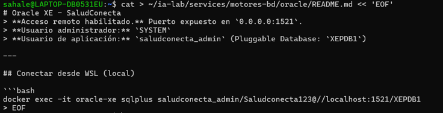
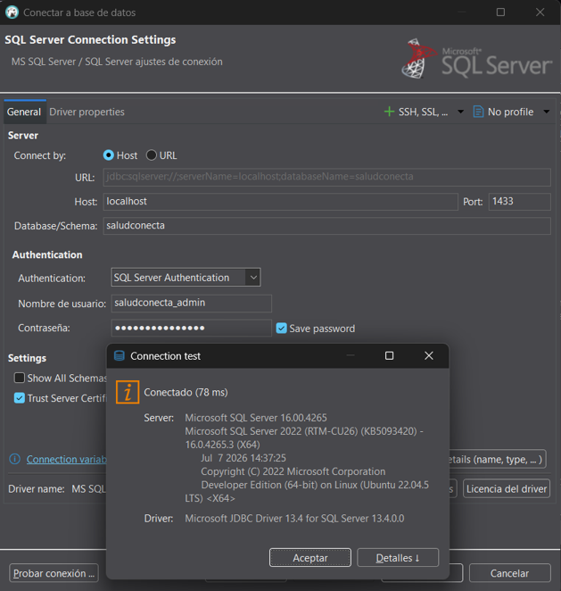
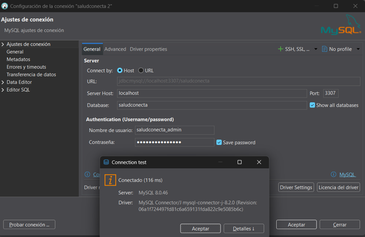
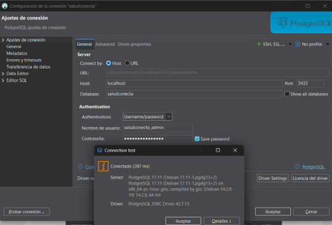
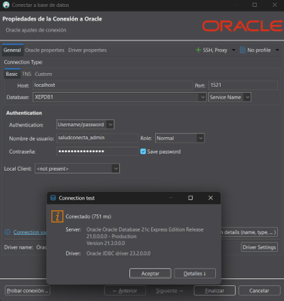
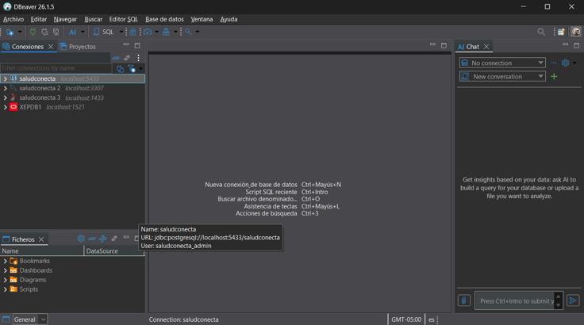

# Guía Paso a Paso: Despliegue de 4 Motores de Base de Datos en Docker sobre WSL 2 (Proyecto SaludConecta)

Este documento detalla el procedimiento completo seguido por **Sahale** (`sahale@LAPTOP-DB0531EU`) para la instalación de entornos, estructuración de directorios, creación de la red Docker, configuración y levantamiento de 4 motores de bases de datos (**MySQL**, **PostgreSQL**, **Microsoft SQL Server** y **Oracle XE**), solución de inconvenientes técnicos presentados, creación de usuarios/bases de datos para el proyecto **SaludConecta**, integración de scripts de automatización y pruebas de conectividad en **DBeaver**.

---

## Índice
1. [Paso 1: Instalación y Configuración de WSL (Ubuntu)](#paso-1-instalación-y-configuración-de-wsl-ubuntu)
2. [Paso 2: Instalación de Docker y Docker Compose en WSL](#paso-2-instalación-de-docker-y-docker-compose-en-wsl)
3. [Paso 3: Estructura de Directorios y Red Personalizada](#paso-3-estructura-de-directorios-y-red-personalizada)
4. [Paso 4: Configuración e Instalación de MySQL 8.0](#paso-4-configuración-e-instalación-de-mysql-80)
5. [Paso 5: Configuración e Instalación de PostgreSQL 17](#paso-5-configuración-e-instalación-de-postgresql-17)
6. [Paso 6: Configuración e Instalación de Microsoft SQL Server 2022](#paso-6-configuración-e-instalación-de-microsoft-sql-server-2022)
7. [Paso 7: Configuración, Solución de Errores e Instalación de Oracle XE 21c](#paso-7-configuración-solución-de-errores-e-instalación-de-oracle-xe-21c)
8. [Paso 8: Automatización con Scripts Bash (`start-all.sh` y `stop-all.sh`)](#paso-8-automatización-con-scripts-bash-start-allsh-y-stop-allsh)
9. [Paso 9: Reconfiguración del Puerto en MySQL (Resolución de Conflictos)](#paso-9-reconfiguración-del-puerto-en-mysql-resolución-de-conflictos)
10. [Paso 10: Creación de Usuarios Remotos y Bases de Datos para SaludConecta](#paso-10-creación-de-usuarios-remotos-y-bases-de-datos-para-saludconecta)
11. [Paso 11: Pruebas de Conexión Remota Exitosas en DBeaver](#paso-11-pruebas-de-conexión-remota-exitosas-en-dbeaver)
12. [Anexos](#anexos)

---

## Paso 1: Instalación y Configuración de WSL (Ubuntu)

1. Abrir **PowerShell** como administrador en Windows.
2. Ejecutar el comando para instalar WSL y la distribución predeterminada (Ubuntu):
   ```powershell
   wsl --install
   ```

Tras la descarga e instalación del subsistema de Windows para Linux (versión 2.7.11) y la distribución Ubuntu, se definió el usuario y la contraseña del sistema:
* **Usuario Unix por defecto:** `sahale`

---

## Paso 2: Instalación de Docker y Docker Compose en WSL

Dentro de la terminal de Ubuntu en WSL, se preparó el repositorio oficial de Docker y se instaló el motor y el plugin de Docker Compose:

1. Configurar las claves GPG y el repositorio oficial de Docker:
   ```bash
   sudo install -m 0755 -d /etc/apt/keyrings
   sudo curl -fsSL https://download.docker.com/linux/ubuntu/gpg -o /etc/apt/keyrings/docker.asc
   sudo chmod a+r /etc/apt/keyrings/docker.asc
   
   echo      "deb [arch=$(dpkg --print-architecture) signed-by=/etc/apt/keyrings/docker.asc] https://download.docker.com/linux/ubuntu      $(. /etc/os-release && echo "$VERSION_CODENAME") stable" |      sudo tee /etc/apt/sources.list.d/docker.list > /dev/null
   ```

2. Actualizar el índice de paquetes e instalar Docker Engine y Docker Compose:
   ```bash
   sudo apt update
   sudo apt install docker-ce docker-ce-cli containerd.io docker-buildx-plugin docker-compose-plugin
   ```

3. Verificación de versiones instaladas:
   ```bash
   docker --version
   # Docker version 29.7.2, build a7dcaa6

   docker compose version
   # Docker Compose version v5.5.0
   ```

---

## Paso 3: Estructura de Directorios y Red Personalizada

Para mantener un entorno organizado donde persistan los datos y configuraciones de cada servicio, se creó la estructura de carpetas en el directorio personal `~/ia-lab` y una red Docker compartida.

1. Creación de las carpetas de servicios y datos:
   ```bash
   sudo mkdir -p ~/ia-lab/services/motores-bd/{mysql,postgres,mssql,oracle}
   sudo mkdir -p ~/ia-lab/data/{mysql,postgres,mssql,oracle}
   ```

2. Instalación de la herramienta `tree` para verificar la jerarquía de directorios:
   ```bash
   sudo apt install tree
   tree ~/ia-lab/
   ```

   **Resultado:**
   ```plaintext
   /home/sahale/ia-lab/
   ├── data
   │   ├── mssql
   │   ├── mysql
   │   ├── oracle
   │   └── postgres
   └── services
       └── motores-bd
           ├── mssql
           ├── mysql
           ├── oracle
           └── postgres
   ```

3. Creación de la red Docker compartida (`ia-lab-network`):
   ```bash
   docker network inspect ia-lab-network >/dev/null 2>&1 || docker network create ia-lab-network
   docker network ls | grep ia-lab
   ```

---

## Paso 4: Configuración e Instalación de MySQL 8.0

1. Creación de `docker-compose.yml`:
   ```bash
   cat > ~/ia-lab/services/motores-bd/mysql/docker-compose.yml << 'EOF'
   services:
     mysql:
       image: mysql:8.0
       container_name: mysql-server
       restart: unless-stopped
       env_file:
         - .env
       ports:
         - "3306:3306"
       volumes:
         - ../../../data/mysql:/var/lib/mysql
         - /mnt/d/academia/bd:/backups
       command: >
         --character-set-server=utf8mb4
         --collation-server=utf8mb4_unicode_ci
         --bind-address=0.0.0.0
       networks:
         - ia-lab-network
       healthcheck:
         test: ["CMD", "mysqladmin", "ping", "-h", "localhost"]
         interval: 10s
         timeout: 5s
         retries: 5
         start_period: 30s

   networks:
     ia-lab-network:
       external: true
   EOF
   ```

2. Creación del archivo de variables de entorno `.env`:
   ```bash
   cat > ~/ia-lab/services/motores-bd/mysql/.env << 'EOF'
   TZ=America/Bogota
   MYSQL_ROOT_PASSWORD=Saludconecta123
   MYSQL_DATABASE=saludconecta
   EOF
   ```

3. Creación del archivo informativo `README.md`:
   ```bash
   cat > ~/ia-lab/services/motores-bd/mysql/README.md << 'EOF'
   # MySQL 8.0 - SaludConecta
   > **Acceso remoto habilitado.** Puerto expuesto en `0.0.0.0:3306`.
   > **Usuario por defecto:** `root` (acceso remoto: `%`)

   ---

   ## Conectar desde WSL (local)
   ```bash
   docker exec -it mysql-server mysql -u root -p
   # Password: Saludconecta123
   EOF
   ```

---

## Paso 5: Configuración e Instalación de PostgreSQL 17

1. Creación de `docker-compose.yml`:
   ```bash
   cat > ~/ia-lab/services/motores-bd/postgres/docker-compose.yml << 'EOF'
   services:
     postgres:
       image: postgres:17
       container_name: ia-postgres
       restart: unless-stopped
       env_file:
         - .env
       ports:
         - "5433:5432"
       volumes:
         - ../../../data/postgres:/var/lib/postgresql/data
       networks:
         - ia-lab-network
       healthcheck:
         test: ["CMD-SHELL", "pg_isready -U $$POSTGRES_USER -d $$POSTGRES_DB"]
         interval: 10s
         timeout: 5s
         retries: 5
         start_period: 20s

   networks:
     ia-lab-network:
       external: true
   EOF
   ```

2. Archivo `.env`:
   ```bash
   cat > ~/ia-lab/services/motores-bd/postgres/.env << 'EOF'
   TZ=America/Bogota
   POSTGRES_DB=saludconecta
   POSTGRES_USER=saludconecta_admin
   POSTGRES_PASSWORD=Saludconecta123
   PGDATA=/var/lib/postgresql/data
   EOF
   ```

3. Archivo `README.md`:
   ```bash
   cat > ~/ia-lab/services/motores-bd/postgres/README.md << 'EOF'
   # PostgreSQL 17 - SaludConecta
   > **Acceso remoto habilitado.** Puerto expuesto en `0.0.0.0:5433`.
   > **Usuario por defecto:** `saludconecta_admin` (acceso remoto sin restricción de host)

   ---

   ## Conectar desde WSL (local)
   ```bash
   docker exec -it ia-postgres psql -U saludconecta_admin -d saludconecta
   # Password: Saludconecta123
   EOF
   ```

4. Levantamiento del contenedor y verificación:
   ```bash
   cd ~/ia-lab/services/motores-bd/postgres
   docker compose up -d
   ```

5. Verificación de roles y bases de datos:
   ```bash
   docker exec -it ia-postgres psql -U saludconecta_admin -d saludconecta
   ```
   **Comandos ejecutados en psql:**
   ```sql
   \du
   \l
   ```

---

## Paso 6: Configuración e Instalación de Microsoft SQL Server 2022

1. Creación de `docker-compose.yml`:
   ```bash
   cat > ~/ia-lab/services/motores-bd/mssql/docker-compose.yml << 'EOF'
   services:
     mssql:
       image: mcr.microsoft.com/mssql/server:2022-latest
       container_name: sqlserver-container
       restart: unless-stopped
       user: root
       env_file:
         - .env
       ports:
         - "1433:1433"
       volumes:
         - ../../../data/mssql:/var/opt/mssql
       networks:
         - ia-lab-network

   networks:
     ia-lab-network:
       external: true
   EOF
   ```

2. Archivo `.env` ajustado con clave unificada:
   ```env
   ACCEPT_EULA=Y
   MSSQL_SA_PASSWORD=Saludconecta123
   MSSQL_PID=Developer
   ```

3. Archivo `README.md`:
   ```bash
   cat > ~/ia-lab/services/motores-bd/mssql/README.md << 'EOF'
   # SQL Server 2022 - Motor de Base de Datos
   > **Acceso remoto habilitado.** Puerto expuesto en `0.0.0.0:1433`.
   > **Usuario por defecto:** `SA` (acceso remoto: habilitado por defecto)

   ---

   ## Conectar desde WSL (local)
   ```bash
   docker exec -it sqlserver-container /opt/mssql-tools18/bin/sqlcmd -C -S localhost -U SA -P 'Saludconecta123'
   EOF
   ```

---

## Paso 7: Configuración, Solución de Errores e Instalación de Oracle XE 21c

### 7.1 Configuración inicial
1. Creación de `docker-compose.yml`:
   ```bash
   cat > ~/ia-lab/services/motores-bd/oracle/docker-compose.yml << 'EOF'
   services:
     oracle:
       image: gvenzl/oracle-xe
       container_name: oracle-xe
       restart: unless-stopped
       user: root
       env_file:
         - .env
       ports:
         - "1521:1521"
         - "8080:8080"
       volumes:
         - ../../../data/oracle:/opt/oracle/oradata
       networks:
         - ia-lab-network

   networks:
     ia-lab-network:
       external: true
   EOF
   ```

2. Archivo `.env`:
   ```bash
   cat > ~/ia-lab/services/motores-bd/oracle/.env << 'EOF'
   ORACLE_PASSWORD=Saludconecta123
   ORACLE_DATABASE=XE
   EOF
   ```

### 7.2 Diagnóstico del error de permisos (`Permission denied`)
Al levantar el contenedor con `docker compose up -d`, el estado indicaba reinicios constantes (`Restarting`). Al revisar los logs con `docker logs oracle-xe --tail 50`, se identificó el fallo de permisos:
```plaintext
NL-00280: error creating log stream /opt/oracle/product/21c/dbhomeXE/network/log/listener.log
Linux Error: 13: Permission denied
Listener failed to start.
DATABASE STARTUP FAILED!
```

### 7.3 Solución del problema
Para solucionar el fallo de permisos ocasionado por un volumen o carpeta previa con permisos incorrectos:

1. Detener el contenedor:
   ```bash
   cd ~/ia-lab/services/motores-bd/oracle
   docker compose down
   ```

2. Respaldar el directorio previo y crear un directorio nuevo y limpio:
   ```bash
   mv ~/ia-lab/data/oracle ~/ia-lab/data/oracle_backup_2024
   mkdir -p ~/ia-lab/data/oracle
   ```

3. Asignar la propiedad adecuada al UID/GID interno de Oracle (`54321:54321`):
   ```bash
   sudo chown -R 54321:54321 ~/ia-lab/data/oracle
   ls -ld ~/ia-lab/data/oracle
   # drwxr-xr-x 2 54321 54321 4096 Aug 18 16:37 /home/sahale/ia-lab/data/oracle
   ```

4. Desplegar nuevamente el contenedor y verificar logs:
   ```bash
   docker compose up -d
   docker logs oracle-xe --tail 50
   # DATABASE IS READY TO USE!
   ```

---

## Paso 8: Automatización con Scripts Bash (`start-all.sh` y `stop-all.sh`)

Para gestionar el arranque y apagado unificado de todos los motores, se crearon dos scripts ejecutables:

1. **Script de Inicio (`start-all.sh`):**
   ```bash
   cat > ~/ia-lab/services/motores-bd/start-all.sh << 'EOF'
   #!/bin/bash
   set -e
   BASE=~/ia-lab/services/motores-bd
   echo "========================================"
   echo "Iniciando motores de base de datos..."
   echo "========================================"
   for dir in mysql postgres mssql oracle; do
       echo ""
       echo ">>> Levantando $dir..."
       cd "$BASE/$dir"
       docker compose up -d
       echo "    $dir: OK"
   done
   echo ""
   echo "========================================"
   echo "Todos los motores iniciados."
   echo "========================================"
   EOF
   
   chmod +x ~/ia-lab/services/motores-bd/start-all.sh
   ```

2. **Script de Detención (`stop-all.sh`):**
   ```bash
   cat > ~/ia-lab/services/motores-bd/stop-all.sh << 'EOF'
   #!/bin/bash
   set -e
   BASE=~/ia-lab/services/motores-bd
   echo "========================================"
   echo "Deteniendo motores de base de datos..."
   echo "========================================"
   for dir in mysql postgres mssql oracle; do
       echo ""
       echo ">>> Deteniendo $dir..."
       cd "$BASE/$dir"
       docker compose down
       echo "    $dir: OK"
   done
   echo ""
   echo "========================================"
   echo "Todos los motores detenidos."
   echo "========================================"
   EOF

   chmod +x ~/ia-lab/services/motores-bd/stop-all.sh
   ```

3. Prueba de ejecución e inspección de contenedores:
   ```bash
   ~/ia-lab/services/motores-bd/start-all.sh
   docker ps --format "table {{.Names}}	{{.Status}}	{{.Ports}}"
   ```

---

## Paso 9: Reconfiguración del Puerto en MySQL (Resolución de Conflictos)

### 9.1 Problema detectado al conectar en DBeaver
Al intentar conectarse mediante DBeaver, se detectó un conflicto porque el puerto local `3306` estaba siendo ocupado por otro servicio de base de datos preexistente en el equipo, lo que generaba errores de autenticación o la redirección al MySQL incorrecto.

### 9.2 Solución aplicada
Se modificó el puerto mapeado en el host a `3307` (manteniendo el puerto interno `3306` del contenedor), actualizando `docker-compose.yml`, `.env` y `README.md`:

1. `docker-compose.yml` (Cambio de puerto a `3307:3306`):
   ```yaml
       ports:
         - "3307:3306"
   ```

2. Actualización del archivo `.env` y `README.md`:
   ```bash
   cat > ~/ia-lab/services/motores-bd/mysql/.env << 'EOF'
   TZ=America/Bogota
   MYSQL_ROOT_PASSWORD=Saludconecta123
   MYSQL_DATABASE=saludconecta
   EOF

   cat > ~/ia-lab/services/motores-bd/mysql/README.md << 'EOF'
   # MySQL 8.0 - SaludConecta
   > **Acceso remoto habilitado.** Puerto expuesto en `0.0.0.0:3307`.
   > **Usuario por defecto:** `root`.

   ---

   ## Conectar desde WSL (local)
   ```bash
   docker exec -it mysql-server mysql -u root -p
   # Password: Saludconecta123
   EOF
   ```

---

## Paso 10: Creación de Usuarios Remotos y Bases de Datos para SaludConecta

Para cumplir con la arquitectura limpia del proyecto **SaludConecta**, se crearon los usuarios de aplicación dedicados `saludconecta_admin` en cada motor:

### 10.1 MySQL 8.0
```bash
docker exec -it mysql-server mysql -u root -p
```
**Comandos ejecutados en MySQL:**
```sql
CREATE DATABASE IF NOT EXISTS saludconecta CHARACTER SET utf8mb4 COLLATE utf8mb4_unicode_ci;
CREATE USER 'saludconecta_admin'@'%' IDENTIFIED BY 'Saludconecta123';
GRANT ALL PRIVILEGES ON saludconecta.* TO 'saludconecta_admin'@'%';
FLUSH PRIVILEGES;
SELECT user, host FROM mysql.user WHERE user = 'saludconecta_admin';
```

### 10.2 PostgreSQL 17
En PostgreSQL, el usuario `saludconecta_admin` y la BD `saludconecta` se crearon automáticamente con el `.env`. Se verificaron y asignaron permisos adicionales sobre el esquema público:
```bash
docker exec -it ia-postgres psql -U saludconecta_admin -d saludconecta
```
**Comandos SQL ejecutados:**
```sql
GRANT ALL ON SCHEMA public TO saludconecta_admin;
ALTER SCHEMA public OWNER TO saludconecta_admin;
\du
```

### 10.3 Microsoft SQL Server 2022
Se ingresó con la herramienta `sqlcmd` para crear la base de datos `saludconecta`, el Login de servidor y asociar el usuario con rol de propietario (`db_owner`):
```bash
docker exec -it sqlserver-container /opt/mssql-tools18/bin/sqlcmd -C -S localhost -U SA -P 'Saludconecta123'
```
**Comandos T-SQL ejecutados:**
```sql
CREATE LOGIN saludconecta_admin WITH PASSWORD = 'Saludconecta123';
GO
USE saludconecta;
GO
CREATE USER saludconecta_admin FOR LOGIN saludconecta_admin;
GO
ALTER ROLE db_owner ADD MEMBER saludconecta_admin;
GO
SELECT name, type_desc, is_disabled FROM sys.sql_logins WHERE name = 'saludconecta_admin';
GO
```

### 10.4 Oracle XE 21c (Solución Multitenant PDB: XEPDB1)
Dado que en Oracle 21c la arquitectura multitenant restringe la creación de usuarios comunes en la raíz (`CDB$ROOT`) sin el prefijo `C##`, se cambió de contenedor a la Pluggable Database `XEPDB1` para crear el usuario de aplicación limpio:
```bash
docker exec -it oracle-xe sqlplus system/Saludconecta123@XE
```
**Comandos SQL*Plus ejecutados:**
```sql
ALTER SESSION SET CONTAINER = XEPDB1;
CREATE TABLESPACE saludconecta_ts DATAFILE '/opt/oracle/oradata/XE/XEPDB1/saludconecta_ts.dbf' SIZE 100M AUTOEXTEND ON;
CREATE USER saludconecta_admin IDENTIFIED BY Saludconecta123 DEFAULT TABLESPACE saludconecta_ts QUOTA UNLIMITED ON saludconecta_ts;
GRANT CREATE SESSION, CREATE TABLE, CREATE VIEW, CREATE SEQUENCE, CREATE TRIGGER TO saludconecta_admin;
GRANT DBA TO saludconecta_admin;
SELECT username, account_status, default_tablespace FROM dba_users WHERE username = 'SALUDCONECTA_ADMIN';
```

Actualización del `README.md` de Oracle para documentar la conexión hacia `XEPDB1`:
```bash
cat > ~/ia-lab/services/motores-bd/oracle/README.md << 'EOF'
# Oracle XE - SaludConecta
> **Acceso remoto habilitado.** Puerto expuesto en `0.0.0.0:1521`.
> **Usuario administrador:** `SYSTEM`
> **Usuario de aplicación:** `saludconecta_admin` (Pluggable Database: `XEPDB1`)

---

## Conectar desde WSL (local)

```bash
docker exec -it oracle-xe sqlplus saludconecta_admin/Saludconecta123@//localhost:1521/XEPDB1
EOF
```



---

## Paso 11: Pruebas de Conexión Remota Exitosas en DBeaver

Se verificó la conectividad remota desde el cliente gráfico **DBeaver** hacia cada uno de los 4 motores de **SaludConecta**:

### 11.1 Microsoft SQL Server 2022
* **Host:** `localhost` | **Puerto:** `1433` | **BD:** `saludconecta`
* **Usuario:** `saludconecta_admin` | **Pass:** `Saludconecta123`
* **Resultado:** Conexión exitosa (`Conectado (78 ms)` - `Microsoft SQL Server 16.00.4265`).



### 11.2 MySQL 8.0
* **Host:** `localhost` | **Puerto:** `3307` | **BD:** `saludconecta`
* **Usuario:** `saludconecta_admin` | **Pass:** `Saludconecta123`
* **Resultado:** Conexión exitosa (`Conectado (116 ms)` - `MySQL 8.0.46`).



### 11.3 PostgreSQL 17
* **Host:** `localhost` | **Puerto:** `5433` | **BD:** `saludconecta`
* **Usuario:** `saludconecta_admin` | **Pass:** `Saludconecta123`
* **Resultado:** Conexión exitosa (`Conectado (287 ms)` - `PostgreSQL 17.11`).



### 11.4 Oracle XE 21c
* **Host:** `localhost` | **Puerto:** `1521` | **Service Name:** `XEPDB1`
* **Usuario:** `saludconecta_admin` | **Pass:** `Saludconecta123`
* **Resultado:** Conexión exitosa (`Conectado (751 ms)` - `Oracle Database 21c Express Edition Release 21.0.0.0.0`).



### 11.5 Panel General de Conexiones Activas en DBeaver
Vista de la consola DBeaver con las 4 bases de datos agregadas y verificadas correctamente:



---

## Anexos

### Anexo A: Tabla Resumen de Motores y Credenciales (SaludConecta)

| Motor BD | Contenedor | Puerto Local (Host) | Puerto Contenedor | Usuario Administrador | Usuario Aplicación | Base de Datos / Service Name |
| :--- | :--- | :--- | :--- | :--- | :--- | :--- |
| **MySQL 8.0** | `mysql-server` | `3307` | `3306` | `root` | `saludconecta_admin` | `saludconecta` |
| **PostgreSQL 17** | `ia-postgres` | `5433` | `5432` | `saludconecta_admin` | `saludconecta_admin` | `saludconecta` |
| **SQL Server 2022** | `sqlserver-container` | `1433` | `1433` | `SA` | `saludconecta_admin` | `saludconecta` |
| **Oracle XE 21c** | `oracle-xe` | `1521` | `1521` | `SYSTEM` | `saludconecta_admin` | `XEPDB1` |

---

### Anexo B: Comandos Útiles de Gestión Docker
```bash
# Ver estado de todos los contenedores y puertos
docker ps --format "table {{.Names}}	{{.Status}}	{{.Ports}}"

# Inspeccionar logs de un contenedor específico
docker logs mysql-server --tail 50 -f
docker logs ia-postgres --tail 50 -f
docker logs sqlserver-container --tail 50 -f
docker logs oracle-xe --tail 50 -f

# Descubrir la IP de la interfaz WSL
hostname -I

# Ejecutar scripts de arranque y apagado global
~/ia-lab/services/motores-bd/start-all.sh
~/ia-lab/services/motores-bd/stop-all.sh
```

---

### Anexo C: Diagrama de la Arquitectura de Persistencia (SaludConecta)
```plaintext
┌─────────────────────────────────────────────────────────────────────────────┐
│                              WINDOWS HOST                                    │
│  ┌─────────────────┐  ┌─────────────────┐  ┌──────────────┐  ┌─────────────┐ │
│  │    DBeaver      │  │ MySQL Workbench │  │   pgAdmin    │  │ Azure Data  │ │
│  └────────┬────────┘  └────────┬────────┘  └──────┬───────┘  └──────┬──────┘ │
└───────────┼────────────────────┼──────────────────┼─────────────────┼────────┘
            │                    │                  │                 │
            │  IP_WSL:3307       │  IP_WSL:5433     │  IP_WSL:1433    │  IP_WSL:1521
            │  (MySQL)           │  (PostgreSQL)    │  (SQL Server)   │  (Oracle)
            ▼                    ▼                  ▼                 ▼
┌─────────────────────────────────────────────────────────────────────────────┐
│                              WSL / DOCKER                                    │
│                                                                              │
│  ┌─────────────┐ ┌─────────────┐ ┌──────────┐ ┌─────────┐                   │
│  │mysql-server │ │ ia-postgres │ │sqlserver │ │oracle-xe│                   │
│  │   :3306     │ │   :5433     │ │  :1433   │ │  :1521  │                   │
│  └──────┬──────┘ └──────┬──────┘ └────┬─────┘ └────┬────┘                   │
│         │               │             │            │                        │
│         └───────────────┴─────────────┴────────────┘                        │
│                              │                                              │
│                       ia-lab-network                                        │
│                              │                                              │
│  ┌───────────────────────────┴────────────────────────────┐                 │
│  │              Base de Datos: saludconecta               │                 │
│  │              Usuario: saludconecta_admin               │                 │
│  └────────────────────────────────────────────────────────┘                 │
└─────────────────────────────────────────────────────────────────────────────┘
```
